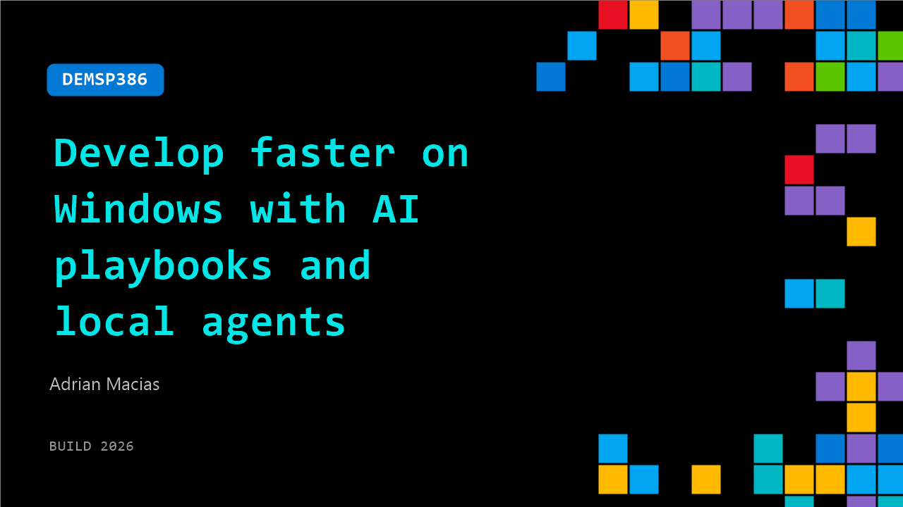

# DEMSP386: Develop faster on Windows with AI playbooks and local agents

**Session code:** DEMSP386  
**Date:** Wednesday, June 3, 2026 / 10:30 AM - 10:55 AM PDT (Duration 25 minutes)  
**Watch on-demand:** <https://build.microsoft.com/en-US/sessions/DEMSP386>

---

## Speakers

- **Adrian Macias** - Sr Director - Developer Acceleration Team, AMD

## About the session

In this session you'll experience a practical path for a streamlined setup-to-ship workflow. Learn how you can use innovations in local coding on AMD's Ryzen™ AI PCs to optimize workflows powered by AI Playbooks to reduce friction and accelerate the path from idea to first commit. Finish with a clear example showing how to build once, run locally, and scale across Windows systems optimized for AMD hardware.

Seating for this session is first-come, first-served. Add it to your schedule to plan your day and arrive early to secure a spot.

## AI summary

**Introduction and Context:** The speaker opens the session by explaining that there is a large amount of new information and features to cover in the demo 00:00:00–00:00:12. They invite participants to ask questions at any time for an interactive discussion. As a member of AMD's Developer Acceleration Team, the speaker focuses on the client side of AI—highlighting AI PCs that merge local compute with cloud processing. The team collaborates closely with ISVs and OEMs to accelerate AI app deployment, supported by experts across full-stack and backend implementations 00:00:22–00:01:07. The session centers around introducing AMD’s “Playbooks”—developer resources designed to streamline application creation, alongside foundational technologies like Lemonade and Lemonade Routers within the ROCm stack 00:01:16–00:01:49.

**AI Use Cases and Developer Empowerment:** The discussion shifts to AI use cases that have evolved in recent years, such as workflow automation, knowledge bases, gaming, and coding as a ubiquitous foundation 00:02:20–00:03:00. Participants are invited to a hands-on workshop about coding with agents. The speaker emphasizes “choice” as a pivotal theme across modern AI development 00:03:29–00:03:40. They describe layers of choice in model quality, cost, locality (CPU/GPU/NPU or client-cloud split), and modality (text, vision, image, audio) 00:03:52–00:05:06. These choices empower developers to define where and how their AI workloads run, dynamically balancing user experience, cost efficiency, and computing logistics. The emerging omnimodal AI models combine text, speech, and vision—though the standardization of serving such models remains a work in progress 00:05:12–00:06:02.

**Agentic Coding and Dynamic Routing Choices:** The speaker delves into examples of agentic coding—demonstrating how developers can set agents for specific tasks and dynamically choose computation modes 00:06:04–00:07:00. For heavy architectural tasks, developers might opt for larger cloud models, while quicker debugging or creative iterations can run locally—even without Wi-Fi connection. The demo showcases dynamic model routing based on resource availability and workflow context 00:07:10–00:07:40. Next, the speaker introduces Lemonade, part of the ROCm stack, which abstracts backend complexity by automatically routing workloads across different processors through semantic rules 00:08:00–00:09:19. Lemonade integrates easily with frameworks such as Codex, Claude, or Gaia, and selects locally optimized models automatically, making intelligent routing seamless 00:09:25–00:10:05. Through a weather-dashboard demo 00:10:10–00:11:17, the session illustrates how Lemonade supports creative, agile workflows locally and dynamically shifts resources when needed.

**Playbooks and Omni-Modal Demonstrations:** AMD’s “Playbooks” concept is detailed as a unified open-source set of guides for developers across skill levels—from kernel optimization to image generation UI integration 00:11:51–00:13:00. The collection offers full-stack recipes adaptable for Rock’em kernels, Lemonade-powered abstraction, and cross-platform AI app development. These resources recently launched for Radeon GPUs and client devices, with expansion toward Halo appliance PCs and EPIC server platforms. The speaker highlights the open GitHub repository where these playbooks are hosted, encouraging developers to explore unreleased clustering and multimodal capabilities 00:13:33–00:14:10. The demo on “omni-modal routing” shows Lemonade’s ability to combine models intelligently—such as linking image generation, narration, and editing functions—to enable tasks like generating and narrating interactive stories 00:15:53–00:17:30. This integration demonstrates Lemonade’s ability to manage complex multimodal queries contextually without requiring deep technical knowledge.

**Semantic Filtering, Cost Optimization, and Developer Ecosystem:** Further examples show Lemonade and VLLM router being used for semantic filtering and secure routing 00:18:42–00:20:00. The system dynamically distinguishes private data to route locally or expensive cloud-based tasks to appropriate endpoints, optimizing both cost and privacy. For instance, personal queries with sensitive data remain on-device, while trivial queries or small jobs run locally to reduce cloud costs 00:19:15–00:20:50. The backend “cortex” architecture unifies diverse device APIs such as Vulkan, Stable Diffusion, Whisper, and ROCm under a standard inference API inspired by OpenAI’s endpoint format 00:22:00–00:22:17. Together with model management and application-level utility layers, this approach democratizes AI development through the open-source developer community 00:22:27–00:23:03. The speaker highlights developer enthusiasm—mentioning community projects and cross-vendor contributions—and reveals the upcoming “Halo box,” a headless PC appliance designed for continuous AI agent operation and background automation tasks 00:23:26–00:24:22.

**Conclusion and Call to Action:** The session closes with an invitation to explore AMD’s Developer Portal (00:24:26–00:25:26), where visitors will find announcements on Halo, Lemonade updates, and Playbook workshops. The speaker underscores AMD’s emphasis on hands-on, global developer engagement—with recent workshops drawing thousands of attendees worldwide. They encourage new developers to register for updates and access cloud compute credits for AMD Instinct-class devices. After addressing final audience questions about hardware pricing and launch timing 00:25:33–00:26:31, the presenter thanks attendees and concludes the interactive session, emphasizing AMD’s commitment to accessible, scalable AI innovation through open tools and community collaboration.

## Session tags

- **Session type:** Demo
- **Level:** (200) Intermediate
- **Topic:** Developer tools & frameworks
- **Tags:** AI, API, Agents, Developer, Windows Developer, Agents on Windows, Windows SDKs, Developer Technologies, Windows Development, Developer Frameworks
- **Location:** Gateway Pavilion, Level 2, Theater B
