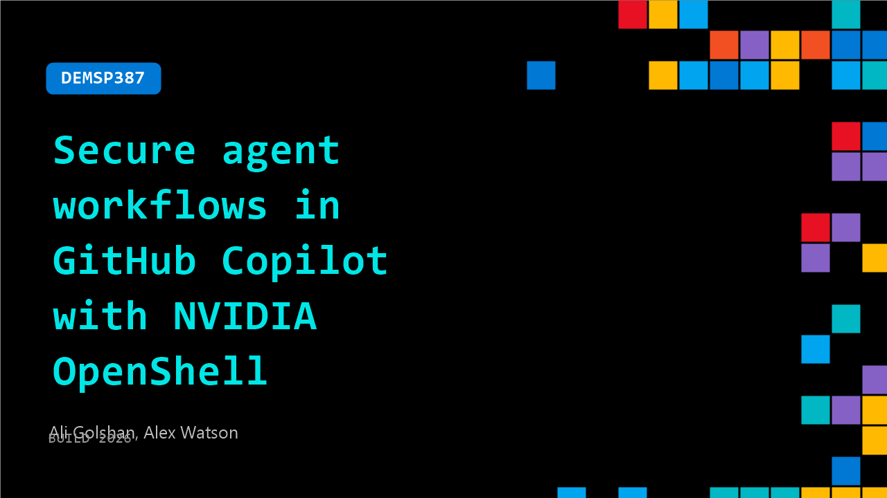

# DEMSP387: Secure agent workflows in GitHub Copilot with NVIDIA OpenShell

**Session code:** DEMSP387  
**Date:** Wednesday, June 3, 2026 / 9:30 AM - 9:55 AM PDT (Duration 25 minutes)  
**Watch on-demand:** <https://build.microsoft.com/en-US/sessions/DEMSP387>

---

## Speakers

- **Ali Golshan** - Senior Director of AI Software, NVIDIA
- **Alex Watson** - NVIDIA

## About the session

Agentic workflows in GitHub Copilot can run complex tasks with broad access to local systems. In this session, see how to enforce policy and governance for agents operating in CLI environments. You’ll walk through how NVIDIA OpenShell applies kernel-level controls, isolates agent processes, and limits permissions based on task context. Learn how to apply zero-trust principles to secure agent-driven development workflows.

Seating for this session is first-come, first-served. Add it to your schedule to plan your day and arrive early to secure a spot.

## AI summary

**Introduction and Project Overview:** The video opens with Ali and Alex introducing 00:00:03–00:00:13 Open Shell, a project developed at NVIDIA. They explain that the focus is on building an agent-native software stack and exploring what software should look like in an environment where agents execute long-running, stateful sessions. The main goals for Open Shell are developing a secure, trusted runtime and creating an environment designed for machine-speed operation. The project was initiated to handle autonomy and persistence for large-scale agent deployments while maintaining zero trust and strong governance.

**Security Foundations and Architecture:** The discussion moves to security principles, where the team highlights the zero-trust environment of Open Shell 00:01:45–00:02:12. Each sandbox starts locked down and only gains access as explicitly granted. Policies and governance are enforced at the kernel or infrastructure level rather than the model layer. Examples, like preventing prompt injection, show that credentials and secrets reside outside the sandbox to limit exposure. The system architecture is fully open source under Apache 2.0 00:03:20–00:03:32, with gateways, sandboxes, and sub-agent isolation forming the core primitives that ensure security and scalability.

**Policy Prover and Privacy Router:** Alex introduces the Policy Prover component 00:04:24–00:05:54, which uses formal logic verification based on OPA and Rego policy languages. This system can mathematically prove an agent’s permissions and prevent vulnerabilities caused by human error or false approvals. The privacy router 00:07:41–00:09:23 is another unique component that uses technology derived from synthetic data protection. It automatically routes queries to appropriate inference models depending on whether personally identifiable information (PII) is detected, allowing secure orchestration among local and frontier models. This balance enables efficient use of global compute resources while keeping sensitive data local.

**Demo: GitHub Persistence and Agent Collaboration:** The first demo 00:09:42–00:15:06 shows how multiple agents can use GitHub as a persistence layer within Open Shell. Several sandboxes are spun up to execute tasks independently, each storing results in isolated GitHub files. A synthesis agent then aggregates these outcomes. During the demonstration, the team highlights policy management for GitHub access, ensuring that agents only interact through predefined REST endpoints without handling credentials directly. Hot reloading of policies is emphasized as a design feature optimizing agent-speed execution, preventing sandbox restarts and latency issues.

**Demo: Automated Policy Negotiation:** In the second demo 00:15:35–00:18:03, Ali and Alex demonstrate dynamic policy negotiation. An agent with only read access attempts to write to GitHub, prompting automatic blocking and self-proposal for additional permissions. The Policy Prover evaluates the request, proofs the logic against existing rules, and either approves or denies the expansion. All actions are logged in a standardized cybersecurity format (OCSF), compatible with tools like Splunk and Datadog. This automation drastically reduces human intervention while maintaining granular control over agent privileges.

**Conclusion and Future Outlook:** The presentation closes 00:18:11–00:21:45 with details on Open Shell’s roadmap and partnerships. The project is already integrated into major platforms including Azure, GitHub, Ubuntu, and Red Hat OpenShift. It remains open source under Apache 2.0, with plans for CNCF or Linux Foundation contribution. The speakers invite community testing and contributions, noting that the alpha version debuted at GTC in March and will advance to beta soon. They explain new driver capabilities for sandboxing primitives such as Firecracker or Kubernetes SIG sandboxing. The session ends with questions on reducing human approval rates and maintaining secure boundaries through dynamic policy negotiation.

## Session tags

- **Session type:** Demo
- **Level:** (200) Intermediate
- **Topic:** Developer tools & frameworks
- **Tags:** Agents
- **Location:** Gateway Pavilion, Level 2, Theater B
