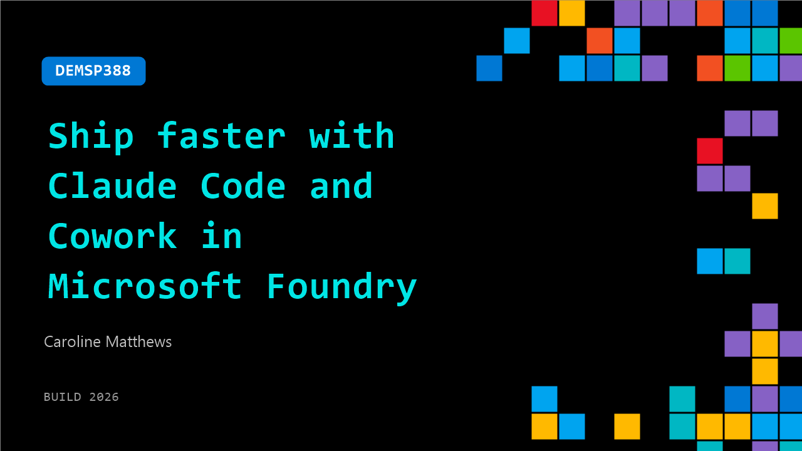

# DEMSP388: Ship faster with Claude Code and Cowork in Microsoft Foundry

**Session code:** DEMSP388  
**Date:** Tuesday, June 2, 2026 / 3:10 PM - 3:35 PM PDT (Duration 25 minutes)  
**Watch on-demand:** <https://build.microsoft.com/en-US/sessions/DEMSP388>

---

## Speakers

- **Caroline Matthews** - Applied AI Architect, Anthropic

## About the session

Agentic coding has moved from research demos to production engineering. Claude can now handle multi-hour tasks across large codebases: reading existing code, planning across files, running tests, and recovering when things go wrong. Walk through what makes long-running coding agents work in practice inside Microsoft Foundry: the Claude Code harness, how it manages context, and the patterns engineers use to keep agents on track. We will build it live with Claude in Microsoft Foundry.

Seating for this session is first-come, first-served. Add it to your schedule to plan your day and arrive early to secure a spot.

## AI summary

**Introduction and Context:** The presentation begins with Caroline Matthews from Anthropic greeting the audience and introducing herself as an applied AI architect there 00:00:07. She explains that her talk focuses on building with agentic coding agents in Microsoft Foundry and sets the stage by discussing how the landscape of software development has evolved—from traditional coding and autocomplete suggestions to fully autonomous agents capable of writing complete applications 00:00:21. Caroline provides a brief history of Anthropic’s Frontier model progression over six generations spanning roughly 18 months, highlighting performance metrics like SuiteBench for coding tasks and emphasizing how they’ve achieved near-expert accuracy levels in model-generated code 00:00:43.

**Model Advancements and Integration:** She continues by elaborating on Foundry’s integration capabilities, which combine Anthropic’s safe, governed AI models with Microsoft’s enterprise stack to accelerate the path from pilot to production 00:01:58. Caroline then announces the recent model release, Opus 4.8, describing it as Anthropic’s most advanced Frontier Intelligence offering ideal for accuracy-critical, long-horizon tasks 00:02:12. She compares it with other models—Sonnet 4.6, billed as a cost-effective coding agent, and Haiku, praised for its exceptional speed and low-latency tasks such as summarization and text classification 00:02:56. Importantly, all models share Anthropic’s constitutional AI foundation, meaning consistent safety and prompt strategies across deployments.

**Agentic Coding Frontiers:** Caroline transitions to the main theme—exploring the “frontiers” of agentic coding, defining four conceptual challenges that represent boundaries of advancement: what agents can touch, how they validate their correctness, what they can perceive, and when/where they can operate autonomously 00:03:24. To illustrate these ideas, she initiates a demonstration by launching a long-running task in Cloud Code—specifically, the creation of an arcade game 00:05:04. She introduces “dynamic workflows,” a new feature in Opus 4.8 enabling modular, sub-agent collaboration. This sets the foundation for hands-off development where agents work concurrently while the user continues other activities.

**First Frontier – Autonomy and Safety:** Caroline discusses reducing human bottlenecks by introducing auto mode, a new classifier-based safety layer between model requests and execution permissions 00:06:35. Earlier systems required constant manual confirmations for simple tasks, but now permissions can be intelligently inferred—allowing non-risky actions to proceed automatically while flagging potentially destructive commands for review 00:07:00. Through a live demo, she contrasts manual approval workflows against auto mode execution, showing how developers can literally step away from their desktop and return to completed tasks safely managed by the classifier 00:08:44. This marks significant progress toward true agent autonomy in enterprise coding.

**Second and Third Frontiers – Evaluating and Perceiving Code:** The next section explores enabling AI agents to verify their own work. Caroline describes a multi-agent architecture composed of a planner, generator, and evaluator, emphasizing the importance of building strong evaluation agents first 00:10:11. She demonstrates this with an “Oracle” reviewer setup, where one agent writes a simple function and another critiques it through test cases, effectively serving as a tough code reviewer 00:11:11. This evaluative separation is crucial for scaling quality control. Moving to perception, Caroline showcases how Claude Opus can now use browser-based vision and high-resolution image processing to perform tasks such as penetration testing 00:13:06. In this demo, the AI identifies hidden application security risks from a screenshot far more effectively than humans, demonstrating its advanced reasoning capabilities over images 00:15:20.

**Fourth Frontier and Closing Insights:** The final frontier concerns when and where agents can run. Caroline describes continuous, multi-surface execution—agents capable of running across devices, looping through schedules, and completing tasks in parallel even while developers attend meetings 00:17:01. She revisits the earlier arcade game demo, revealing it successfully completed using dynamic workflows that orchestrated several sub-agents who designed, judged, and tested different game versions 00:18:08. The result, “Neon Ascent,” exemplifies how autonomous yet structured agents collaborate without human micromanagement. Caroline concludes by emphasizing that the goal isn’t to replace humans but to elevate their focus—leaving repetitive code tasks to agentic systems while humans guide critical, high-value decisions 00:20:40. The talk closes with appreciation and encouragement to continue advancing agentic coding responsibly within safe AI boundaries 00:21:07.

## Session tags

- **Session type:** Demo
- **Level:** (200) Intermediate
- **Topic:** Developer tools & frameworks
- **Tags:** AI, Agents, Developer
- **Location:** Festival Pavilion, Theater A
