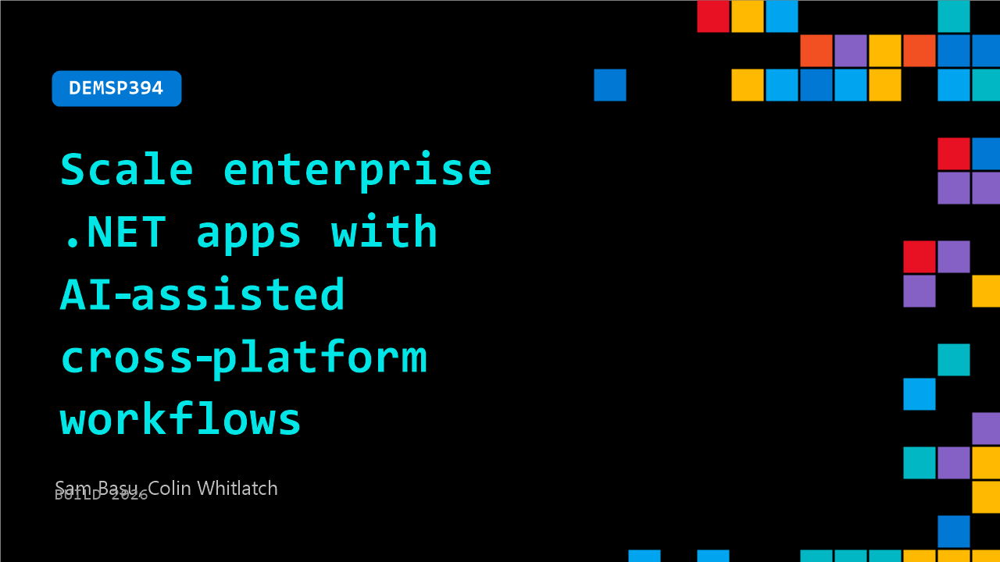

# DEMSP394: Scale enterprise .NET apps with AI‑assisted cross‑platform workflows

**Session code:** DEMSP394  
**Date:** Tuesday, June 2, 2026 / 2:40 PM - 3:05 PM PDT (Duration 25 minutes)  
**Watch on-demand:** <https://build.microsoft.com/en-US/sessions/DEMSP394>

---

## Speakers

- **Sam Basu** - Lead Developer Advocate, Uno Platform
- **Colin Whitlatch** - CTO, Kahua

## About the session

Most AI tooling for .NET targets greenfield code generation. Enterprise app development is different: layered systems, cross-platform targets, mixed-skill teams, and production demands. In this session, Uno Platform and Kahua show an end-to-end AI-assisted workflow across web, desktop, and mobile, where AI can inspect live app state, understand runtime UI behavior, and act with context. Be ready for real productivity with contextual AI.

Seating for this session is first-come, first-served. Add it to your schedule to plan your day and arrive early to secure a spot.

## AI summary

**Introduction and Context:** The video opens with greetings at Microsoft Build (00:00:00), where Sam Basu from Uno Platform and Colin Whitlatch from Kahua introduce their joint session on "Cross-platform modern .NET with Uno Platform at enterprise scale with AI-assisted workflows." They explain their collaboration—Uno as the platform maker and Kahua as an enterprise-scale user pushing its capabilities. The speakers position the talk as an exploration of how developer tooling is evolving to support agentic, AI-enhanced workflows in real-world applications, setting the tone for multiple announcements during the session.

**AI-Driven Development Evolution:** Early discussion (00:00:50–00:02:00) centers on how software building has progressed from manual coding to visual tools and now to AI-assisted approaches. The presenters outline a spectrum from code-centric practices to high-level automation, emphasizing that AI integration makes development faster but that solid fundamentals like architecture and context remain critical. Kahua’s experience exemplifies this transition—they’ve moved from traditional development to fully AI-orchestrated coding, where developers serve more as orchestrators than line-by-line coders. The team highlights integrating AI with design tools like Figma and extending support for end-to-end workflows that produce runnable enterprise code, not prototypes.

**Introducing Uno Platform Studio and Tooling:** The speakers then present Uno Platform Studio as a suite of AI and design tools for modern .NET development (00:03:16–00:04:55). They explain features such as “Hot Design” for real-time UI tweaking, seamless integration with Figma pipelines, and AI agents with full application context through MCP tools. The goal is to let developers and AI co-edit live applications that run across iOS, Android, WebAssembly, Windows, Linux, and macOS from one shared code base. This segment emphasizes context-driven AI, ensuring that generated code aligns with project documentation and user interaction patterns—what they call “AI with eyes and hands.”

**Uno Platform Studio 3.0 Announced and Demoed:** A major announcement follows—the launch of Uno Platform Studio 3.0 (00:05:08–00:09:00). The update introduces a specialized agent equipped with more than 60 skills, AI plugins, and deep MCP integration, enabling intelligent guidance in app creation. The session transitions into a live demo where AI builds a weather app directly in the browser using a single text prompt. Viewers see how apps can shift between light and dark modes, preview on various devices, and be exported into Visual Studio or GitHub seamlessly. The platform demonstrates full responsiveness, real-time collaboration through hot reload across multiple devices, and easy design iteration. Subsequent examples include CRM and coffee-ordering applications rendered live, underscoring Studio 3.0’s full-stack generation capability.

**Advanced Use Cases and AI Integration:** The demo extends into advanced scenarios (00:10:00–00:16:00), showing Uno integration within Visual Studio Code and GitHub Copilot. The agent autonomously launches, edits, and validates applications through visual trees and interactive design modes. Demonstrations show live UI testing, data-driven chart updates, and AI performing validation steps—mirroring concepts from end-to-end UI testing frameworks. Colin emphasizes customizable AI orchestration and cost-efficient model use, referring to GPT-5 Mini as an example. Core developer utilities such as hot reload, hot design, and doc-grounded MCP servers are shown to improve productivity and iteration, all while preserving native .NET standards like XAML and C#.

**Future Vision and Conclusion:** The final section (00:17:40–00:23:33) summarizes new building blocks in Uno Platform Studio 3.0—skills, plugins, design previews, and snippet-based UI assembly. Kahua shares real-world enterprise implementations using AI-driven workflows for large-scale construction and inspection apps leveraging LiDAR and 360-degree visualization. Both teams urge developers to adopt a human-and-AI collaborative model: humans define goals while AI iterates and verifies output in continuous loops. They close by stressing that while AI accelerates development, foundational principles and context remain cornerstones of reliable software. Attendees are invited to explore cross-platform demos and meet the teams at their Microsoft Build booth for interactive sessions and even themed arcade games built with Uno Platform technology.

## Session tags

- **Session type:** Demo
- **Level:** (200) Intermediate
- **Topic:** Developer tools & frameworks
- **Tags:** AI, Agents, .NET, Developer, GitHub Copilot, Visual Studio Code, OSS, Visual Studio
- **Location:** Festival Pavilion, Theater A
