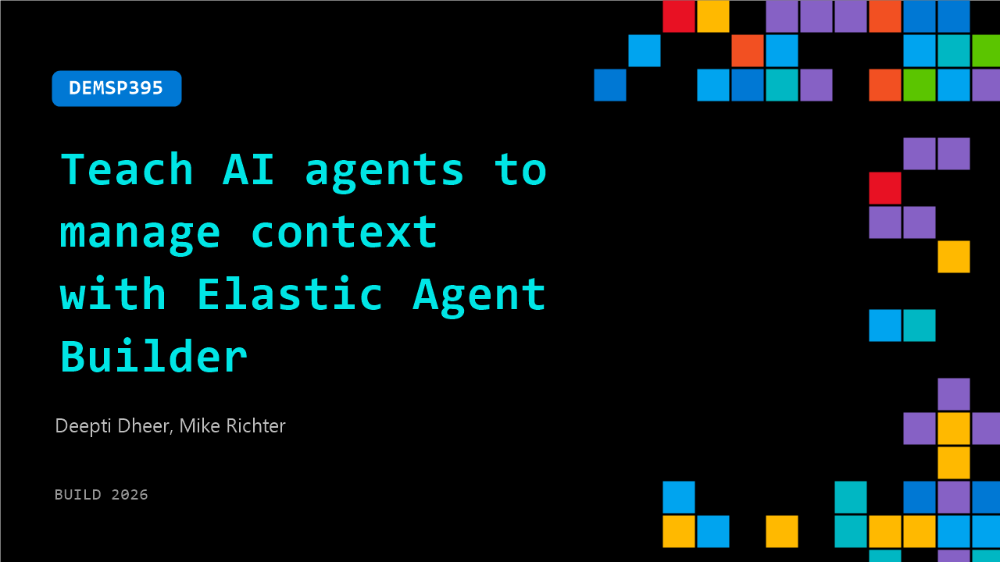

# DEMSP395: Teach AI agents to manage context with Elastic Agent Builder

**Session code:** DEMSP395  
**Date:** Wednesday, June 3, 2026 / 2:00 PM - 2:25 PM PDT (Duration 25 minutes)  
**Watch on-demand:** <https://build.microsoft.com/en-US/sessions/DEMSP395>

---

## Speakers

- **Deepti Dheer** - Senior Product Manager, Elastic
- **Mike Richter** - Principal Partner Solution Architect, Microsoft

## About the session

Solve AI context limits by enabling agents to manage their own memory. Learn how to prevent bloated prompts and context drift during long tasks, reduce input token usage while ensuring enterprise data governance and scalability. Walk away with next steps for deploying the dynamically loaded skills, conversation context store, selective compaction, and secure external data connectors from Elasticsearch 9.4's Agent Builder in the Microsoft ecosystem.

Seating for this session is first-come, first-served. Add it to your schedule to plan your day and arrive early to secure a spot.

## AI summary

**Introduction and Microsoft–Elastic Collaboration:** The session opens with Mike Richter, Principal Partner Solution Architect at Microsoft, introducing himself and the topic of discussion—Elastic running on Azure (00:00:02–00:00:23). He highlights the strong partnership between Microsoft and Elastic, emphasizing how his role involves helping partners build and sell solutions on Azure. Mike notes that Elastic exemplifies an ideal partner for Microsoft’s cloud ecosystem, offering simplicity in procurement and enterprise-level integration. Deepti, the Product Manager from Elastic, briefly introduces herself as well, setting up the transition to the main conversation about Elastic’s cloud offering within Azure.

**Elastic on Azure: Deployment and Integration Overview:** Mike begins by explaining how straightforward it is for customers to purchase and deploy Elastic from the Azure Marketplace (00:01:03–00:01:36). He outlines that Elastic is currently available in around fifteen Azure regions and continually expanding. Customers with Azure commitment dollars (MAC agreements) can use those funds to procure Elastic services, simplifying enterprise billing through a single invoice. He also mentions the availability of Elastic’s hosted and serverless offerings and the benefits of zero egress costs when workloads communicate within the same Azure region (00:02:02–00:02:13). Integration features include Azure Active Directory-based authentication, private link support for secure communications, and enterprise-ready compliance configurations—all ensuring seamless data flows within customers’ virtual networks.

**Elastic Cloud, Vector Support, and AI Capabilities:** Mike continues by detailing Elastic’s advanced technical capabilities such as first-class vector support, making it well-suited for Retrieval-Augmented Generation (RAG) and agentic applications inside Azure (00:03:00–00:03:29). He emphasizes that Microsoft Foundry’s large language models (LLMs)—including ones offered by Anthropic and OpenAI—can be seamlessly integrated to power Elastic-based agents. He transitions to mentioning Elastic’s Agent Builder, which Deepti will cover in detail, and invites attendees to visit the Microsoft booth after the session for hands-on demos and discussions about applications and agents built with Elastic’s ecosystem (00:03:43–00:04:08).

**Context Gap and Architecture of Elastic Agent Builder:** When Deepti takes over (00:04:12), she starts by outlining the core problem Elastic seeks to solve—the fragmentation caused by data silos across disparate systems. She explains that AI systems fail to perform optimally when data resides in isolated contexts, so Elastic’s goal is to bridge this “context gap.” The platform achieves this by wrapping diverse data sources—both within and external to Elastic—with contextual retrieval and token optimization processes (00:05:11–00:05:33). Deepti presents an architectural overview showing how Elastic gathers context from multiple systems, feeds it to agents, and dispatches it to endpoints such as Microsoft Foundry, Copilot Studio, or other supported environments.

**Building Blocks: Context Engine, Skills, and Tools:** Deepti then breaks down the key components of Elastic’s context architecture—agents, skills, connectors, plugins, and the core context engine (00:06:38–00:07:20). The context engine aligns and standardizes semantic meaning across data sources, creating metadata mappings that prevent repetitive computation. She explains this with an example where customer details like name, email, and phone number are recognized as “personal information,” enabling secure and efficient processing (00:07:39–00:07:57). The system’s design improves both security and speed, reducing token usage by up to 30%. She then introduces tools and skills creation—demonstrating how developers can use Elastic SQL, index workflows, and connectors like SharePoint or Slack to define contextual interactions. These tools serve as domain-specific “soldiers” executing precise functions within agents.

**Live Demonstration and Use Cases:** In a live demo segment (00:09:46–00:16:28), Deepti shows how a customer support team could use Elastic Agent Builder to unify internal case data with external systems such as GitHub or SharePoint. She queries the system conversationally to retrieve customer interaction summaries, automatically generate dashboards, and integrate enterprise reasoning transparency. Then she demonstrates creating a custom skill for generating a “financial exposure report” and using indexed data tools to perform contextual operations. Finally, she showcases connectors enabling federated search across Slack, SharePoint, and GitHub, including scenarios where an AI agent retrieves a dispute report, finds related policies, checks engineering dependencies, and shares the summarized insights directly into Slack. Deepti ends by reinforcing that Agent Builder drastically minimizes context fragmentation and enables fast, secure, AI-driven business decisions in Azure-integrated environments.

## Session tags

- **Session type:** Demo
- **Level:** (300) Advanced
- **Topic:** Developer tools & frameworks
- **Tags:** AI, Agents, Developer
- **Location:** Festival Pavilion, Theater A
