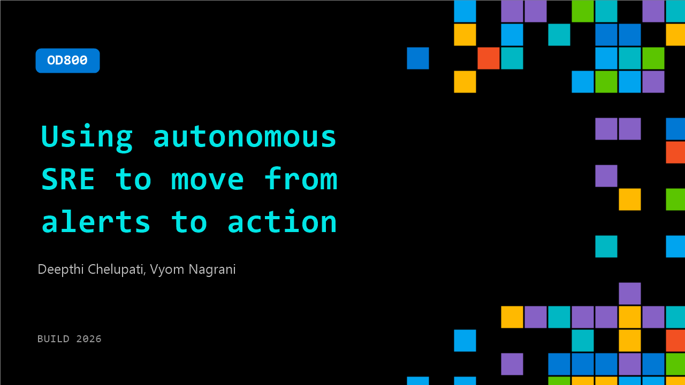

# OD800: Using autonomous SRE to move from alerts to action

**Session code:** OD800  
**Watch on-demand:** <https://build.microsoft.com/en-US/sessions/OD800>

---

## Speakers

- **Deepthi Chelupati** - Principal Product Manager, Microsoft
- **Vyom Nagrani** - Group PM Manager, Microsoft

## About the session

What happens when AI agents don’t just observe incidents—but act on them? Discover how autonomous remediation, SLO management, and deep observability are redefining modern SRE workflows and changing how teams operate large scale production systems.

## AI summary

**Introduction and Context Setting:** The session opens with background music 00:00:00–00:01:29 before hosts Vyom Nagrani and Deepthi Chelupati introduce themselves as Product Managers from the Azure SRE Agent team 00:01:30. They pose a central question: what if AI agents in site reliability engineering could not only observe incidents but actively resolve them 00:01:43? The discussion highlights the growing role of generative AI in all aspects of work, particularly in software development, where by 2028 nearly 90% of enterprise engineers are projected to use AI assistance 00:02:19. Vyom contextualizes the evolution of developer responsibilities, emphasizing how modern developers rely on agents for migration, security, release management, and documentation, while citing tangible results from companies using AI agents to improve efficiency and reduce noise in operations 00:02:25. This sets the stage for introducing Azure SRE Agent as an AI-powered system focused on operational automation, root cause diagnosis, and customization for production reliability 00:04:01.

**First Demo – Preventing Issues and Reducing Toil:** As the first major scenario begins 00:06:09, Deepthi demonstrates how developers can use SRE Agent to automate deployment checks and prevent regressions before they reach production. She describes typical manual tasks like code reviews and staging tests 00:06:32, then shows how the agent connects to telemetry systems such as Dynatrace, Log Analytics, and Azure activity logs 00:07:52. Through a CLI-based walkthrough, she creates an agent using a prebuilt Microsoft recipe 00:10:06, configures connectors, and sets an HTTP trigger for GitHub Actions. The trigger enables the agent to analyze every new pull request automatically, performing canary tests to identify risky changes. Deepthi validates the configuration via Copilot CLI 00:16:00 and runs a demo PR to show the agent identifying a problematic database URL modification that could disrupt production 00:22:03. The agent then comments directly on the PR and flags it as high risk, streamlining error prevention and saving engineering time.

**Core Capabilities and Extensibility:** Vyom resumes 00:24:18 by summarizing three pillars of the SRE Agent’s design—root cause analysis, automated mitigation, and incident response. The agent conducts data-driven analyses across metrics and logs, arriving at transparent, explainable insights in minutes 00:24:30. It can autonomously execute safe, reversible mitigation actions 00:25:01 while keeping teams in control. Additionally, the system enhances incident response by synthesizing alerts and likely causes instantly when production issues arise 00:25:21. Vyom highlights its extensibility—organizations can embed custom logic, troubleshooting workflows, or proprietary compliance rules so that the agent behaves according to internal standards 00:26:00. Deep integration with GitHub Copilot creates a feedback loop between issue detection and development, ensuring continuous operational improvement and aligned automation.

**Second Demo – Automated Incident Response:** Deepthi transitions into the second scenario, demonstrating how SRE Agent handles live production incidents autonomously 00:27:13. She simulates an error by rotating a database password that was not updated in the deployed application 00:31:05. Upon receiving a ServiceNow incident alert, the agent initiates investigation, referencing stored app architecture and past incident memory to narrow down probable causes 00:32:00. It correlates logs, telemetry, and detected password rotation events, confirming them as the root cause 00:33:19. With autonomous remediation enabled, the agent updates credentials, redeploys affected containers, validates the fix, and creates a detailed GitHub issue linking all analysis for traceability 00:37:02. This example illustrates how the system can shrink mean-time-to-resolution from hours to minutes while offering configurable human oversight if preferred.

**Trust, Control, and Operational Modes:** Continuing from the demos 00:37:30, Vyom outlines the safeguards and enterprise controls built into Azure SRE Agent. It operates under managed identities with three permission tiers—reader, user, and administrator—to ensure least privilege access 00:37:45. Governance is enforced through configurable run modes such as review or autonomous execution 00:38:32, validated commands, and audited sessions within Application Insights 00:39:06. Security architecture eliminates secrets and uses micro-VM sandboxes, OAuth connectors, and egress proxy for controlled network access 00:39:15. Monitoring tools provide metrics dashboards and performance scores, helping teams evaluate mitigation quality and agent effectiveness 00:40:05. Vyom then categorizes three operational modes—interactive (manual chat), reactive (alert-driven response), and proactive (scheduled autonomous checks)—covering troubleshooting to automated maintenance 00:40:50.

**Conclusion and Getting Started:** Wrapping up, Vyom summarizes why Azure SRE Agent stands out 00:42:16: it is Azure-native, adaptable to any environment, secure by design, and integrates seamlessly with tools like GitHub, ServiceNow, PagerDuty, and Datadog. He encourages teams of all sizes to implement the system, explaining three onboarding steps—teach it with organizational runbooks 00:43:05, connect it with telemetry sources, and let it work autonomously 00:43:34. The session concludes with a call to action: visit sre.azure.com for documentation, labs, and support 00:43:51. Music plays as the video ends, reinforcing the theme of continuous AI-driven reliability and innovation in Azure operations 00:44:15.

## Session tags

- **Session type:** Pre-recorded
- **Level:** (300) Advanced
- **Topic:** Developer tools & frameworks
