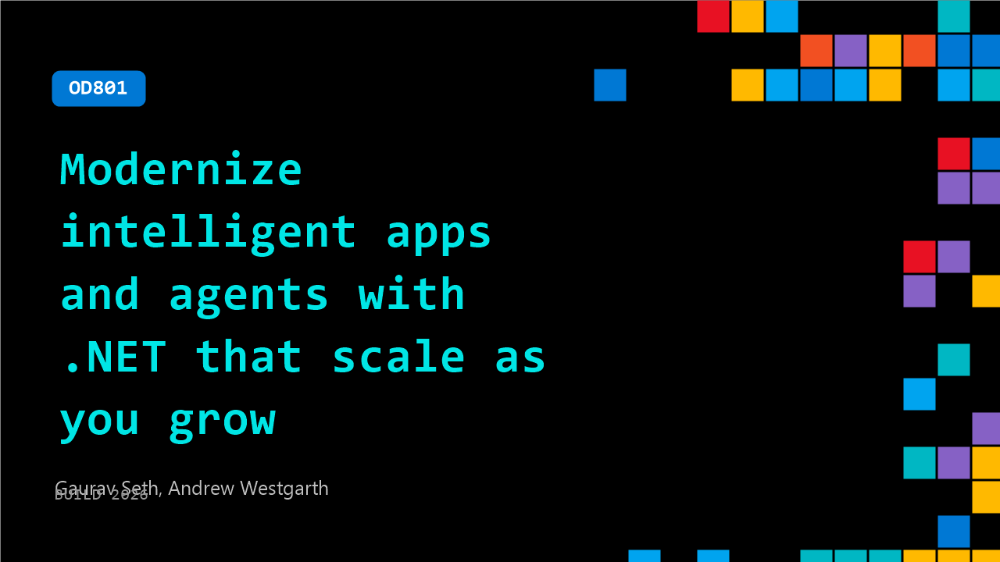

# OD801: Modernize intelligent apps and agents with .NET that scale as you grow

**Session code:** OD801  
**Watch on-demand:** <https://build.microsoft.com/en-US/sessions/OD801>

---

## Speakers

- **Gaurav Seth** - Senior Product Manager, Microsoft
- **Andrew Westgarth** - Principal Product Manager, Microsoft

## About the session

.NET helps you build high performance services, add AI where it matters, and stay productive across the stack. In this session, we show how using Managed Instance on Azure App Service, you can modernize legacy .NET apps without code rewrites, remove migration blockers, retain dependencies, and move to a scalable PaaS foundation while reducing cost and accelerating innovation.

## AI summary

**Introduction and Session Overview:** The session begins with Andrew Westgarth welcoming viewers to the presentation on modernizing intelligent apps and agents with .NET that scale on Azure (00:00:07). Joined by co-presenter Gaurav Seth, Andrew outlines that both are product managers on Azure App Service and will explore recent innovations that accelerate cloud migration and AI integration. The agenda covers app modernization challenges, the previously launched *Managed Instance on Azure App Service* from Ignite (00:00:58), the newly introduced *Built-In MCP* at Build (00:01:18), the GitHub Copilot modernization tooling, and a live demonstration by Gaurav followed by closing resources and insights on cloud transformation.

**Modernization Challenges and Strategic Needs:** Andrew discusses critical barriers organizations face when transitioning applications to cloud environments (00:02:14). He outlines dependencies on legacy systems, third-party libraries, and Windows OS components such as MSMQ and GDI libraries that complicate modernization. Other major issues include handling stateful versus stateless architecture for scalability (00:03:31), managing configuration and secrets securely (00:04:12), and dealing with lengthy migration timelines that impact ROI (00:04:39). The discussion sets the stage for how Managed Instance and integrated AI solutions simplify these areas—offering centralized governance, reduced operational overhead, and faster deployment without excessive code rewrites.

**Managed Instance on Azure App Service:** Andrew introduces the *Managed Instance on Azure App Service* preview as a foundational element for easing migration (00:05:06). This service combines the flexibility of virtual machines with the scalability of platform-as-a-service, addressing Windows and third-party dependency challenges while supporting both horizontal and vertical scaling. It offers built-in security via Managed Identity and integration with services like Key Vault and SQL (00:05:59). With minimal or zero code changes, developers can migrate apps while maintaining access to mapped drives, registry keys, and configuration compatibility (00:07:08). Managed Instance also enables direct RDP access through Bastion for troubleshooting, dynamic scalability, automatic maintenance, and incremental modernization for continuous improvement after migration (00:10:04).

**Introducing Built-In MCP and Agentic Patterns:** The session reveals a major new capability—*Built-In MCP*—unveiled at Build (00:13:03). This feature allows APIs to function as AI tools accessible to intelligent agents using secure, language-agnostic endpoints that support .NET, Java, Node.js, and Python. The presenters describe how existing applications can expose APIs seamlessly for AI consumption through MCP interfaces (00:13:12). Andrew also introduces agentic application patterns (00:15:02)—modular approaches where specialized agents (e.g., sales or shipping agents) coordinate tasks orchestrated by AI—allowing dynamic scaling, hybrid integration with legacy systems, and intelligence-driven automation across enterprise workloads.

**GitHub Copilot Modernization Tooling and Live Demo:** Gaurav Seth demonstrates how GitHub Copilot aids modernization from within Visual Studio (00:19:29). He runs an AI-powered assessment of a legacy ASP.NET web app, which identifies migration readiness and dependency issues like registry or local storage handling (00:21:14). Using Copilot’s built-in recommendations, developers can target Azure App Service Managed Instance to overcome sandbox limitations and accelerate deployment. Gaurav walks through publishing an app, configuring installation scripts for custom components, managing storage mounts and registries secured via Key Vault, and connecting through Bastion RDP for live system access (00:36:36). He then showcases turning an existing API into an MCP server that integrates directly with GitHub Copilot and shows how observability data for agents is collected and visualized through App Insights (00:45:01).

**Conclusion and Key Resources:** In closing, Andrew summarizes the session’s key lessons and directs attendees to explore documentation and blogs for *App Service @ Build* 2026 (00:46:39). He highlights learning paths on agentic app development, Built-In MCP for AI integration, and the Managed Instance overview. Additional materials cover GitHub Copilot modernization strategies and examples of automated IIS migrations leveraging agent-based workflows. Andrew concludes by reiterating that Azure App Service now enables enterprises to move, modernize, and intelligently extend their .NET applications with unparalleled agility, security, and AI-connected innovation (00:49:00).

## Session tags

- **Session type:** Pre-recorded
- **Level:** (300) Advanced
- **Topic:** Developer tools & frameworks
