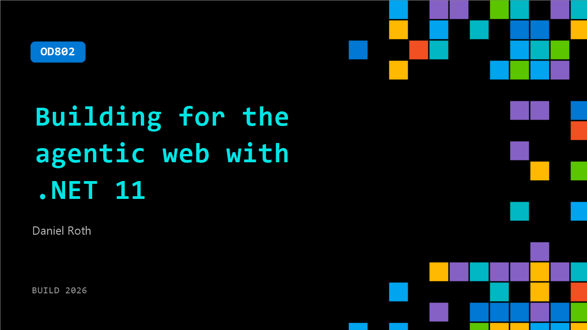

# OD802: Building for the agentic web with .NET 11

**Session code:** OD802  
**Watch on-demand:** <https://build.microsoft.com/en-US/sessions/OD802>

---

## Speakers

- **Daniel Roth** - Principal Product Manager, Microsoft

## About the session

The demands on modern web apps are increasing. Users expect more performance, airtight security, and even agentic capabilities. What does the next generation of web apps look like on .NET? In .NET 11, ASP.NET Core and Blazor are getting faster and more secure at the core, closely integrated with Aspire for distributed app development, and a new set of building blocks — agents, tools, skills, and components — for building agentic web apps. Get ready to build for the modern agentic web!

## AI summary

**Introduction and Vision for .NET 11:** Daniel Roth opens the session at 00:00:00 by introducing himself as the Principal Product Manager for ASP.NET Core and Blazor. He welcomes viewers to "Building for the Agentic Web with .NET 11" and explains how modern web applications continuously raise the bar for performance, security, and observability. Users expect apps that are cloud-native, distributed, interactive, and increasingly "agentic"—applications that can reason, use tools, and collaborate with people in real time. Developers are looking to build faster by partnering with AI, and .NET 11 investments address the needs of these demanding web apps. Roth mentions that the roadmap for ASP.NET Core and .NET 11 is available on GitHub, structured around six core themes: addressing top feedback, strengthening foundations, investing in the modern stack, simplifying distributed app development, enabling agentic web apps, and improving AI-assisted development.

**Strengthening the Foundation:** At 00:02:51–00:04:48, Roth dives into the first theme—enhancing fundamentals like performance, security, and observability. He highlights improvements such as reduced TLS handshake overhead, optimized handling of malformed requests, and new Zstandard compression for faster connections. Security enhancements include hardening Kestrel (the cross-platform web server) using AI-based scanning, modernized cross-site request forgery protection leveraging Fetch Metadata headers, and automatic authentication token refresh for SignalR and Blazor Server. Observability gains include native OpenTelemetry semantic convention tags emitted automatically for every request, plus upcoming full telemetry support for Blazor WebAssembly components. Roth emphasizes that upgrading to .NET 11 brings faster, safer, and more observable apps without code changes.

**Modern Stack Innovations and Demo:** Beginning at 00:04:52 and extending through 00:18:00, Roth details investments into the modern ASP.NET Core stack, primarily Minimal APIs, SignalR, and Blazor. Minimal APIs receive async validation support and OpenAPI 3.2 compatibility, while Blazor’s server-side rendering gets major upgrades for static SSR parity with MVC. In several demos, he showcases new Blazor components like Environment Boundary, Label, and DisplayName, plus improvements in QuickGrid event handling and TempData support for cross-navigation persistence. He also illustrates updates in client-side validation, localization, and asynchronous validation workflows. Roth previews runtime consolidation from Mono to CoreCLR, 64-bit memory capabilities, multithreading, Blazor Web Workers template for background tasks, and support for C# unions—all contributing to a richer, scalable, and more expressive web development platform.

**Distributed App Development with Aspire Integration:** At 00:21:21–00:28:28, Roth turns to distributed apps and cloud-readiness, focusing on integration with the Aspire ecosystem. Aspire provides orchestration, observability, and configuration management for multi-service architectures. .NET 11 deepens this relationship by enabling Blazor WebAssembly apps to work seamlessly with Aspire, including service discovery, OpenTelemetry tracing, and debug support. Roth demonstrates a Blazor WebAssembly app hosted via Aspire’s new Blazor Gateway service, which eliminates the need for CORS while handling routing, configuration, and metrics collection. This gateway also replaces the legacy Blazor dev server, offering a production-grade hosting experience for distributed applications with improved scalability and full end-to-end telemetry visibility.

**Empowering Agentic and AI-driven Web Apps:** Around 00:28:30–00:36:03, Roth introduces the “agentic web”—web applications infused with intelligent agents capable of reasoning, planning, and interacting with users. Collaborating with the Microsoft Agent Framework team, .NET 11 supports protocols such as OpenAI Responses, A2A for multi-agent interaction, and AGUI (Agent-User Interaction) for real-time conversational interfaces. He demonstrates Blazor integration with AGUI, showing a Blazor-based version of the AGUI Dojo app where an agent generates responses, executes tools, and interacts with the UI via both backend and front-end tool calls. The demonstration highlights asynchronous streaming, reasoning progress tracking, and human-in-loop workflows for co-creating plans and content with agents. Roth previews future Blazor AI components simplifying agent-based UI experiences.

**AI-Assisted Development and Conclusion:** In the final segment starting at 00:36:12 through 00:43:36, Roth discusses improvements to AI-assisted .NET development. The .NET Skills Marketplace and repository supply agent skills for ASP.NET Core and Blazor development, ensuring coding agents understand framework patterns. He shares examples of skills like “Plan UI Change” that teach AI to better structure UI components, resulting in cleaner code. Testing results compare untrained and skill-enhanced AI-generated Blazor Kanban apps, demonstrating significant improvements in componentization and idiomatic code quality. Roth concludes by summarizing .NET 11’s key achievements across performance, modern tooling, distributed app readiness, agentic integrations, and AI empowerment. He invites developers to try .NET 11 previews, explore Aspire and Microsoft AI Extensions, and contribute to building the agentic web of the future.

## Session tags

- **Session type:** Pre-recorded
- **Level:** (300) Advanced
- **Topic:** Developer tools & frameworks
- **Tags:** .NET, Developer
