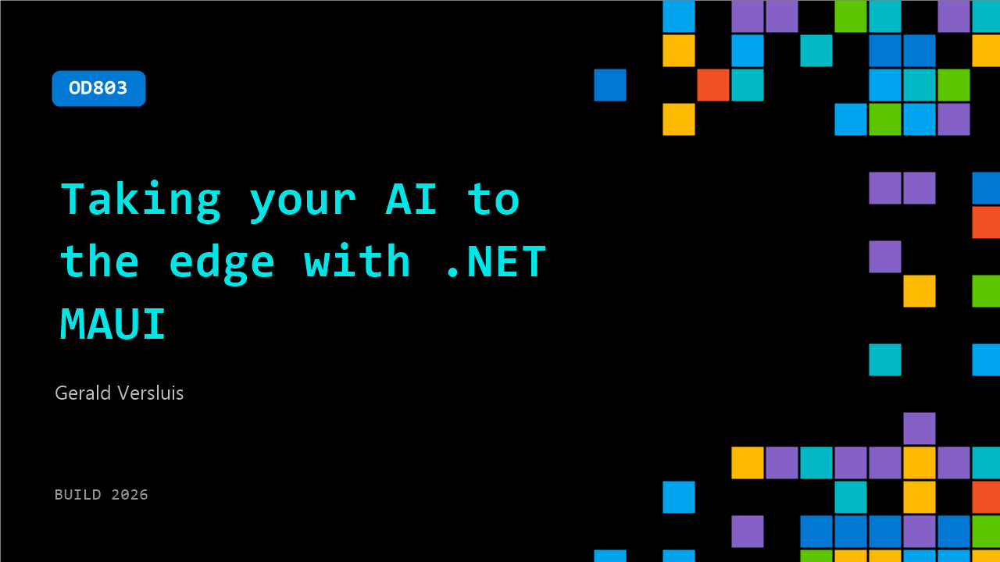

# OD803: Taking your AI to the edge with .NET MAUI

**Session code:** OD803  
**Watch on-demand:** <https://build.microsoft.com/en-US/sessions/OD803>

---

## Speakers

- **Gerald Versluis** - Senior Software Engineer, Microsoft

## About the session

AI is transforming both what we build and how we build it. Learn how .NET MAUI developers can bring AI to the edge using local models and on-device capabilities across mobile and desktop, while understanding the role of cloud AI. We’ll cover the impact on privacy, performance, and UX, explore .NET 10 features and what’s coming in .NET 11, and show how AI-powered tools and agentic workflows like DevFlow can accelerate app development.

## AI summary

_No AI summary available._

## Session tags

- **Session type:** Pre-recorded
- **Level:** (300) Advanced
- **Topic:** Developer tools & frameworks
- **Tags:** .NET, Developer
