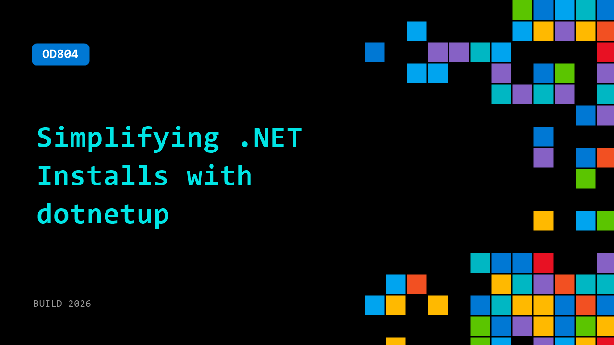

# OD804: Simplifying .NET Installs with dotnetup

**Session code:** OD804  
**Watch on-demand:** <https://build.microsoft.com/en-US/sessions/OD804>

---

## Speakers

_Not listed._

## About the session

A new way to manage .NET SDK and Runtime installations that works for every user, on every platform!

## AI summary

**Introduction and Problem Definition:** The video opens with Chet Husk welcoming viewers to Build and introducing the session focused on simplifying .NET installations through a new tool called .NET Up 00:00:02–00:00:08. He outlines the agenda—to discuss installation challenges, introduce the proposed solution, demonstrate early preview features, and share an upcoming roadmap. Chet explains that managing .NET versions and installations across different platforms is complex, especially for developers outside of Visual Studio environments 00:00:12–00:01:06. He identifies the heterogeneous ecosystem of installers like package managers and manual scripts, emphasizing pain points around inconsistency, lack of management visibility, and version mismatches that plague developers when setting up .NET 00:04:41–00:07:15.

**Introducing .NET Up:** To solve these challenges, Chet presents .NET Up—a lightweight cross-platform management tool designed for user-global installations that do not need administrative rights 00:07:20–00:08:28. Built using native AOT for speed, .NET Up aims to unify installation and management under a consistent experience across operating systems. It leverages existing metadata like global.json to understand project SDK requirements, introduces auditability through signed binaries, and plans to integrate with CI/CD and dependency management tools like Dependabot and Renovate 00:09:04–00:11:00. Chet transitions into internal preview demos but underscores that it’s still an early-stage project seeking community feedback 00:11:07–00:11:35.

**Demo – Basic Installation:** The first demonstration shows how developers can easily acquire and initialize .NET Up using a simple script hosted via aka.ms links 00:12:00–00:13:12. Once installed, the init command guides users through configuration choices such as channels and usage modes. The tool automatically downloads validated SDKs tailored for the host platform and configures profiles—setting PATH and environment variables 00:14:02–00:16:33. Chet demonstrates running “.NET Up Info” to list installed versions, proving the installation works seamlessly. The tool’s ability to manage shell configuration and maintain user-level installations simplifies the developer experience dramatically compared to managing discrete SDKs manually 00:16:45–00:17:05.

**Demo – Project Compatibility and Multi-Target Testing:** The second part showcases how .NET Up respects project-specific version constraints defined in global.json 00:18:08–00:19:10. Chet switches between SDK versions, demonstrating automatic resolution based on that file’s specification. He then moves into an advanced multi-target test scenario, running a library compatible with .NET 8, 9, and 10 00:23:15–00:27:00. When certain tests fail due to missing runtimes, he installs them efficiently using “.NET Up Runtime Install” rather than multiple full SDKs 00:27:12–00:29:59. .NET Up tracks and updates SDKs and runtimes via manifests, enabling centralized management and automated cleanup—removing versions no longer required 00:30:32–00:33:00.

**Feature Highlights and Future Planning:** Beyond installations and updates, Chet highlights other helpful commands like “Print Init Script” and “Uninstall” 00:31:43–00:33:55. He envisions component-level management similar to Rustup—where developers could control SDK subsets and installation cadence. The roadmap includes internal preview, public preview, and GA milestones 00:38:06–00:41:02. Internal previews will focus on SDK management, nightly build integration, and “one-shot execution” to compare different tool versions 00:39:31–00:41:00. Public preview will add self-updating behavior, signed validation, and integration with agent skill repositories for automation 00:41:19–00:43:07. The GA release aims to make .NET Up official in .NET’s installation documentation and expand global.json to manage runtimes natively.

**Conclusion and Call to Action:** Chet concludes with next steps and resources: installation scripts, documentation, design specs, and feedback forums 00:46:05–00:47:03. He provides repository links to demo projects and encourages viewers to clone, test, and share feedback via GitHub discussions. The team seeks user input on performance, usability, and missing features to refine .NET Up before general release. The session ends with appreciation to the Build audience and an invitation to explore, experiment, and contribute to the next evolution of .NET management tools 00:47:27–00:47:46.

## Session tags

- **Session type:** Pre-recorded
- **Level:** (300) Advanced
- **Topic:** Developer tools & frameworks
- **Tags:** .NET, Developer
