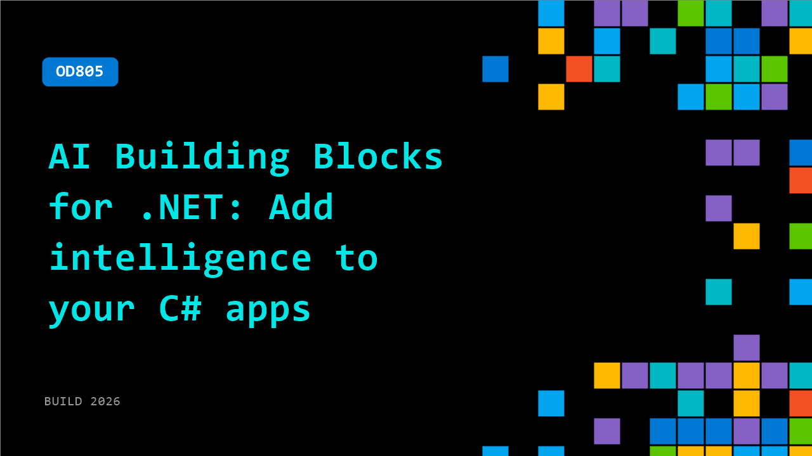

# OD805: AI Building Blocks for .NET: Add intelligence to your C# apps

**Session code:** OD805  
**Watch on-demand:** <https://build.microsoft.com/en-US/sessions/OD805>

---

## Speakers

_Not listed._

## About the session

A practical, opinionated guide to building intelligent apps in .NET.

## AI summary

**Introduction and Overview:** The video opens with Bruno welcoming viewers and introducing the session on AI in .NET 00:00:00. He explains that the goal is to explore AI building blocks provided by Microsoft for developers and demonstrates their integration using a showcase application, a full support center app that analyzes incidents and user feedback 00:00:31. Bruno mentions that the application runs with Aspire coordination, showing how different services interact including a Blazor web UI, a Microsoft Agent Framework agent for image generation, and an NVIDIA Nemo agent for data analysis 00:02:11. He introduces Aspire traces to monitor service interactions and sets the context for the upcoming deep dive into the .NET AI architecture.

**Microsoft Extensions for AI and Local Deployment:** Bruno then introduces Microsoft Extensions for AI, explaining its role as a chat abstraction layer that allows easy interaction with large language models (LLMs) via standardized interfaces 00:03:41. He showcases sample applications using Azure Foundry with integrated security, avoiding the need for API keys while maintaining authentication with CLI credentials 00:06:22. A live demo illustrates switching between models—like GPT-5 and Kimi—and retrieving model-specific responses. Bruno moves on to demonstrate running local models using Ollama 00:08:10, performing sentiment analysis locally through the same interface. He emphasizes how Microsoft’s chat client can connect seamlessly to either cloud or local models, maintaining consistent workflows across environments 00:10:09.

**Data and Embeddings Fundamentals:** Moving deeper, Bruno explains using data within AI applications, particularly Retrieval-Augmented Generation (RAG), which involves reading, chunking, embedding, and storing text 00:11:01. He demonstrates how embeddings convert text into vector representations for semantic search and shows an example where movie descriptions are embedded in memory for querying 00:14:09. By asking questions like “find a family-friendly movie with dragons,” the app accurately retrieves related content such as “Shrek” or “The Matrix.” He also presents a Markdown data ingestion pipeline 00:20:04, detailing how documents can be read, chunked, summarized, and written into a vector store using SQLite. This section demonstrates the scalable flexibility of working with embeddings locally or in the cloud, bridging unstructured data to semantic search capabilities through .NET AI libraries.

**Integrating External Tools with MCP:** Bruno transitions to introducing the Model Context Protocol (MCP), a standard enabling AI applications to access external tools and APIs 00:23:01. He demonstrates a console app connecting to the Microsoft Learn MCP server, showing how chat clients invoke MCP tools to retrieve live documentation and current framework versions from learn.microsoft.com 00:25:02. A side-by-side test shows how answers improve when connected via MCP, bringing live URLs and precise version details without manual linking 00:29:04. This integration showcases how MCP empowers AI clients to extend their capabilities beyond static responses, connecting dynamic data sources directly through .NET chat and embedding frameworks.

**Agent Framework and Multi-Agent Workflows:** The next segment focuses on Microsoft Agent Framework, extending Microsoft Extensions for AI 00:33:09. Bruno explains how agents are created atop chat clients by adding descriptive instructions, transforming them into autonomous entities capable of writing, editing, or generating content 00:35:47. Through examples, he shows how agents collaborate by sharing outputs sequentially in workflows, powered by built-in interfaces like IAgent and visualized using the Dev UI tool. He introduces Agent-to-Agent (A2A) protocol support for cross-agent communication, illustrating NVIDIA Nemo and Microsoft agents interacting via coordinated URLs 00:39:54. The ability to link multiple models, external APIs, and internal logic via agents and workflows demonstrates the full modular power of .NET AI integrations.

**Conclusion and Resources:** In closing, Bruno summarizes the AI ecosystem in .NET encompassing chat interactions, embeddings, RAG pipelines, MCP integrations, and Agent Framework orchestration 00:42:39. He revisits the showcase application where all components—data analysis, image generation, and multi-agent collaboration—work together under Aspire coordination. Developers are encouraged to explore Microsoft's official libraries and documentation at aiappsfor.net and Generative AI for Beginners in .NET for extended learning. Bruno wraps up by thanking viewers, reinforcing that these libraries empower developers to build complex AI solutions natively in C#, with direct support for both cloud and local environments 00:43:45.

## Session tags

- **Session type:** Pre-recorded
- **Level:** (300) Advanced
- **Topic:** Developer tools & frameworks
- **Tags:** AI, Developer
