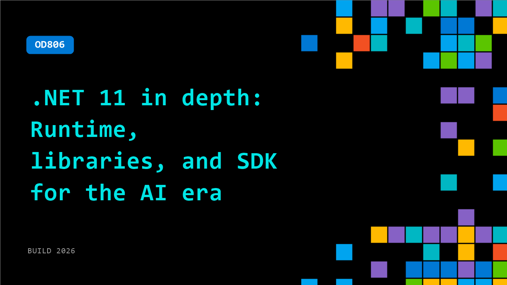

# OD806: .NET 11 in depth: Runtime, libraries, and SDK for the AI era

**Session code:** OD806  
**Watch on-demand:** <https://build.microsoft.com/en-US/sessions/OD806>

---

## Speakers

_Not listed._

## About the session

.NET 11 delivers a new wave of improvements across the runtime, libraries, and SDK to help developers build modern applications for the AI era. In this session, we’ll take an in-depth look at the key investments in performance, diagnostics, and developer productivity, and how they come together to support intelligent, cloud-connected, and agent-driven apps.

## AI summary

**Introduction and Agenda:** The session opens at 00:00:00 with hosts Chet Hosk and Rich Lander welcoming viewers to Microsoft Build 2026, presenting an overview of .NET 11 runtime, libraries, and SDK improvements. Chet outlines that the presentation will cover SDK and tooling-level updates followed by a deep dive into runtime changes from Rich. The team commits to showcasing enhancements coming across performance, usability, and acquisition of .NET tooling for developers.

**SDK and Tooling Enhancements:** Starting around 00:00:51, Chet explains three major .NET SDK workstreams for the .NET 11 release—new user and CLI capabilities, performance optimization, and streamlined management of developer tools. Key improvements include CLI feature updates for multitargeted projects and faster command execution in agent and multi-agent environments. Major updates in this section revolve around Maui device-specific capabilities, where 00:02:00–00:03:19 new .NET run enhancements now let developers deploy directly to target devices and emulators, extending to frameworks like Uno or Avalonia. Chet also shares efforts to make the CLI aware of AI or automated agent contexts to optimize outputs for low-latency scenarios, improving efficiency for builds and concurrent tasks. Additional focus areas include multi-threaded MSBuild, conversion of CLI tools to native AOT for reduced latency, and ecosystem-wide efforts for trimming compatibility in .NET libraries (00:06:08–00:09:47).

**Performance, Acquisition, and Packaging Improvements:** Between 00:11:06 and 00:14:38, Chet highlights the ongoing conversion of .NET CLI commands into native AOT executables for better responsiveness and startup time. This work not only boosts performance but helps ensure ecosystem libraries meet trim-friendly requirements. The team also unveils `.NET Up`, a native AOT acquisition tool that simplifies SDK version management across platforms without administrative permissions. Additionally, improvements to SDK packaging processes through the use of file hard-links have cut SDK container sizes by about 80MB, improving download and deployment speeds across environments. These packaging optimizations build upon earlier runtime features and provide a smaller, more efficient SDK footprint for developers working in containerized setups.

**Runtime and Library Innovations:** At 00:15:00, Rich Lander takes over to discuss runtime and library enhancements. He starts with updates to the Process API, offering new convenience methods like RunAndCaptureTextAsync and ReadAllLinesAsync to avoid common deadlocks and simplify pipe handling between processes. Rich demonstrates how the new CreateAnonymousPipe API modernizes inter-process communication in C#, alongside Fire-and-Forget execution patterns and optimized trimming behavior. From 00:20:13 onward, text processing improvements center on Unicode and Regex capabilities, such as UTF-8/16 validation and universal line-ending support, ensuring developers can process text consistently across platforms. Updates also include Rune-aware string functions to correctly handle extended Unicode characters, improving emojis and complex scripts handling across applications.

**System.Text.Json and Compression Advances:** Around 00:24:11–00:28:29, Rich describes new System.Text.Json serializer policies allowing more granular control over property casing, omission of null values, and per-type serialization rules. These enhancements ease working with structured data in event-logging environments and agent-based applications. The team introduces JSON Lines (NDJSON) support to efficiently handle streaming data or AI agent conversations. Compression libraries also gain integrated Zstandard algorithms and broad optimizations for multiple codecs, delivering smaller, faster compression results that developers can measure using new benchmarks within the runtime repository.

**Runtime Async and Memory Safety Projects:** The final section (00:28:33–00:43:54) turns to major runtime architecture changes. Rich introduces "Runtime Async," a new performance-oriented model for async calls that eliminates traditional compiler state machines. Enabled via a simple configuration property, Runtime Async delivers cleaner stack traces, smaller binaries, and potentially faster code without any language syntax changes. The team also previews the memory safety initiative beginning in .NET 11 and continuing into .NET 12, redesigning unsafe code usage into reviewable contracts. Enhancements to JIT optimizations improve bounds-check eliminations and inlining behavior, removing unsafe patterns from performance-critical libraries like SIMD. The talk closes with Rich and Chet emphasizing how developers can experiment with these preview features now, provide GitHub feedback, and help optimize .NET 11 for its upcoming general release.

## Session tags

- **Session type:** Pre-recorded
- **Level:** (300) Advanced
- **Topic:** Developer tools & frameworks
- **Tags:** Developer
