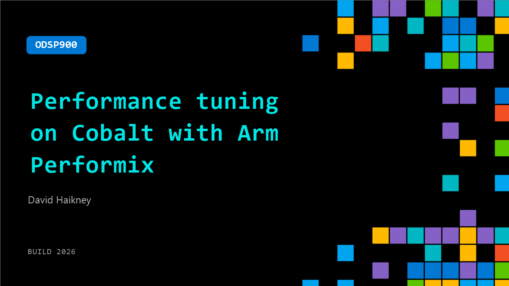

# ODSP900: Performance tuning on Cobalt with Arm Performix​

**Session code:** ODSP900  
**Watch on-demand:** <https://build.microsoft.com/en-US/sessions/ODSP900>

---

## Speakers

- **David Haikney** - Technical Product Director, Arm

## About the session

Learn how to identify code hotspots, interpret performance data, and move from raw metrics to concrete improvements. The session also explores advanced command-line usage and shows how Arm Performix can be integrated into automated and agentic workflows for continuous performance analysis.​ By the end of the session, you’ll be able to apply Performix in real-world development pipelines to continuously monitor, diagnose, and optimize application performance.

## AI summary

**Introduction and Context:** At the start of the video (00:00:00), David Haikney, Technical Product Director at Arm, welcomes viewers to the Microsoft Build session and introduces Arm Performix, a new performance analysis toolkit designed to help developers observe and accelerate workloads on the Cobalt platform. He highlights the close partnership between Microsoft and Arm, underlining that Performix was created in collaboration with Microsoft’s performance experts. David acknowledges that many viewers may be new to Cobalt and encourages them to explore available migration resources that can aid in their optimization journey (00:00:33).

**Understanding Performance Analysis:** Before demonstrating the tool, David frames performance analysis as an investigative process (00:00:44–00:01:10). He compares it to a crime investigation that requires gathering evidence, forming hypotheses, and revising assumptions — an iterative and scientific method. Performix was built to simplify this complex process by unifying multiple analysis utilities. Effective performance analysis, he explains, begins by forming a broad understanding of the platform’s capabilities, then applying workloads to gather data before diving deeper into bottlenecks. This systematic approach ensures that experiments are consistent, measurable, and comparable across test runs (00:01:26–00:02:00).

**Basic Concepts and Setup:** When introducing the Performix UI (00:02:07), David explains that users can work through the interface or the command line. He introduces two foundational concepts: “targets” and “recipes.” Targets refer to the systems (in this case, Cobalt instances) where workloads will run, which can be configured easily using SSH credentials. Recipes are sets of experiments designed to analyze various aspects of system performance (00:02:43). Some recipes are still experimental as the toolkit grows. To demonstrate, David runs a “system characterization” recipe that benchmarks memory bandwidth and cache performance to validate the Cobalt instance’s baseline capability (00:03:04–00:03:40).

**Running Workload Analysis:** The next demonstration focuses on observing system behavior under load using the “system utilization” recipe (00:03:42). Users can launch a new workload, attach to an existing process, or analyze all system activity. A heat map visualization of a 96-core system is shown, illustrating that about two-thirds of the cores are actively used. This quick view helps analysts determine potential next steps, such as adjusting thread count or investigating idle cores for lock contention issues (00:04:03–00:04:30). David then demonstrates deeper analysis with the “code hotspots” recipe, which highlights time-intensive code regions across languages such as Java and .NET, allowing developers to focus optimization efforts precisely. He follows this by showing the “instruction mix” recipe and how runs can be compared between different optimizations — for example, using Arm NEON versus SVE instructions (00:05:00–00:05:33).

**Deep Microarchitectural Insights:** David continues by demonstrating the “CPU microarchitecture” recipe (00:05:35), which leverages Arm’s top-down methodology to analyze how time is distributed across CPU functions. This analysis covers cache performance, pipeline behavior, and issues such as branch mispredictions. He emphasizes how Performix combines breadth-first and depth-first exploration — starting broadly to find trends and then drilling into specific causes — enabling a comprehensive investigation process (00:05:55–00:06:05).

**Integrating AI and Final Summary:** In the final segment (00:06:10), David introduces how Performix integrates with an MCP server and large language models (LLMs) to transition from analysis to automatic insight generation. Within Visual Studio, profiling data, disassembly, and system context can be provided to the LLM, enabling dynamic feedback and confidence-based recommendations for performance improvement (00:06:26–00:06:50). In closing, he summarizes that Performix’s recipe-based guided workflow helps users move methodically from broad system characterization to focused optimization. Now freely available for download and use, David invites developers to try the toolkit and share feedback (00:07:00–00:07:39).

## Session tags

- **Session type:** Pre-recorded
- **Level:** (300) Advanced
- **Topic:** Developer tools & frameworks
- **Tags:** Automation, Azure, Compute, Developer, GitHub Copilot, Local AI, MCP, OSS, App Developers, ISV
