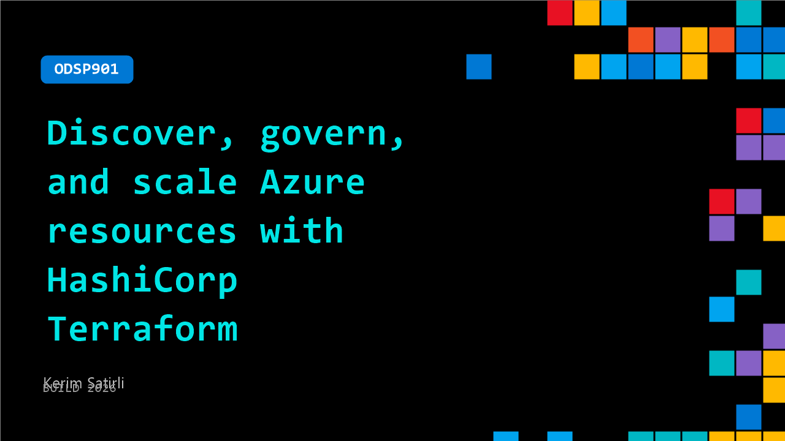

# ODSP901: Discover, govern, and scale Azure resources with HashiCorp Terraform

**Session code:** ODSP901  
**Watch on-demand:** <https://build.microsoft.com/en-US/sessions/ODSP901>

---

## Speakers

- **Kerim Satirli** - Senior Developer Advocate, HashiCorp, an IBM Company

## About the session

Managing existing Azure environments is a major barrier to scaling cloud operations, with many resources outside infrastructure-as-code. In this session, learn how HashiCorp Terraform and Terraform Search help teams discover unmanaged Azure resources and bring them under management quickly and declaratively. Move from fragmented environments to consistent, policy-driven infrastructure for AI workloads and agents while improving governance, reducing manual effort, and accelerating Azure adoption.

## AI summary

**Introduction and Problem Context:** The session opens with Kerim Satirli introducing himself as a Senior Developer Advocate at HashiCorp and presenting the focus of the talk: discovering, governing, and scaling Microsoft Azure resources using HashiCorp Terraform 00:00:02–00:00:19. He identifies a common challenge faced by Azure teams—the disconnect between Terraform’s state and the actual cloud infrastructure running within subscriptions and tenants. Many assume near-total management through Terraform, yet real audits show only about 40–60% coverage. This mismatch occurs because infrastructure often drifts outside code management for human reasons. Kerim promises that by the end of the next twenty minutes, viewers will see a workflow to close this gap dramatically faster than traditional methods 00:01:02–00:01:34.

**Explaining Infrastructure as Code and Causes of Drift:** Kerim then explains "infrastructure as code" for those newer to Terraform 00:01:40–00:02:30. Unlike manual Azure portal provisioning, defining infrastructure in code improves repeatability and lowers human error. However, unmanaged resources arise for various human reasons: postponed codification (“I’ll codify later”), emergency fixes 00:03:01, acquisitions where environments are inherited 00:03:17, and proofs-of-concept that became production without proper rebuild 00:03:33. He stresses that these situations are unavoidable, framing the goal not as prevention but as having a fast path to bring unmanaged resources back under control. Kerim also notes that unmanaged infrastructure is particularly problematic for AI workloads—causing misattributed costs, insecure networks, and identity sprawl for agent-based architectures 00:04:00–00:04:49.

**Introducing Terraform Import and Terraform Search:** Shifting focus to the solution, Kerim introduces how Terraform traditionally handled imports—using CLI commands—with one resource managed at a time, which was slow and manual 00:05:01–00:05:19. Later releases introduced import blocks, improving efficiency but still requiring teams to manually specify resource IDs. The recent Terraform 1.14 upgrade, released November 2025, brought a breakthrough feature—Terraform Search 00:06:09. This tool automates resource discovery and code generation in three steps: define a query, execute it via CLI, and generate code. With Terraform Search, users can request unmanaged Azure resources (e.g., all SQL servers) and automatically receive configuration files, dramatically reducing manual effort and potential errors 00:06:24–00:07:10. The feature inverts the traditional import logic—shifting from “I know what I want” to “show me what’s there and help me manage it”—saving teams weeks of inventory work 00:07:26–00:07:46.

**Live Demo: Discovering and Importing Unmanaged Azure Resources:** Kerim transitions to a live demo showcasing Terraform Search in action 00:07:53. He displays an unmanaged Azure environment containing roughly thirty scattered resources—networking, storage, gateways, and DNS entries—with missing or inconsistent tagging 00:08:04–00:08:37. Through a discovery query targeting resources such as NAT gateways, security groups, and public IPs, Kerim demonstrates how Terraform inherits Azure authentication details automatically and lists unmanaged resources for import 00:10:08–00:10:22. Exporting the configuration creates a Terraform file containing generated resource definitions and import blocks, which can be applied through a normal Terraform plan/apply cycle 00:11:42–00:12:56. This output automates what previously required hundreds of manual lines of code and allows immediate alignment with the Terraform state.

**Applying Organizational Governance with Sentinel:** Once resources are imported, Kerim explains the next step—governing them using HashiCorp Sentinel 00:14:03. Sentinel enforces policies across Terraform-managed environments, ensuring newly imported resources comply with organizational standards such as proper tags, naming conventions, and approved SKUs. He builds and demonstrates a policy that validates ownership metadata, detecting violations like missing or misformatted tags 00:15:25–00:15:41. Kerim notes that Sentinel can operate in soft-fail or hard-fail modes, and organizations should transition toward hard enforcement for strong governance 00:16:37–00:16:54. This approach eliminates configuration drift, ensures consistency, and helps teams maintain a compliant infrastructure environment.

**Conclusion and Next Steps:** The session closes with Kerim summarizing key takeaways—teams can now use Terraform Query to identify and import unmanaged Azure resources, and Sentinel to enforce governance policies 00:17:12–00:17:26. He provides helpful resources for further learning, including documentation for CLI commands, a detailed blog about Terraform Query, and a Sentinel playground for testing policies 00:17:49–00:18:03. Kerim ends by thanking viewers and wishing them a productive experience at Microsoft Build 2026 00:18:07.

## Session tags

- **Session type:** Pre-recorded
- **Level:** (200) Intermediate
- **Topic:** Developer tools & frameworks
- **Tags:** Azure, Scaling, Terraform, Developer Frameworks
