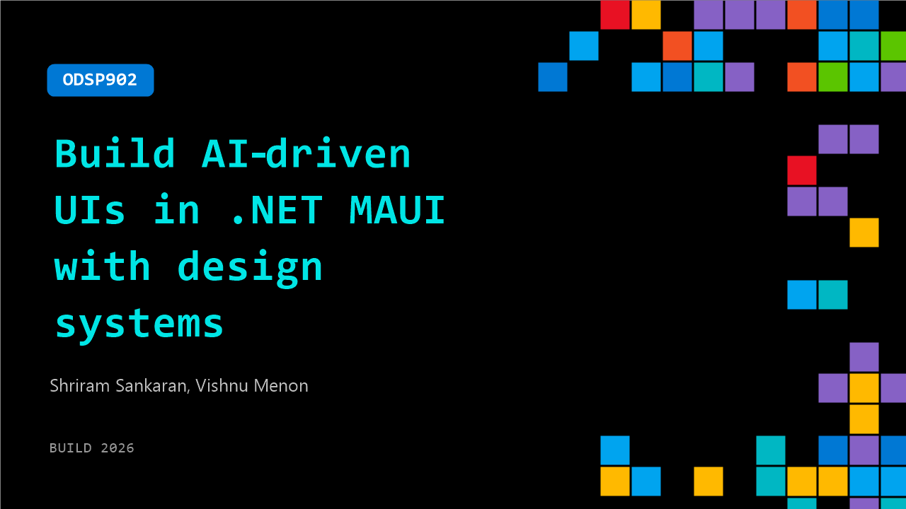

# ODSP902: Build AI‑driven UIs in .NET MAUI with design systems

**Session code:** ODSP902  
**Watch on-demand:** <https://build.microsoft.com/en-US/sessions/ODSP902>

---

## Speakers

- **Shriram Sankaran** - Senior Product Manager, Syncfusion
- **Vishnu Menon** - Product Manager, Syncfusion

## About the session

This session shows how to build a real‑world .NET MAUI application using structured design systems and AI‑assisted UI composition. Start by defining a design system and translating it into reusable MAUI components and tokens. Learn how AI‑driven UI workflows help compose screens, apply theming, and enforce consistency across the app—accelerating UI development without losing control, performance, or maintainability.

## AI summary

**Introduction and Session Overview:** At 00:00:00, Vishnu Menon, Senior Product Manager at Syncfusion, greets the audience and introduces the session topic—building AI-driven user interfaces in .NET MAUI applications. He explains that the goal is to make UIs faster, more consistent, and intelligent by leveraging design systems. He outlines the agenda at 00:00:20, which covers challenges in UI building, why AI struggles in this area, an exploration of design system standards, AI skills, and an AI-driven UI workflow, followed by a demo showcasing these ideas in action.

**Demonstrating Basic AI-Generated UI and Its Limitations:** Beginning at 00:00:43, Vishnu prompts an AI tool to create a simple employee dashboard mobile application using .NET MAUI. The AI generates a functional and colorful interface, but upon closer inspection at 00:01:21–00:01:49, he notices misaligned icons and inconsistent colors. He explains that although AI can produce layouts rapidly, these UIs often lack polish and are not production-ready because AI lacks design context. At 00:02:03, Vishnu stresses that without understanding a project’s design system—spacing rules, patterns, and component standards—AI typically outputs guess-based implementations instead of intentional designs.

**Understanding the Design System:** Moving into the solution space at 00:02:46, Vishnu identifies two crucial concepts for improving AI-generated UI: the design system and skills. He elaborates at 00:02:58–00:03:11 that a design system ensures consistency across colors, typography, spacing, and reusable components. He showcases a .NET MAUI example using the "styles.xaml" file at 00:03:18, which defines styles for controls. By referencing shared elements like fonts or primary colors, developers avoid redundant hardcoding and repeated UI decisions. Vishnu emphasizes that adhering to a unified design system accelerates development and maintains visual harmony across enterprise applications.

**Explaining Skills and Their Role in AI Design Guidance:** At 00:04:56, the presentation transitions to AI “skills.” Vishnu defines a skill as a structure that guides AI through preferred instructions and rules. Demonstrating with a file at 00:05:17–00:05:44, he explains that a skills.md file for a Syncfusion MAUI Button helps an agent understand how and when to use a control, while troubleshooting files provide recovery guidance. He clarifies at 00:06:03–00:06:21 that skills do not render the UI—they constrain decision-making—teaching AI how good design should look. The difference between outputs “with skills” and “without skills,” highlighted at 00:06:23–00:06:48, reveals that an AI guided by skills creates more consistent, design-aware interfaces.

**Demo: Applying Skills and Design System in Practice:** The hands-on demo begins around 00:06:52. Vishnu demonstrates setting up Syncfusion’s MAUI controls and inserting skills files via the Terminal. At 00:07:10–00:07:48, he shows that multiple skills are added for various controls and introduces an additional “design-system” skill for this demo. After prompting AI to use these skills at 00:08:08–00:09:10, the generated dashboard includes defined models, design tokens, and a properly structured page. When he runs the application at 00:09:14–00:09:29, the resulting UI is well-aligned, visually consistent, and reflective of the design guidelines.

**Conclusion and Key Takeaways:** Wrapping up at 00:09:34, Vishnu summarizes the core message: AI should not be told to design UIs independently but instead taught how humans design them through design systems and structured skills. This guidance ensures that AI creates interfaces with the same principles and standards as expert developers. He concludes with a QR link to access the demo resources at 00:09:54 and thanks the audience for attending, encouraging them to embrace “happy coding with AI.”

## Session tags

- **Session type:** Pre-recorded
- **Level:** (400) Expert
- **Topic:** Developer tools & frameworks
- **Tags:** AI
