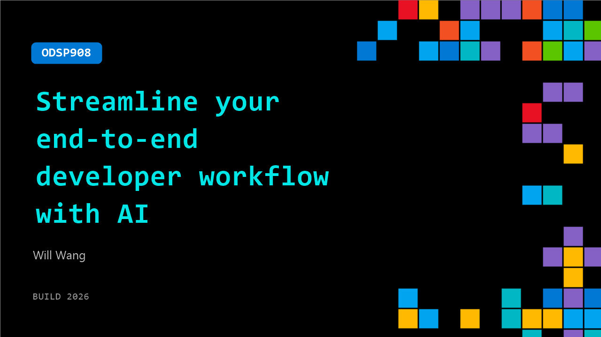

# ODSP908: Streamline your end-to-end developer workflow with AI

**Session code:** ODSP908  
**Watch on-demand:** <https://build.microsoft.com/en-US/sessions/ODSP908>

---

## Speakers

- **Will Wang** - CEO/Co-founder, Clova

## About the session

Most developers want to ship their own ideas, but the friction between coding, communication, and release slows them down. In this session, follow a real daily workflow building Clova—from ideation to launch—using GitHub Copilot in VS Code, Microsoft Teams, Logitech MX tools, and AI-assisted workflows. Learn practical patterns to streamline work, reduce friction, and accelerate execution.

## AI summary

**Introduction and Overview:** At 00:00:00, Will Wang, founder of Clova, welcomes viewers and introduces the topic of streamlining end-to-end developer workflows with AI. He shares background details about his startup, which helps brands generate on-brand assets efficiently, and mentions being backed by the Founders Inc. accelerator in San Francisco. Will also notes his YouTube presence with over 18,000 subscribers, where he documents his startup journey. He outlines the video’s structure, explaining that he will walk through four phases of product shipping—from ideation to building, team communication, and going to market 00:00:35.

**Phase 1 - Generating Startup Ideas:** Beginning at 00:00:54, Will advises building solutions for problems one personally experiences, emphasizing that firsthand understanding allows for rapid iteration and deeper insight. He highlights domain expertise as another asset for identifying strong startup ideas and gaining access to early adopters through industry networks. He shares that inspiration often strikes unexpectedly, recommending tools like the Logitech MX Master 4 mouse to quickly capture ideas via notepad or screenshots 00:02:00–00:02:25. Will also discusses conducting unbiased user interviews focused on task-based questions—what people spend time on, their workflows, and organizational budgets—resulting in valuable, non-opinionated insights for product ideation 00:02:38.

**Phase 2 - Building with AI Tools:** At 00:02:58, Will transitions to the building phase, describing how he uses GitHub Copilot to write code, documentation, and tests more effectively. He demonstrates configuring pre-set prompts on his Logitech Creative MX Keypad to automate repetitive AI interactions within VS Code, preventing context switching and boosting productivity 00:03:26–00:03:39. Will emphasizes managing AI sessions per feature to maintain context clarity and writes detailed AI logs to connect work across sessions. He notes that, due to the speed of modern iteration, his team now ships multiple features to production quickly—letting market feedback, rather than internal debates, determine direction 00:04:21.

**Phase 3 - AI-Enhanced Team Communication:** Starting around 00:04:36, Will explains how AI has dramatically improved communication within teams. Previously, he relied on verbal updates, but now he uses AI to generate structured HTML documentation that visually aligns his team during meetings. Tools like Microsoft Teams automatically capture transcripts and generate actionable summaries, enabling clearer decision-making and recordkeeping 00:05:00–00:05:31. He maintains pre-tested prompts for consistent AI outputs, stored conveniently on his Logitech keypad for instant access. This streamlined documentation workflow saves time while improving clarity and follow-through across both technical and business discussions.

**Phase 4 - Going to Market:** At 00:05:53, Will turns to post-launch strategies, emphasizing finding users where they gather. For developer-focused products, he recommends Twitter and Product Hunt, while also advocating open-source projects to attract contributors and build visibility through GitHub Stars. For his own startup, Clova, Will primarily markets on Instagram and LinkedIn 00:06:36–00:06:43. He shares how building in public—such as sharing his process on YouTube—creates emotional investment and organic growth. Will also describes using AI-integrated message templates for outreach, allowing him to personalize but send efficiently 00:07:16–00:07:23.

**Conclusion and Key Insights:** Near the end 00:07:28, Will reflects on AI’s transformative leverage—enabling faster building, testing, and iteration of software ideas. He observes a growing trend toward personalized applications that were previously too costly to create, now made viable by AI acceleration 00:07:49. He concludes by encouraging viewers to ship their own projects and share them with him, expressing excitement about the emerging wave of creativity and innovation AI makes possible. The presentation wraps up at 00:08:07 with gratitude and encouragement to continue learning and building.

## Session tags

- **Session type:** Pre-recorded
- **Level:** (200) Intermediate
- **Topic:** Developer tools & frameworks
- **Tags:** AI, Agents, GitHub Copilot, Windows, Windows Developer, VS Code, DevTools, Dev Tools
