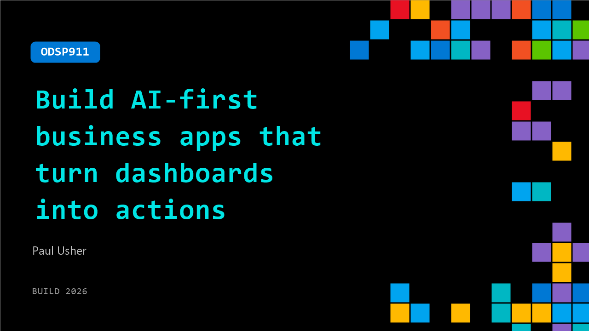

# ODSP911: Build AI-first business apps that turn dashboards into actions

**Session code:** ODSP911  
**Watch on-demand:** <https://build.microsoft.com/en-US/sessions/ODSP911>

---

## Speakers

- **Paul Usher** - Technical Evangelist, Developer Express Inc.

## About the session

Business apps are shifting from dashboards and filters to AI-driven experiences. In this session, we show how users can ask questions, get insights, and take action instantly. Using DevExpress components, we demonstrate how structured UI brings AI responses to life, turning data into clear, actionable outcomes.

## AI summary

**Introduction and Overview:** At the beginning of the session (00:00:00–00:00:27), Paul Usher from DevExpress introduces the Microsoft Build 2026 presentation, emphasizing that the focus is not on generating code or simply integrating a chatbot, but on embedding AI deeply into Blazor applications to enhance natural user experiences. He outlines the demo environment—built with Visual Studio, .NET, DevExpress Blazor controls, DevExpress Reporting, and Azure OpenAI connected through an iChat client. The session explores three practical use cases: AI-powered DevExpress grid interactions via tool calling, AI-integrated translations within a report viewer, and Azure OpenAI-assisted contract analysis visualized through DevExpress reports.

**AI-Driven Data Interaction in Blazor Grids:** The demonstration begins with the main dashboard (00:01:03–00:04:01) featuring KPI cards, charts, and a data grid tied to 10,000 rows of sales information. Initially, Paul manually filters and sorts the grid to show conventional interactions. Then he introduces the DX AI Chat control, which allows users to use natural language for data operations—such as grouping orders by customer, filtering to Texas, or exporting results to Excel. Rather than simply responding with text, the AI triggers DevExpress grid API calls like “filterRiskAccounts,” dynamically changing the grid. This collaboration demonstrates how AI processes intent while DevExpress handles structured interaction, transforming chat responses into direct application actions.

**Technical Breakdown and Tool Calling Integration:** Transitioning to Visual Studio (00:04:05–00:07:33), Paul dissects how the integration is structured. The DX AI chat control within Home.razor is linked to a “DX tools” AI client, defined in Program.cs and configured with Azure OpenAI details sourced from .NET user secrets. The AI Tools Context Builder is used to register allowed capabilities—methods like “filterByRegion,” “export,” or “summarize.” These methods form a toolbox that defines what the AI model can invoke. The “filterByRegion” example shows metadata annotations that help the model understand when and how to use each method. Importantly, live DevExpress component instances are injected at runtime, allowing AI to execute real API functions while maintaining strict control over permitted actions. This creates a secure bridge where user intent is translated into controlled UI behavior.

**AI Integration in Reporting and Translation:** The next section (00:07:39–00:09:03) shifts to the DevExpress report viewer, highlighting built-in AI translation features. A quarterly memo, initially in French, is automatically translated into English using AI-driven reporting extensions. This translation workflow requires no separate chat UI—the report viewer itself manages the AI process. Within Visual Studio, Paul reveals how this functionality is enabled via “AddBlazorReportingAIIntegration” calls in Program.cs. The translation pipeline supports multiple languages and integrates inline translation rendering so users can interact directly with translated documents. Here, the AI is fully embedded within the control, reinforcing the model of self-contained, domain-specific intelligence where the DevExpress component dictates how AI enhances user tasks.

**Contract Review Workflow and Custom AI Application:** In the final major demo (00:09:12–00:11:43), the focus moves to contract analysis. Within the DevExpress report viewer, Azure OpenAI reviews a master service agreement, identifying risky or one-sided clauses that are then visually marked inside the document with warning tags and highlight borders. The “ReviewAsync” method injects the iChat client directly, sending the full contract text and receiving a structured response outlining clause risks. The AI results feed into the report, modifying its data source so each clause is tagged as risky or safe. The key insight is that the report itself remains AI-agnostic—it simply reacts to a data field state. Thus, AI produces analytical context while DevExpress visualizes results through its reporting engine.

**Conclusion and Key Takeaways:** Wrapping up (00:12:00–00:13:31), Paul emphasizes that these three pages exemplify complementary AI integration models: tool calling within grids, embedded AI processing within reports, and full workflow composition for document review. Each approach illustrates how AI and DevExpress components cooperate effectively—the AI interprets user intent, and the controls deliver structured outcomes. The architectural pattern deliberately keeps AI as a supporting layer rather than an overarching system, preserving clear separation between UI, data services, and intelligent function calls. The session concludes noting that Azure OpenAI provides intelligence, DevExpress delivers interaction frameworks, and Visual Studio unifies the ecosystem for intelligent, user-centered applications.

## Session tags

- **Session type:** Pre-recorded
- **Level:** (200) Intermediate
- **Topic:** Developer tools & frameworks
- **Tags:** AI, Developer, Software Development Company, DevTools, Developer Frameworks
