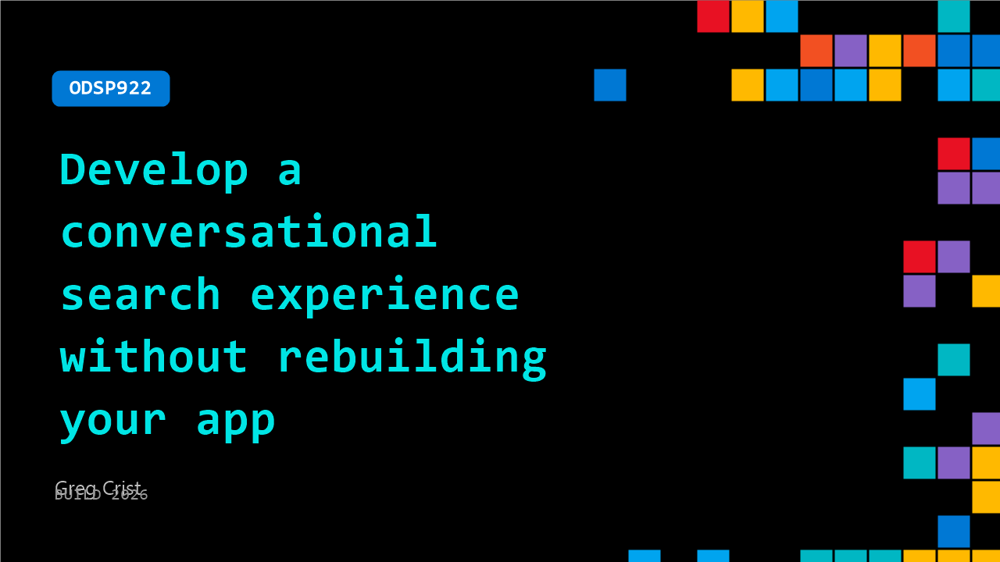

# ODSP922: Develop a conversational search experience without rebuilding your app

**Session code:** ODSP922  
**Watch on-demand:** <https://build.microsoft.com/en-US/sessions/ODSP922>

---

## Speakers

- **Greg Crist** - Ecosystem Cloud Architect -, Elastic

## About the session

In this on‑demand demo, see how to use Elastic Agent Builder to add LLM‑powered conversational search to an existing production system. You’ll walk through integrating a hosted model on Azure OpenAI and wiring retrieval into search workflows, resulting in a production‑ready conversational experience you can extend immediately.

## AI summary

**Introduction and Context:** At 00:00:07 Greg Crist, Cloud Ecosystem Architect at Elastic, opens the video by welcoming viewers and introducing his colleague Jonathan Simon, who will present a demo. He explains the exciting union of two rapidly evolving technologies: the Microsoft AI ecosystem and Elastic’s capability to supply user-specific data to AI systems. Beginning around 00:00:25, Greg outlines Microsoft’s Azure OpenAI and Foundry IQ offerings and emphasizes how Elastic integrates seamlessly with Azure Marketplace, enabling users to deploy production-grade AI search within the Microsoft ecosystem. He clarifies that combining Elastic’s data context with Microsoft’s model catalog yields more grounded and trustworthy AI results. Finally, he previews that Jonathan’s demo will show how Elastic Agent Builder transforms a standard e-commerce site into a conversational AI experience.

**Overview of Elastic Solutions:** Jonathan Simon begins his portion at 00:02:04 by introducing himself and the structure of his presentation, which includes an overview, demo, and architectural walkthrough. Around 00:03:00, he explains Elastic’s three key solutions: Search, Observability, and Security. Search provides lexical, semantic, and agentic search through Elastic Agent Builder; Observability offers application monitoring using AI to analyze logs; and Security supports cybersecurity management through automated workflows for attack discovery and remediation. By 00:04:02, Jonathan demonstrates how users can easily start by deploying Elastic Serverless from the Azure Marketplace with a few clicks. He then officially announces the general availability of Elastic Agent Builder at 00:04:55, marking its transition from technical preview to production-ready status.

**E-Commerce Demo and AI Search Capabilities:** At 00:05:14, Jonathan launches into a demo of an e-commerce site for a fictional Wayfinder Supply Company. The site’s products, descriptions, and titles are AI-generated, with Elastic powering its search. Between 00:05:33 and 00:06:43, he showcases browsing and hybrid search functions. When searching for "jackets" versus "coats," he demonstrates how lexical searches fail on missing keywords while hybrid search succeeds by using vector-based semantic connections via Elastic Inference Service. The demo then evolves at 00:07:00 as Jonathan envisions creating a trip planner powered by AI — an agent that can recommend camping gear and plan itineraries — which leads into building such an agent through Elastic Agent Builder.

**Building the Trip Planner Agent with Elastic Agent Builder:** Starting around 00:07:17, Jonathan enters the Agent Builder interface. He illustrates how pre-configured large language models (LLMs), such as Anthropic, can be swapped out or expanded by connecting Azure-hosted models. Between 00:08:05 and 00:09:51, he shows the deployment of a Mistral Large model on Microsoft Foundry, linking it via URI and API key to Elastic. Once validated, this custom connector appears as a selectable LLM inside Agent Builder. At 00:10:02, Jonathan creates a workflow for the Trip Planner, copying workflow logic from code, explaining how it handles manual triggers, HTTP posts to MCP servers, retries, and logging. By 00:12:08, the workflow successfully retrieves sample user data, confirming operational readiness. He then constructs a tool using this workflow at 00:13:00 and validates its output with customer profile data before finally building the Trip Planner agent around 00:15:02, assigning it tools and behavior parameters.

**Testing and Integrating the Agent:** With the Trip Planner created, Jonathan tests it inside Agent Builder at 00:16:19. Running the prompt “Plan a three-day backpacking trip to Yosemite this weekend,” the agent generates detailed reasoning traces showing weather checks, gear searches, itinerary creation, and trip recommendations. By 00:18:11, the finalized itinerary is displayed within Agent Builder. He demonstrates that all these agent operations are API-accessible; at 00:19:13, he queries the agent to generate an example Python API call, showing how external apps can use the same functions. Finally, Jonathan integrates the Trip Planner back into the Wayfinder web app at 00:20:10, confirming that the button now triggers live trip planning using the AI agent. The app surfaces reasoning steps, recommended gear, itineraries, and direct add-to-cart features, converting simple search into a conversation-driven recommendation engine.

**Architecture and Conclusion:** Near 00:22:42, Jonathan concludes by exploring the architecture underpinning the demo. The React-based front end sends requests to a FastAPI Python backend, which communicates with Elastic’s Trip Planner agent. The agent accesses four custom tools: semantic product search, user affinity via ESQL queries, trip safety via MCP workflows, and customer profile retrieval through CRM integration. By 00:24:00, he encourages viewers to explore Elastic Agent Builder through official documentation, GitHub code, and a free workshop, highlighting that Azure users can deploy a free seven-day trial through a QR code. The video wraps up at 00:25:02 as Greg Crist thanks Jonathan and invites attendees to visit Elastic’s booth at the Microsoft Build Conference 2026, closing on music and a reminder of the synergy between Elastic and Microsoft AI solutions.

## Session tags

- **Session type:** Pre-recorded
- **Level:** (300) Advanced
- **Topic:** Developer tools & frameworks
- **Tags:** Azure, Observability, GitHub Copilot, GitHub, Foundry IQ, Foundry Agents, Entra
