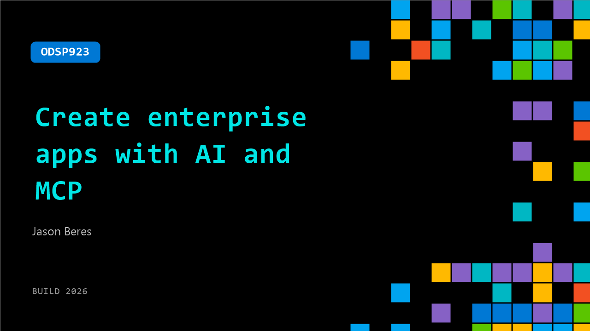

# ODSP923: Create enterprise apps with AI and MCP

**Session code:** ODSP923  
**Watch on-demand:** <https://build.microsoft.com/en-US/sessions/ODSP923>

---

## Speakers

- **Jason Beres** - COO, Infragistics

## About the session

Build a real enterprise app UI using Ignite UI, MCP servers, and Agent Skills. See AI generate data-rich screens, apply design-system themes, add chat-style UI, and accelerate React, Angular, Blazor, Web Components, WinUI, and .NET MAUI work.

## AI summary

**Introduction and Overview:** The presenter, Jason Beres, begins by introducing the topic of creating enterprise applications leveraging AI and low-code capabilities (00:00:01–00:00:11). He explains that the focus is on accelerating enterprise app development with minimal coding through Infragistics UI components, which have been refined over 35 years to support desktop, mobile, and web platforms including Blazor, Angular, React, and Web Components (00:00:26–00:00:44). He also announces the launch of a new WinUI component suite introduced at Build 2026 (00:01:55–00:02:03), highlighting support for MAUI as part of their cross-platform approach.

**Exploration of Products and App Builder Overview:** Jason shows how visitors can learn more about Infragistics products such as UI components, Reveal for embedded analytics, and Slingshot for AI-native work management from the company website (00:02:34–00:02:52). He demonstrates Ignite UI’s unified feature set across frameworks and introduces App Builder — a low-code, WYSIWYG environment for creating apps through either drag-and-drop or conversational AI input (00:03:32–00:03:49). The process involves signing in with Office 365, choosing sample apps like CRM, applying customizable components such as data grids, themes, and layouts, and seeing generated Blazor or React code instantly reflected (00:04:07–00:06:21). He emphasizes the open-source nature of 50 components, enabling developers to begin building freely while also supporting custom theming and routing.

**Publishing and Integration with AI Tools:** Moving into a live coding segment, Jason publishes the CRM app from App Builder directly to GitHub, Azure DevOps, or as a downloadable package (00:07:14–00:07:41). He then clones it in Visual Studio Code and begins configuring AI integration via the Ignite UI CLI, installing MCP (Model Context Protocol) servers and task-specific skills for Blazor (00:08:37–00:09:44). These settings enable GitHub Copilot and Claude Code to understand Ignite UI commands, confirming readiness to help generate new app elements automatically (00:10:16–00:10:23). Upon running the project, he verifies that all data grid interactions — filtering, column manipulation, exporting, and pinning — now appear as expected through generated Blazor code without manual scripting (00:10:34–00:10:53).

**AI-Driven Application Expansion:** Jason leverages agent-based collaboration to extend the app’s functionality by instructing AI to add a new Ignite UI data grid to the Tasks page using cloud-hosted JSON data (00:11:03–00:12:05). The AI automatically binds data, applies a collapsible multi-row header for addresses, adds filtering and export options, and renders images correctly — all done upon command (00:12:10–00:13:35). The result is a pixel-perfect section with fully interactive elements. Building on this, Jason uploads a design screenshot and requests the AI to synthesize a matching application (00:13:46–00:14:22). Within minutes, it generates a functional blue-themed dashboard that closely replicates the supplied image layout, complete with charts and gauges (00:15:24–00:15:32). He underscores that this AI workflow removes design drift and delivers production-ready results using established frameworks and approved design systems.

**WinUI Component Launch and Capabilities:** In the final demonstration, Jason highlights their new WinUI product suite released at Build 2026, featuring sophisticated charts, data grids, and the innovative Dashboard Tile component for interactive user customization (00:16:23–00:17:11). He demonstrates switching chart types dynamically and viewing data analysis options, showing consistent API experiences between WinUI, WPF, and web technologies like Blazor and React (00:17:23–00:17:50). Through sample XAML code, he notes that even GitHub Copilot can assist in customizing the WinUI interfaces. The video concludes with encouragement to explore Infragistics’ latest offerings — Ignite UI for web, App Builder for AI-aided low-code development, and WinUI components for modern desktop experiences (00:18:13–00:19:12). He closes by thanking viewers and inviting them to visit infragistics.com for demos and resources to begin building smarter enterprise apps today.

## Session tags

- **Session type:** Pre-recorded
- **Level:** (200) Intermediate
- **Topic:** Developer tools & frameworks
- **Tags:** AI, Copilot, Agents, .NET, Developer, Visual Studio Code, MCP, DevTools, Developer Frameworks, Dev Tools
