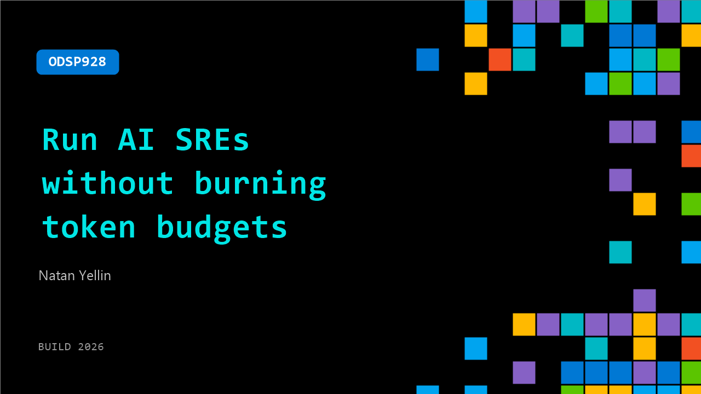

# ODSP928: Run AI SREs without burning token budgets

**Session code:** ODSP928  
**Watch on-demand:** <https://build.microsoft.com/en-US/sessions/ODSP928>

---

## Speakers

- **Natan Yellin** - CEO, Robusta Dev

## About the session

Most AI SREs have an underlying cost per investigation of about $2 per alert. This makes it difficult for most enterprises to use AI SREs as a first-line solution for triaging alerts, based on token cost. In this session, we review the math and optimizations and show practival ways to bring the LLM cost of AI SREs into a manageable range, where running them on every alert becomes viable.

## AI summary

**Introduction and Context:** At the beginning of the video (00:00:00–00:00:08), Natan Yellin introduces himself and his topic: building affordable and scalable SRE (Site Reliability Engineering) agents for production alerts. He explains that while many companies are trying to build SRE agents, the economic feasibility is a major challenge. As the CEO and co-founder of Robusta (00:00:25–00:00:34), Yellin draws on extensive experience delivering these agents to clients ranging from Fortune 500 corporations to small startups. He sets the stage by committing to share practical lessons learned from deploying SRE agents in varied operational environments.

**Understanding the Cost Problem:** Yellin breaks down the cost calculation behind AI-driven SRE agents, emphasizing that naïve implementations are prohibitively expensive (00:00:43–00:00:56). He illustrates with an example where a typical large organization could spend $730,000 yearly if each investigation costs around $2 and handles approximately 1,000 alerts daily (00:00:59–00:01:07). He notes that this figure is often higher than manual alert triage performed by human operators, making it economically unviable. Yellin details how investigation prices vary—typically between 50 cents and $5 per alert (00:01:49–00:02:21)—and how vendors amplify these costs with markups, sometimes charging between $15 and $25 per alert. The foundational cost driver, he explains, comes from input tokens consumed by AI models when analyzing logs, metrics, and related data rather than output tokens.

**Exploring Model and Configuration Optimizations:** Transitioning from cost analysis, Yellin examines optimization opportunities by adjusting model selection and architecture (00:03:04–00:03:07). He explores how using cheaper large language models, such as DeepSeek V4 (00:03:45–00:03:50), could theoretically reduce expenses compared to Opus family models. However, he cautions that cheaper models may yield lower accuracy and often consume more tokens overall because they retrieve incorrect data first and reattempt queries (00:04:26–00:04:47). Despite this potential inefficiency, he acknowledges that switching models remains a baseline optimization that teams can easily experiment with, although Robusta prefers sticking with higher-performing Opus models due to better real-world results and other in-place cost management techniques.

**Reducing Investigation Redundancy with Context and Grouping:** Yellin moves into advanced strategies for cost reduction, highlighting contextual memory and alert grouping (00:04:51–00:05:56). He explains that without memory or reusable context, SRE agents must rediscover environment-specific details and observability configurations for every alert. Enabling context persistence or auto-learning can cut costs by 20–30%, as agents avoid redundant queries (00:05:38–00:05:53). The largest optimization, however, comes from LLM-native grouping of alerts, where similar or duplicate alerts—often hundreds triggered during a single outage—are investigated collectively (00:05:59–00:06:20). Yellin contrasts this AI-driven grouping with traditional deterministic rules, which fail to accurately cluster alerts across systems. Robusta’s methodology lets the LLM dynamically create and persist grouping rules (00:07:04–00:07:19), optimizing both accuracy and efficiency.

**Technical Optimizations and Performance Gains:** Adding more technical depth, Yellin describes how caching and context reuse further reduce costs (00:07:28–00:07:54). When an investigation is triggered repeatedly for related alerts, the system can reuse the same context window if it remains active within Anthropic’s five-minute cache cycle. This method substantially lowers computation fees compared with regenerating a fresh context window each time. These combined optimizations—intelligent grouping, caching, and context reuse—collectively enable investigations to scale across all alerts efficiently without compromising accuracy or triggering unnecessary repeats (00:07:57–00:08:05).

**Conclusion and Invitation:** Yellin concludes by reaffirming that AI-based SRE agents can achieve remarkable accuracy but often fail to deliver cost-effectiveness unless carefully optimized (00:08:51–00:09:05). Once cost per investigation falls sufficiently, organizations can confidently deploy SRE agents for every alert, unlocking proactive performance improvements and automated escalation (00:08:13–00:08:46). He closes by inviting viewers to reach out via email for deeper discussions and implementation guidance, emphasizing his willingness to share applied insights drawn from extensive field experience in automated reliability operations (00:09:07–00:09:13).

## Session tags

- **Session type:** Pre-recorded
- **Level:** (300) Advanced
- **Topic:** Developer tools & frameworks
- **Tags:** AI, Observability, Outages, Platform Engineering, Reliability, Resiliency, Platform, Agents, Production Systems
