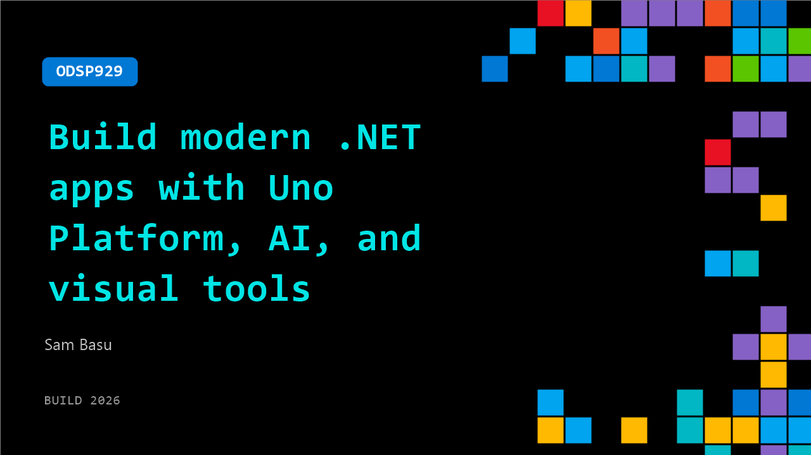

# ODSP929: Build modern .NET apps with Uno Platform, AI, and visual tools

**Session code:** ODSP929  
**Watch on-demand:** <https://build.microsoft.com/en-US/sessions/ODSP929>

---

## Speakers

- **Sam Basu** - Lead Developer Advocate, Uno Platform

## About the session

See how to build modern cross-platform .NET apps using Uno Platform with AI-powered and visual tools. This demo shows how to accelerate feature delivery, improve runtime performance, and achieve consistent rendering with SkiaSharp. Learn patterns for streamlining development across platforms with shared tooling and IDE support.

## AI summary

**Introduction and Overview:** The video opens with Sam Basu welcoming viewers to Microsoft Build 2026 in San Francisco and online (00:00:00). He introduces the session titled “Modern Cross-Platform .NET Development with AI and Visual Tools,” powered by Uno Platform (00:00:09). Sam explains that Uno Platform helps developers take modern .NET applications to every major platform efficiently. It provides a flexible open-source stack that enables building cross-platform apps for mobile (iOS, Android), web (via WebAssembly), desktop (Windows, macOS, Linux), and embedded systems from a single shared C# and XAML codebase (00:00:39). He emphasizes productivity features like theming, extensions, and UI toolkits, all designed to streamline the development lifecycle from any OS or IDE such as Visual Studio or VS Code (00:01:05).

**Uno Platform Studio and AI Tooling:** Building on this foundation, Sam introduces Uno Platform Studio, a collection of AI-driven design tools crafted to enhance productivity (00:01:25). He demonstrates “Hot Design,” a runtime visual designer that enables developers to tweak their UI while the app is running, keeping everything synchronized through Hot Reload (00:01:33). He explains the concept of MCP (Model Context Protocol) tools, which bridge the gap between AI agents and real application context by grounding them in documentation and allowing them to validate generated UIs (00:02:02). To show enterprise-grade success, Sam highlights Kahua, a partner using Uno Platform’s AI and design tools to modernize .NET applications and deploy them cross-platform with AI integrated into their user experience (00:02:19).

**Getting Started and Visual Studio Demo:** The next section demonstrates how to begin with Uno Platform through the official website and documentation (00:02:54). Sam walks through setting up a new cross-platform .NET app in Visual Studio using the Uno Platform extension and the “Uno Check” tool for installing dependencies (00:03:34). He shows the wizard for creating new apps, which allows configuring runtime targets, themes, features, and CI/CD options (00:03:48). The scaffolded project supports multiple platforms, maintaining a single shared codebase (00:04:26). Running the default project demonstrates Hot Reload and Hot Design pre-integrated, confirming that Visual Studio-based development is ready for instant iteration (00:05:01).

**Advanced App Design in Visual Studio Code:** Sam transitions to a Mac setup using Visual Studio Code to show “Uno Chefs,” a more complex sample app from Uno’s open-source gallery (00:05:59). He demonstrates Hot Design in action, opening the live design canvas to modify running app elements directly (00:06:49). Through “Interactive Mode,” developers can navigate their app as users would and modify UI components, such as changing a chart’s color dynamically to verify real-time updates (00:08:01). Sam highlights that Hot Design and Hot Reload work seamlessly together to synchronize UI changes between IDE code, the running app, and the visual design canvas (00:09:00).

**AI-Driven App Building and MCP Integration:** Shifting focus to AI-powered workflows, Sam introduces how AI agents like GitHub Copilot, Claude Code, or Gemini can generate and validate .NET UIs using Uno Platform with MCP integration (00:09:56). He explains two MCP servers: Uno MCP, which grounds the AI in Uno documentation, and Uno App MCP, which lets AI interact visually with apps—taking screenshots, navigating UI trees, and simulating user actions (00:10:39). Sam shows how an AI agent can compile, launch an app, and extract data visually, demonstrating a generated enterprise sales dashboard (00:12:13). He also performs doc-grounded AI queries about MVUX design patterns, showing that the agent fetches and summarizes relevant material directly within the IDE (00:14:50). The same experience extends to terminal-based agentic workflows, maintaining consistent contextual understanding (00:16:22).

**Showcase, Invitation, and Conclusion:** To illustrate the creative possibilities, Sam highlights Uno’s AI Gallery—a set of visually stunning, AI-generated sample apps like dashboards, animations, and dynamic UI concepts built using the same MCP foundation (00:17:18). He encourages developers to experiment and build their own innovative interfaces using AI and Uno’s design features. In closing, Sam invites attendees to meet the Uno Platform team at Microsoft Build, attend their theater sessions in collaboration with Kahua, and explore upcoming announcements (00:18:26). The video ends with a call to action for developers to begin building at platform.uno and join the community in exploring modern cross-platform .NET development powered by AI and visual design tools (00:19:30).

## Session tags

- **Session type:** Pre-recorded
- **Level:** (200) Intermediate
- **Topic:** Developer tools & frameworks
- **Tags:** AI, .NET
