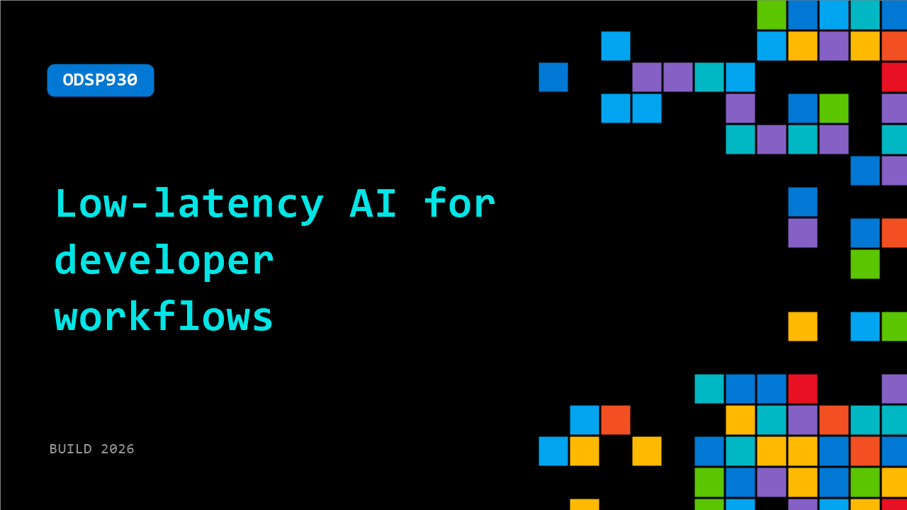

# ODSP930: Low-latency AI for developer workflows

**Session code:** ODSP930  
**Watch on-demand:** <https://build.microsoft.com/en-US/sessions/ODSP930>

---

## Speakers

_Not listed._

## About the session

Developer experience leaders from Cerebras and OpenAI show how low-latency inference changes coding agents, voice-driven workflows, slide generation, and workplace automation. See what you can build when responses land in seconds.

## AI summary

_No AI summary available._

## Session tags

- **Session type:** Pre-recorded
- **Level:** (100) Foundational
- **Topic:** Developer tools & frameworks
- **Tags:** AI, Agents, Developer, GitHub Copilot, VS Code, DevTools, Dev Tools
