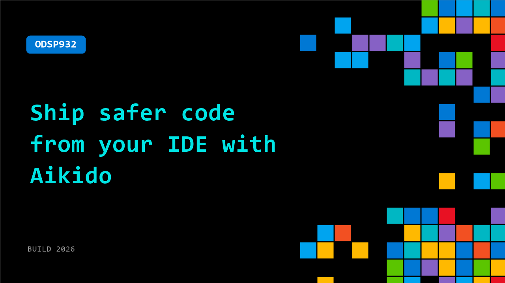

# ODSP932: Ship safer code from your IDE with Aikido

**Session code:** ODSP932  
**Watch on-demand:** <https://build.microsoft.com/en-US/sessions/ODSP932>

---

## Speakers

_Not listed._

## About the session

Learn how you can integrate security scanning directly into the IDE with Aikido. Using Aikido’s extension, you can ensure that you are shipping less vulnerabilities with your PRs, are not introducing secrets into your commits, and even block malware from making it onto your machine. Best of all, it's extremely lightweight and doesn't slow you down.

## AI summary

**Introduction and Purpose:** Simon from Aikido opens the video by introducing himself and explaining the topic of the demonstration — the Aikido plugin for VS Code 00:00:01–00:00:08. He describes the plugin as a powerful integrated tool that helps developers automatically scan for code issues including secrets, security vulnerabilities, IEC compliance problems, and general code quality concerns as they write code. Simon emphasizes that this capability supports the "shift left" approach by catching issues early in the development process 00:00:19.

**Core Features and Integrations:** The plugin provides several additional functionalities beyond real-time code scanning. Simon highlights the pre-commit hook feature, which checks for exposed secrets prior to code commits 00:00:27, and the Safe Chain integration that acts as a malware package scanner 00:00:34. Another advanced component, the Aikido MCP, assists with proactive analysis such as automated checks for generated code or AI prompts to ensure they adhere to security and quality guidelines 00:00:39.

**Setup and Installation Process:** Simon assures viewers that installation is straightforward 00:00:51. Users simply need an Aikido license and can log in using either a login button or a personal access token 00:00:55. Once active, the plugin scans open files within VS Code and visually flags detected issues. By selecting an issue, developers can immediately locate the problematic section within the code and view Aikido’s explanation and suggested resolution 00:01:08.

**AI-Powered Fixing and Workflow Integration:** Aikido AI plays a central role by helping users evaluate issue impact, report false positives, or even apply AI-generated fixes automatically 00:01:21–00:01:43. When a fix is suggested, the plugin opens a separate tab that displays a diff-style comparison — with red lines marking problematic code and green lines showing the corrected version 00:02:11–00:02:16. Users can then choose to apply or reject the proposed changes. Simon notes that Aikido’s interactive interface makes it easy to adopt corrections and maintain safe, high-quality code directly within the IDE.

**Comprehensive Scanning Capabilities:** Beyond individual file analysis, Simon demonstrates how the plugin can run both dependency scans and full workspace scans 00:01:50–00:02:30. The dependency scan identifies vulnerabilities in open source libraries, while the workspace scan reviews the entire repository to list all files with detected issues. Clicking on any result opens the corresponding file and reveals the flagged lines along with specific details about the problem 00:03:03. The plugin even supports automated fixes for open source dependencies, updating outdated or insecure packages directly within the IDE 00:03:22–00:03:37.

**Conclusion and Expansion:** The demo concludes with Simon reiterating the versatility and ease of the Aikido VS Code plugin. With its expansion packs, users can access all of these advanced capabilities — from secret detection to automated fixes — integrated smoothly into their day-to-day development environment 00:03:42–00:03:48. He wraps up the session by thanking viewers and wishing them a great day, leaving an impression that Aikido simplifies continuous security and quality assurance directly inside VS Code 00:03:49–00:03:53.

## Session tags

- **Session type:** Pre-recorded
- **Level:** (200) Intermediate
- **Topic:** Developer tools & frameworks
- **Tags:** AI, Resiliency, Security, .NET, Developer, Visual Studio Code, Community, VS Code, App Developers, Platform Security, Secure App Development, Attack Surface Reduction, DevTools, Agentic Security, Developer Technologies, Dev Tools, DevSecOps
