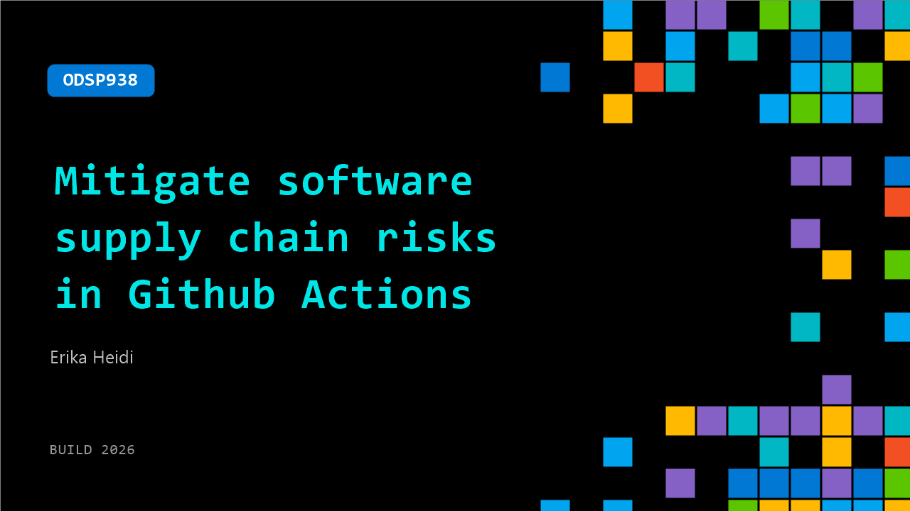

# ODSP938: Mitigate software supply chain risks in Github Actions

**Session code:** ODSP938  
**Watch on-demand:** <https://build.microsoft.com/en-US/sessions/ODSP938>

---

## Speakers

- **Erika Heidi** - Staff Developer Relations Engineer, Chainguard

## About the session

GitHub Actions workflows are a prime target for supply chain attacks—from malicious pull requests exfiltrating secrets to compromised dependencies and hijacked tags. In this 15-minute session, we'll walk through practical, high-impact strategies to protect your CI/CD pipelines, including how to inspect repos for hidden risks, shrink your attack surface, and lock down what your workflows can actually do. Leave with a concrete checklist to harden your workflows today. Stay safe!

## AI summary

**Introduction and Overview:** At 00:00:00, Erika Heidi, Staff DevRel Engineer at Chainguard, introduces herself and explains that she will present five key strategies to mitigate software supply chain risks in GitHub Actions. The talk begins by emphasizing the importance of inspecting repositories for insecure defaults and common bad practices such as using pull request targets with head code execution, broad-scope personal access tokens (PATs), direct shell execution, and actions pinned by tag (00:00:13–00:00:37). Erika suggests using GitHub Copilot to automatically evaluate workflows and detect vulnerabilities in a repository (00:00:55–00:01:02), noting it can identify numerous issues effectively.

**Insecure Workflow Demonstration and Protection Measures:** Erika walks through a test repository intentionally configured with insecure settings to demonstrate how secrets can be exfiltrated 00:01:16. She explains the risk of pull request targets that execute code in the context of the main branch, exposing secrets and environment variables to potential attackers (00:01:38–00:02:16). Erika references incidents like the Trivy exploitation, where tags were rewritten to point to malicious commits (00:03:07–00:03:24). She highlights the importance of protecting the main branch and release tags to prevent unauthorized pushes and tag rewrites that could propagate malicious code. These settings, she states, need to be manually enabled in repository configuration (00:04:03–00:04:33).

**Minimizing Attack Surface and Using Secure Images:** The second major strategy, beginning at 00:04:37, is to minimize the attack surface. Erika advises removing unnecessary components from runtime environments to reduce potential entry points for exploitation. She explains that direct and transitive dependencies can serve as weak links in the security chain (00:05:04–00:05:15). The use of minimal container images is recommended to avoid excessive packages and vulnerabilities. Chainguard builds all packages from source, ensuring up-to-date, patched images with remarkably fewer CVEs compared to standard images from Docker Hub (00:05:59–00:06:26). This approach provides a simple yet powerful improvement in security posture.

**Pulling from Trusted Sources and the Risks of Public Registries:** Erika transitions to the third tip at 00:06:50, focusing on fetching dependencies only from trusted sources. She reports that about 98% of malware is introduced during build and distribution times, bypassing source code review (00:07:01–00:07:25). Public registries, although useful for sharing libraries, often lack sufficient security measures to prevent artifact tampering or “ghost releases,” which introduce malicious payloads during build processes (00:07:50–00:08:33). She describes how attackers exploit CI/CD pipelines and developer machines to gain credentials and spread infections laterally. Using Chainguard’s secure library repositories for Python, Java, and JavaScript ensures verified, tamper-proof builds without pre- or post-install scripts (00:09:21–00:10:12).

**Pin by Digest and Automated Updates:** The fourth principle at 00:10:18 discusses replacing tag-based versioning with digest-based pinning. A digest, Erika explains, is a unique cryptographic hash identifying a specific build, ensuring users execute known code every time (00:10:33–00:10:48). To keep digests updated safely, she introduces Digestabot—a free, open-source Chainguard tool that automatically sends pull requests with new digests when updated versions are available (00:11:05–00:11:24). This step helps maintain continuous workflow security without relying on vulnerable tags.

**Managing Access Tokens and Final Recap:** The last strategy, starting at 00:12:03, concerns banning long-lived PATs. Erika warns that these tokens, when leaked, grant attackers extensive control over entire organizations—as in the Trivy incident (00:12:28–00:12:36). She recommends short-lived tokens managed through Octo-STS, a free GitHub application implementing temporary credentials that expire quickly using Sigstore and Cosign principles (00:13:08–00:13:27). Erika concludes with a TLDR at 00:13:49 summarizing the five actions—inspect repositories, minimize attack surfaces, pull from trusted sources, pin by digest, and ban long-lived tokens. She ends the presentation at 00:15:06 by encouraging viewers to stay secure and vigilant.

## Session tags

- **Session type:** Pre-recorded
- **Topic:** Developer tools & frameworks Cloud platform & data
