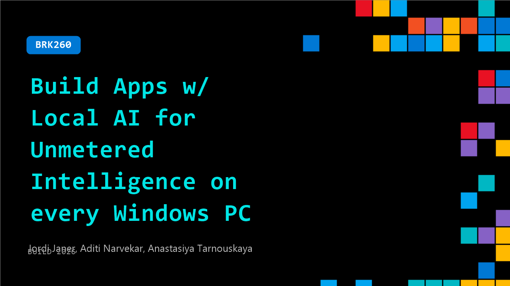

# BRK260: Build Apps w/ Local AI for Unmetered Intelligence on every Windows PC

**Session code:** BRK260  
**Date:** Wednesday, June 3, 2026 / 9:00 AM - 9:45 AM PDT (Duration 45 minutes)  
**Watch on-demand:** <https://build.microsoft.com/en-US/sessions/BRK260>

---

## Speakers

- **Jordi Janer** - Head of Research and Innovation, Voicemod
- **Aditi Narvekar** - Product Manager, Microsoft
- **Anastasiya Tarnouskaya** - Principal Product Manager, Microsoft

## About the session

Start with solution-centric Windows AI APIs - now expanding beyond Copilot+ devices. Use Foundry Local to run open-source models locally. With new tooling in Foundry Toolkit, optimize and prep your models for local AI deployments. Run custom AI workloads locally across GPU, NPU, or CPU with Windows ML, now with support for web apps through WebNN. Learn how the platform enables on-device inference across all Windows PCs to help you ship performant, scalable, and secure AI-powered apps on Windows.

Seating for this session is first-come, first-served. Add it to your schedule to plan your day and arrive early to secure a spot.

## AI summary

**Session Introduction:** The presentation opens with greetings and the announcement of 00:00:03–00:00:14 at Build 2024, where speakers Anastasia and Aditi introduce the focus of the talk: building local AI-powered apps for over 1 billion Windows devices without cloud dependency or token costs. They outline that the stack is production-ready and built with contributions from AMD, Intel, NVIDIA, and Qualcomm. The narrative promises announcements, live demos across multiple devices, and focuses on Microsoft's vision of "unmetered intelligence"—running AI directly on PCs instead of relying exclusively on the cloud 00:01:01–00:01:12. This concept empowers every PC to be an AI-capable device utilizing CPUs, NPUs, and GPUs efficiently.

**AI on Windows and Foundry Overview:** After introducing advanced hardware capabilities 00:01:13–00:01:39, the speakers shift to local AI examples and privacy benefits. They highlight how running models locally enhances security, lowers latency, and reduces operational costs 00:03:22–00:03:57. Many Microsoft products like Outlook and GitHub Copilot already leverage this same stack. The segment then transitions into the Foundry on Windows framework 00:04:17–00:05:15, explaining its developer tools: Windows AI APIs (turnkey for common AI tasks), Foundry Local for optimized open-source models, and Windows ML for custom model execution. Together, they comprise a layered ecosystem allowing developers to integrate localized AI without complex setup.

**Live Demo – The Unmetered Token Cafe:** The narrative progresses to the "Unmetered Token Cafe" scenario 00:05:16–00:06:03, designed to demonstrate Foundry on Windows in real-world use. The cafe embodies a small business using PCs to run operations without relying on a network. The first demo centers on speech recognition APIs converting spoken drive-through coffee orders to text locally 00:06:21–00:07:30. The presenters showcase how orders are processed on different devices, noting that support is expanded to CPUs and GPUs, not just NPUs. They then demonstrate Phi Silica—Microsoft’s small local language model—running on GPU to extract structured JSON output from barista queues with minimal latency 00:08:31–00:10:18. The session illustrates how easy it is for developers to integrate AI APIs through uniform code patterns.

**Video Super Resolution and New AI Models:** Later, Alfred from Clipchamp joins to demonstrate video Super Resolution (VSR) 00:12:08–00:14:10, which upscales video locally using AI. He shows how the feature can run both on CPU and NPU, improving clip sharpness seamlessly. Following that, Aditi and Anastasia preview Ion, the next-generation successor to Phi Silica 00:14:29–00:15:42, powering the Prompt API within Edge Canary. Ion delivers enhanced quality, expanded context window, and faster token throughput—all distributed through Windows Inbox APIs for automatic availability. This section reinforces Microsoft’s strategy to bring upgraded language models uniformly across devices while keeping development friction minimal.

**Foundry Local and Windows ML Deep Dive:** The session then explores Foundry Local’s general availability 00:16:08–00:19:30, enabling local execution of open-source models like Quen 3.5 Vision for image-based inventory management demos. Code walkthroughs reveal simplified model download, load, and inference routines for developers. The speakers expand on Foundry Local’s SDK and CLI that abstract hardware-specific complexity across CPUs, GPUs, and NPUs. This leads into a detailed explanation of Windows ML’s general availability and new tooling, notably the Windows ML CLI preview 00:21:28–00:27:00, which optimizes models through conversion, analysis, and benchmarking in one workflow. They showcase performance improvements and demonstrate how developers can benchmark models for throughput and hardware utilization.

**Web Integration and Partner Demos:** The presenters demonstrate Windows ML and WebNN integration 00:30:00–00:34:00, showing sentiment classification through a web app that exploits native hardware acceleration within browsers. They compare CPU vs NPU inference speed—showing 30ms latency and triple performance gains on NPU for the Aurora latte example. Following confirmation of production readiness, Voicemod team members join to exhibit real-time AI voice transformation 00:35:25–00:38:00. Their demo exemplifies ultra-low-latency performance (below 45 milliseconds) and scalability across major silicon partners using Windows ML. A closing overview lists 2026 updates: improved generative AI throughput, Windows ML 2.0 preview enhancements, new device compatibility, and broader cross-vendor performance improvements.

**Conclusion and Key Takeaways:** Wrapping up 00:40:33–00:41:51, Anastasia and Aditi summarize that building local AI experiences on Windows is now easier, faster, and universally supported across chips. From AI APIs for turnkey tasks to Foundry Local for open models and Windows ML for custom setups, developers gain a unified system achieving cloud-grade intelligence locally. The speakers encourage attendees to explore demo links, additional Build sessions, and QR code resources for feedback, ending with an invitation to meet them after the talk to discuss projects. The session closes with enthusiasm about empowering the developer community to create next-generation local AI workflows using Microsoft Foundry on Windows.

## Session tags

- **Session type:** Breakout
- **Level:** (300) Advanced
- **Topic:** Windows
- **Tags:** AI, API, Developer, Local AI, Windows, Microsoft Foundry, Windows Developer, VS Code, Foundry Local
- **Location:** Building B, Level 3, BATS Improv
