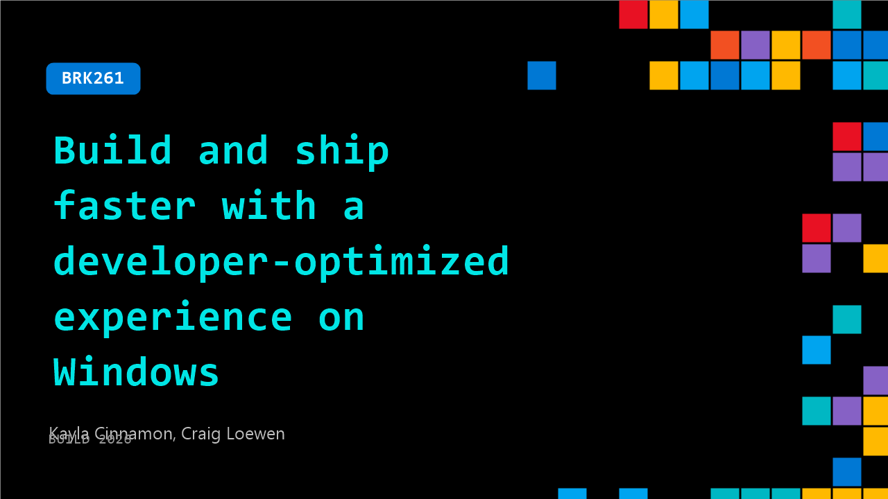

# BRK261: Build and ship faster with a developer-optimized experience on Windows

**Session code:** BRK261  
**Date:** Tuesday, June 2, 2026 / 3:45 PM - 4:30 PM PDT (Duration 45 minutes)  
**Watch on-demand:** <https://build.microsoft.com/en-US/sessions/BRK261>

---

## Speakers

- **Kayla Cinnamon** - Senior AI Developer Tools Advocate, Microsoft
- **Craig Loewen** - Product Manager, Microsoft

## About the session

Learn how Windows delivers a streamlined, end-to-end experience through PCs and OS experiences optimized for developers. See our new experiences in action across WSL, PowerToys and your favorite developer tools so you can code with less toil and stay in your workflows. Walk away with repeatable scenarios that you can easily integrate in your daily development workflows, helping you scale your AI projects with confidence.

Seating for this session is first-come, first-served. Add it to your schedule to plan your day and arrive early to secure a spot.

## AI summary

**Introduction and Session Overview:** The video begins with 00:00:01, where Kayla Cinnamon introduces the “Build and Ship Faster with Developer-Optimized Experience on Windows” session. She is joined by Craig Loewen, Product Manager for Windows Subsystem for Linux (WSL), and Jianye Lu, focusing on Windows performance. The team outlines that their work includes popular developer utilities like PowerToys, Windows Terminal, winget, and WSL. The agenda is divided into two themes: building on Windows (improvements to the developer environment) and building for Windows (tools to make Windows app development smoother). They stress the session’s minimal-slide, demo-rich format and prepare to explore the latest enhancements and developer tools available on the Windows platform.

**Developer Setup and Desktop Enhancements:** Beginning around 00:01:18, Kayla demonstrates how to streamline developer setup with a new winget configuration file. This file automates installing core developer tools—Ubuntu, Git, Copilot CLI, VS Code, and others—creating an optimized environment quickly. It’s designed to be idempotent, so it won’t reinstall software already present. She highlights upcoming desktop features, such as movable taskbars, integrated into the Windows Insider program, and an upgraded Run dialog that now uses PowerToys Command Palette architecture. The open-source foundation means community contributions to PowerToys directly benefit core Windows features. Kayla also showcases “Intelligent Terminal” 00:04:18, an open-source experiment allowing AI agents like GitHub Copilot to assist directly within the terminal. Users can collaborate with the agent to debug commands or craft regex patterns without leaving their console.

**WSL Containers, Coreutils, and Comfort Shell:** Transitioning at 00:06:03, Craig introduces WSL containers, a newly added feature providing native Linux container functionality through commands like “wsl c.” He demonstrates spinning up Ubuntu and Debian containers, explaining how this addition simplifies sharing environments across local and cloud systems. He also reveals “Coreutils for Windows” 00:08:23, which brings over 160 common Linux command-line tools (e.g., grep, tail, env) natively to Windows. Craig’s demo of containerized web-app workflows (such as MarkItDown) shows instant integration between Linux-based tools and Windows hosts. Kayla adds that the Windows Developer Config repository provides a “comfort shell”—a preconfigured Ubuntu setup with tools like Homebrew, ZSH, and Starship—to simplify environment personalization. They recap recent updates, including Intelligent Terminal, Coreutils, Vertical Taskbar, and WSL containers as essential steps toward making Windows the best platform for developers.

**Building for Windows and WinApp Development:** At 00:14:01, the session shifts focus to building for Windows applications. Kayla presents the “winapp CLI,” an open-source command-line interface for managing app packaging, certificates, and publishing. She introduces “win-dev-skills” 00:15:24—a plugin enabling agents like Copilot to build and test WinUI 3 or Windows App SDK projects efficiently. Demonstrating live with Copilot CLI, Kayla generates a WinUI app from voice commands, showing real-time building and UI testing automation. Additional updates include PowerToys “Grab and Move,” simplifying window management. Jianye Lu then explains new performance improvements for developers through Sample-Based PGO (SPGO) 00:20:10, a lightweight profiling method offering up to 20-33% speed improvement in builds without intrusive code instrumentation. He walks through the process—building, profiling, converting samples, and rebuilding—highlighting Adobe’s collaboration achieving significant Photoshop optimization using SPGO.

**Integration of Containers APIs and Partner Collaborations:** In the later portion (00:32:31), Craig revisits WSL containers to introduce the WSL Containers API and its integration into Windows apps. Using a C# project, he demonstrates embedding Linux container execution within a WinUI app via a simple NuGet package. The workflow enables developers to build hybrid apps—running Linux code through containers while presenting a native Windows experience. He also highlights ecosystem improvements like LazyWSLC (a container dashboard) and dev container support in VS Code. Collaborating with the open-source MOONRAY rendering engine 00:37:15, Craig demonstrates how Linux-based rendering workloads can execute seamlessly inside Windows executables using the same API structure, achieving efficient, full-CPU utilization rendering operations with Windows inputs and outputs.

**Wrap-Up and Acknowledgements:** In the closing minutes (00:39:42), Kayla emphasizes the power of open source in shaping Windows developer tools. The team thanks over 16,000 contributors across Terminal, PowerToys, WSL, and WinUI projects. They celebrate the expansion of Coreutils and showcase community recognition using contributors’ examples. The final recap slide collects all featured projects—Windows Developer Config, Intelligent Terminal, WinApp CLI, Win Dev Skills, SPGO guidance, and PowerToys updates—with direct GitHub access for hands-on exploration. The session concludes with a Q&A invitation, underscoring Microsoft’s commitment to open collaboration, enhanced performance, and streamlined developer workflows for every Windows creator.

## Session tags

- **Session type:** Breakout
- **Level:** (300) Advanced
- **Topic:** Windows
- **Tags:** AI, Agents, Windows, Windows Developer, Azure Linux, VS Code, Developer Technologies, Windows Development, Developer Frameworks, Developer Languages, WSL, Terminal
- **Location:** Building B, Level 3, BATS Improv
