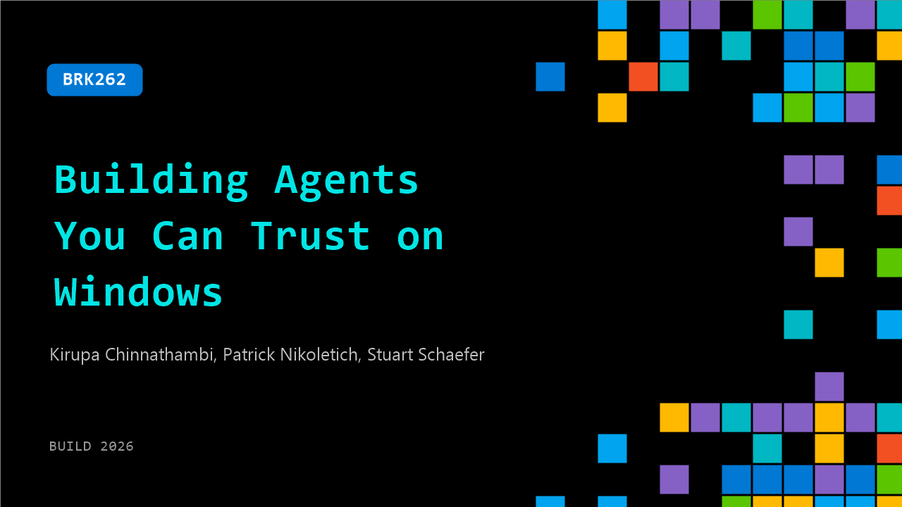

# BRK262: Building Agents You Can Trust on Windows

**Session code:** BRK262  
**Date:** Tuesday, June 2, 2026 / 5:00 PM - 5:45 PM PDT (Duration 45 minutes)  
**Watch on-demand:** <https://build.microsoft.com/en-US/sessions/BRK262>

---

## Speakers

- **Kirupa Chinnathambi** - Group Product Manager, Microsoft
- **Patrick Nikoletich** - Distinguished Product Manager, Microsoft
- **Stuart Schaefer** - Partner Architect, Microsoft

## About the session

Agents now run real commands, modify files, and move data. This breakout highlights the full set of Windows primitives that help agents discover, reason about, and execute AI‑powered activities across the system, while still operating within clear boundaries. Through live demos, you’ll see how agents identify available capabilities, plan and take meaningful actions, and how Windows layers permission scoping, inspection, developer tool capabilities, and rollback to keep developers in control.

Seating for this session is first-come, first-served. Add it to your schedule to plan your day and arrive early to secure a spot.

## AI summary

**Introduction and Context:** The session opens with a welcome from Krupa at 00:00:01, setting the stage for a discussion about the evolution of AI agents. She explains that modern agents now act autonomously — calling tools, running workflows, and making decisions without direct human prompts 00:00:08–00:00:23. With this new level of autonomy comes the challenge of managing safety, predictability, and accountability. She introduces the key focus of the talk: how Windows is building capabilities to ensure AI agents operate securely and reliably. Joining her are Stuart from the Windows Platform team and Patrick from GitHub, who will later demonstrate practical integrations with GitHub Copilot 00:00:43.

**Risks of Autonomous Agents:** Krupa continues by addressing the problems emerging as agents gain more power and independence 00:01:03. She cites real-world failures where agents misinterpreted commands — such as deleting important emails or production databases — illustrating how small errors get amplified into serious consequences 00:01:45–00:02:00. The discussion highlights that traditional approaches like prompt engineering cannot fully mitigate these risks because agents interact across multiple vectors: with humans, tools, apps, and even other agents 00:02:33–00:02:50. Krupa turns the floor over to Patrick from GitHub, who shares how the Copilot team observed the compounding risks when users remove protective gates and let agents run freely for long sessions in both CLI and SDK environments 00:03:07–00:04:21.

**Windows Platform Solutions – Identity, Containment, and Manageability:** After defining the risks, Krupa and Stuart explain how Windows now treats agents as a new type of user at the OS level 00:04:41. Three essential design principles are introduced: identity, containment, and manageability. Each agent must have a distinct identity separate from the human user 00:05:20. It must operate within controlled containment boundaries that limit access and reduce blast radius 00:05:38–00:05:44. Finally, manageability allows IT administrators to set and enforce policies governing what agents can and cannot do. Stuart demonstrates how Windows enforces identity-level separation using a demo showing an Open Clog agent running securely in its own user session, isolated from human desktop processes 00:08:02–00:09:00.

**Containment with Microsoft Execution Containers (MXC):** Stuart dives deeper into containment mechanisms with the MXC Library 00:11:12. He explains that due to agent non-determinism, the system must dynamically create isolation environments that scale based on risk. MXC provides declarative containerization policies, enabling developers to define how agents operate securely by declaring permissions, file access, network limits, and runtime constraints 00:13:05–00:14:14. Live demos illustrate MXC enforcement — first showing failure due to read-only policies and then success once proper permissions are granted 00:15:15–00:15:50. Stuart also presents sandbox monitoring of a malicious agent unsuccessfully trying to break containment, proving how the environment protects critical system resources 00:16:15–00:17:07. He concludes with Hyperlite, a hardware-backed micro VM demo that securely executes tasks in milliseconds with minimal footprint 00:17:12–00:18:00.

**Manageability, Supervision, and Integration:** The discussion transitions to managing autonomous agents and ensuring oversight 00:18:21. Stuart emphasizes policy enforcement, user consent, and supervision so that agents maintain human-in-the-loop transparency. He advises developers to build systems that surface agent intentions and allow real-time user intervention when errors occur 00:19:03–00:19:56. Patrick then demonstrates GitHub Copilot’s experimental sandbox integration, showing real-world containment against destructive agent actions like file deletion and unsafe repository exposure 00:21:00–00:24:04. He reveals how users can toggle protection, customize network filters, and observe sandbox restrictions while maintaining developer flexibility across CLI, SDK, and integrated apps. The sandbox improves safety in autonomous workflows while providing developers guided control 00:25:25.

**Conclusion and Future Outlook:** The session closes with Krupa summarizing the fundamental steps for responsible agent deployment on Windows 00:26:12–00:27:01. Each agent should have a unique identity, run inside sandboxed containment, and remain managed through IT policies. She introduces the upcoming integration with Agent 365 built over MXC, which supports enterprise-grade protections through Defender, Entra, and Intune 00:27:27–00:27:50. Krupa emphasizes that Windows now serves as a platform not just for running agents, but for ensuring they run safely, predictably, and at scale 00:28:03. The talk concludes with an invitation to explore MXC and engage with the Windows, GitHub, and OpenAI teams for deeper collaboration on advancing secure agentic ecosystems 00:28:19–00:28:31.

## Session tags

- **Session type:** Breakout
- **Level:** (300) Advanced
- **Topic:** Windows
- **Tags:** Windows, MCP, Agents on Windows, GitHub Copilot CLI
- **Location:** Building B, Level 3, BATS Improv
