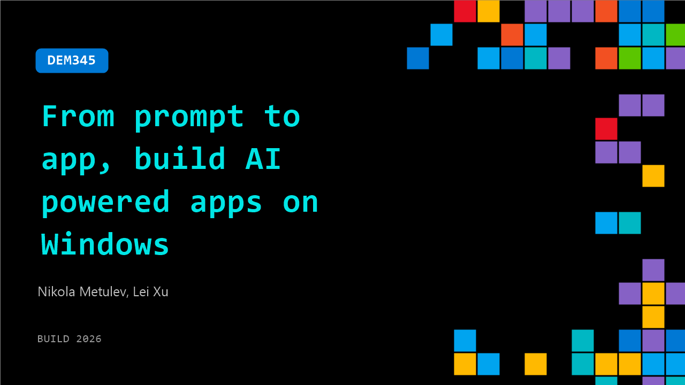

# DEM345: From prompt to app, build AI powered apps on Windows

**Session code:** DEM345  
**Date:** Tuesday, June 2, 2026 / 5:30 PM - 5:55 PM PDT (Duration 25 minutes)  
**Watch on-demand:** <https://build.microsoft.com/en-US/sessions/DEM345>

---

## Speakers

- **Nikola Metulev** - Software Engineer, Microsoft
- **Lei Xu** - Product Manager, Microsoft

## About the session

From prompt to app, see how you can use GitHub Copilot CLI and skills to build an AI powered application that takes advantage of local compute on your Windows dev box.
See an E2E workflow for building a high‑performance desktop application that combines native UI and HW‑accelerated local compute for running AI workloads with Windows ML and Windows AI APIs. See how you can use the Windows ML model kit to prepare the models to run with the highest performance on your local Windows device.

Seating for this session is first-come, first-served. Add it to your schedule to plan your day and arrive early to secure a spot.

## AI summary

**Introduction and Session Overview:** The presenters begin by greeting the audience at 00:00:03 and introducing the session topic — building Windows applications using Copilot and agents, and integrating AI into those apps. They explain that instead of a typical slide presentation, the session will feature live demos primarily run from the terminal. One speaker focuses on Windows AI platforms, while the other specializes in skills and agents, creating a complementary perspective for the discussion. They promise interactive demonstrations, inviting attendees to follow along and ask questions about developing smarter Windows applications powered by AI.

**Demo: Building a Sample AI Application with Copilot:** At 00:01:01, the speakers showcase a sample Windows application created entirely using GitHub Copilot and WinUI. This app processes media files offline, performing AI-driven tasks such as generating transcripts (00:01:25), creating summaries, and embedding captions into videos. The local AI stack, leveraging Whisper and Microsoft Foundry, allows offline transcription and on-device inference. They highlight how Foundry and ONNX runtime help deploy AI models, even large ones like a 14-billion parameter transformer running locally on GPUs. Impressively, the app was fully built by Copilot within about one day (00:02:45), underscoring how Copilot accelerates development by eliminating manual coding for much of the process.

**Exploring Copilot Plugins and WinUI Skills:** The session transitions at 00:03:20 to demonstrating Copilot’s plugin system. The WinUI plugin includes skills for design, packaging, code review, and setup (00:04:11), enabling agents to autonomously build apps. They point out that the skills are simple markdown files but come bundled with CLI tools empowering agents to design and test real applications. Additionally, new WinUI templates are introduced (00:04:43), which simplify manifest and XAML file creation, making CLI-based builds possible without Visual Studio. The presenters also highlight the new “Winapp” CLI tool (00:06:10) that allows running and packaging applications directly from the command line — a capability previously unavailable. These tools enable agents and humans alike to explore APIs, identify compatible controls, and search component samples quickly via a unified workflow.

**Optimizing AI Models with WinML:** Around 00:09:38, the presenters unveil a newly released tool — WinML CLI. This utility streamlines converting, optimizing, and deploying machine learning models for Windows. Using a Hugging Face vision transformer model as an example, they walk through exporting it (00:13:08), analyzing its operators to identify hardware optimization opportunities (00:13:56), and applying automatic performance improvements. These steps, executed with commands like `winml analyze` and `winml optimize`, fuse operators and reduce compute complexity. They demonstrate how the final optimized model performs rapid inference on the NPU, achieving roughly 3-millisecond latency (00:18:19) and supporting over 300 frames per second — an impressive feat for local processing on Copilot Plus devices.

**Live Use Case: Searching Video Frames with AI:** At 00:18:35, the presenters demonstrate how the optimized model powers a new “Find Frames” feature. Built in about 25 minutes through Copilot, the feature scans long videos — in this example, a two-hour keynote — for specific items or people using text prompts. By generating embeddings across frames and comparing them with a search term (“leather jacket”), the application locates the desired frames efficiently, showing a match with NVIDIA’s CEO’s appearance. The entire operation runs offline on the NPU, showcasing the power of AI-accelerated workloads integrated with Copilot-driven app development.

**Recap and Closing Remarks:** In the terminal-based presentation recap at 00:20:16, they summarize how Windows agents and developers both benefit from advanced tooling — matching skills, templates, and AI utilities. Agents can now build, test, and optimize applications from the command line just like humans, accelerating the creation of Windows apps that leverage AI. The discussion closes with reflections on using Copilot to create presentations and applications quickly, showing that app development is becoming as simple as asking a capable AI assistant for help. Finally, at 00:22:10, they thank the audience and encourage further exploration through provided links, marking the end of an informative and hands-on session.

## Session tags

- **Session type:** Demo
- **Level:** (400) Expert
- **Topic:** Windows
- **Tags:** AI, API, Developer, Local AI, Windows, Microsoft Foundry, Windows Developer, VS Code, Foundry Local, Visual Studio, AI Toolkit
- **Location:** Gateway Pavilion, Level 2, Theater B
