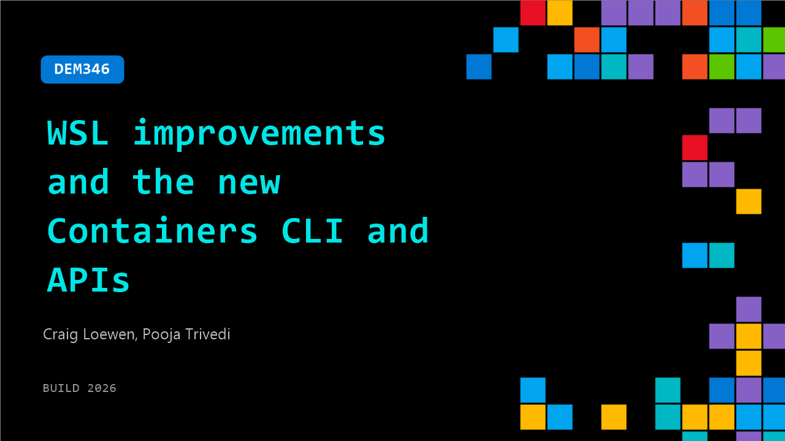

# DEM346: WSL improvements and the new Containers CLI and APIs

**Session code:** DEM346  
**Date:** Tuesday, June 2, 2026 / 2:40 PM - 3:05 PM PDT (Duration 25 minutes)  
**Watch on-demand:** <https://build.microsoft.com/en-US/sessions/DEM346>

---

## Speakers

- **Craig Loewen** - Product Manager, Microsoft
- **Pooja Trivedi** - Principal Architect, Microsoft

## About the session

Learn about the new core end to end improvements to Windows Subsystem for Linux and the new Container CLI and Apis for your applications

Seating for this session is first-come, first-served. Add it to your schedule to plan your day and arrive early to secure a spot.

## AI summary

**Introduction and Key Announcements:** The session begins with Pooja Trivedi and Craig introducing themselves and unveiling a new capability known as WSL Containers (00:00:20). They highlight three central benefits: the ability to run Linux containers natively on Windows, full integration within the Windows Subsystem for Linux (WSL), and enterprise readiness through compatibility with management tools such as Microsoft Defender for Endpoint and Intune (00:00:56). Pooja and Craig emphasize that no extra installation is required — the feature will come bundled as part of WSL updates — ensuring a secure and seamless experience for both developers and enterprise IT administrators alike. The presenters then prepare to transition from an overview into a practical demonstration showcasing this functionality via the command line.

**CLI Demonstration and Basic Container Operations:** Pooja demonstrates how WSL Containers can be accessed and managed using a new tool called WSLC, available after a simple WSL update (00:01:33). She shows that the WSLC command structure mirrors familiar Linux container tooling, allowing users to run commands like “container run,” “container list,” and “container attach” with Linux-like syntax (00:02:06). Through the example of launching and attaching to a Debian-based container, Pooja demonstrates interactive shells, detaching and reattaching, listing running containers, and terminating sessions efficiently (00:03:35). This demo affirms that developers can now perform full local Linux container operations on Windows with minimal setup and familiar CLI semantics.

**Building Custom Images and GPU-Accelerated AI Workloads:** The demonstration continues with a deeper look at container image creation using WSLC (00:04:01). Pooja introduces a sample container file that bundles dependencies, source code, and runtime instructions to create custom environments. She walks through building an example Python-based microservice and mapping ports between the Linux container and the Windows host for seamless testing (00:05:47). Next, she shows an AI workflow where a Jupyter Notebook container utilizes the host GPU to run deep learning models efficiently (00:07:07). Using the "--gpus all" option, she demonstrates fine-tuning a model and compiling kernels with PyTorch, underscoring that developers can now leverage the full performance of Windows hardware for AI and data workloads inside Linux containers. The combination of GPU acceleration, code portability, and interactive tools bridges the gap between Windows development and Linux computational environments.

**API Integration, App Developer Use Cases, and Partner Example:** Craig returns to explain how WSL Containers can be integrated into applications not only through the CLI but also through a new NuGet-based API (00:09:07). He outlines the audience for this feature — container developers, independent software vendors, and IT administrators — describing Microsoft’s goal to unify development tooling and enterprise control. The team highlights improvements in virtualization and cross-OS file performance, benefiting all container technologies including Docker and Rancher Desktop. As a concrete example, Craig runs a demo using the Linux-based Moonray rendering engine (00:12:01). By invoking Moonray directly via a Windows executable, the system transparently manages a Linux container in the background, rendering complex graphics without user intervention. This shows the API’s ability to run Linux-native workloads as seamless Windows apps, even for high-performance graphical computing.

**Developer Workflow Demonstrations and Container Safety:** To illustrate development integration, the presenters show a Visual Studio project embedding a container build process using the WSL Containers SDK (00:14:21). They demonstrate a playful AI stock-trading bot named Herbert running inside a container, visually observed via port-mounted connections. The scenario humorously includes file manipulation actions to highlight container-to-host interactions and the isolation boundaries ensuring data safety (00:16:04). Even though the container can access certain directories, its scope is constrained by explicitly defined mount points, minimizing risk. This portion reinforces the flexibility and secure design of Windows-integrated container environments that allow interactive, AI-driven or graphical workloads while maintaining OS-level isolation.

**Architecture Deep Dive and Conclusion:** Pooja concludes with an architectural breakdown of how WSL Containers operate under the hood (00:17:00). Each application or command-line session runs within an independent lightweight utility VM managed by the WSL service. Communication between Windows and Linux environments happens through hypervisor sockets (HV sockets) for performance and security, while storage is isolated using per-application virtual disks (00:19:00). File sharing between host and containers is powered by VirtioFS, which doubles speed compared to older Plan 9 implementations. Before closing, she mentions additional updates including Azure Linux 4.0’s availability and its upcoming inclusion as a WSL distribution (00:21:52). The presenters wrap up by announcing a forthcoming public preview by the end of June, encouraging developers to experiment, provide feedback, and follow ongoing progress through the Microsoft WSL open-source repository (00:22:57).

## Session tags

- **Session type:** Demo
- **Level:** (400) Expert
- **Topic:** Windows
- **Tags:** AI, Linux, Windows, VS Code, WSL, Linux Containers, Distributions, Windows applications
- **Location:** Gateway Pavilion, Level 2, Theater B
