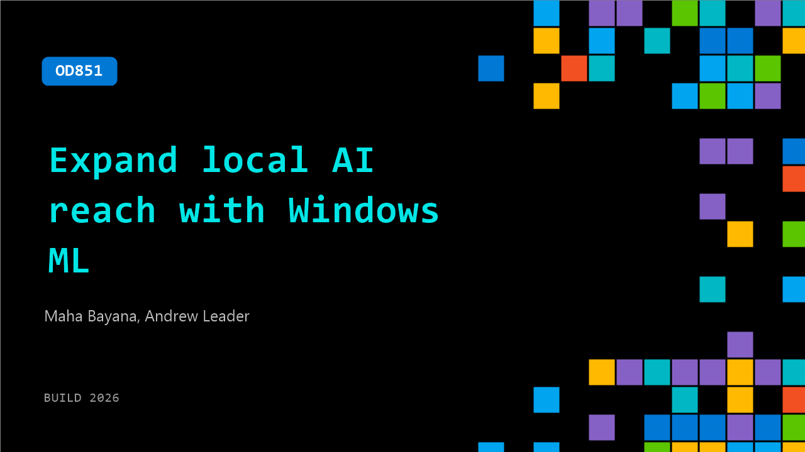

# OD851: Expand local AI reach with Windows ML

**Session code:** OD851  
**Watch on-demand:** <https://build.microsoft.com/en-US/sessions/OD851>

---

## Speakers

- **Maha Bayana** - Software Engineer, Microsoft
- **Andrew Leader** - Senior Product Manager, Microsoft

## About the session

Windows ML lets developers build local, AI‑powered apps using custom or open‑source models that run efficiently across GPU, NPU, and CPU on a unified Windows platform. Learn what’s new, including WebNN support for web experiences and improved tooling with AI Toolkit for VS Code to simplify preparing and deploying models and AI workloads with Windows ML.

## AI summary

_No AI summary available._

## Session tags

- **Session type:** Pre-recorded
- **Level:** (300) Advanced
- **Topic:** Windows
- **Tags:** AI, API, Developer, Local AI, Windows, Microsoft Foundry, Windows Developer, VS Code, Foundry Local
