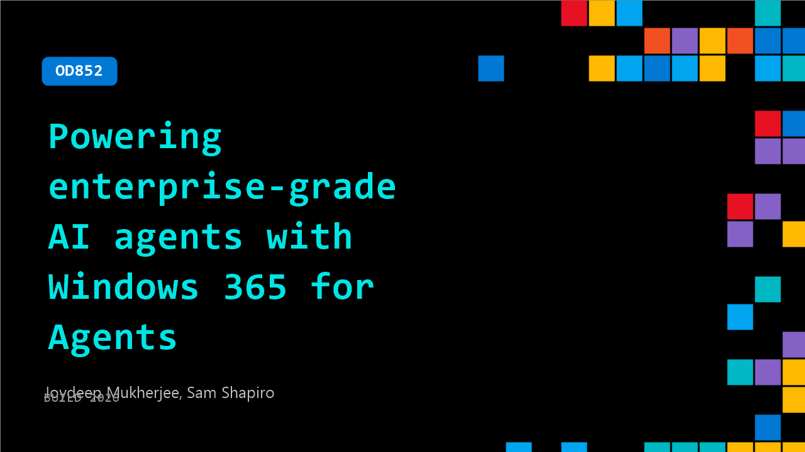

# OD852: Powering enterprise-grade AI agents with Windows 365 for Agents

**Session code:** OD852  
**Watch on-demand:** <https://build.microsoft.com/en-US/sessions/OD852>

---

## Speakers

- **Joydeep Mukherjee** - Principal Product Manager, Microsoft
- **Sam Shapiro** - Senior Product Manager, Microsoft

## About the session

Effective AI agents need GUI automation, legacy apps, or authenticated browser sessions with enterprise-grade security. Windows 365 for Agents meets this challenge by providing Cloud PCs that let AI agents—first or third party—operate inside full and secure computer environments. In this session, we’ll show how to enable agents to complete end-to-end tasks, integrate Windows 365 for Agents with Copilot Studio and custom frameworks, and manage Cloud PCs.

## AI summary

_No AI summary available._

## Session tags

- **Session type:** Pre-recorded
- **Level:** (300) Advanced
- **Topic:** Windows
- **Tags:** Windows 365, Windows, Windows 365 for Agents, Agents on Windows
