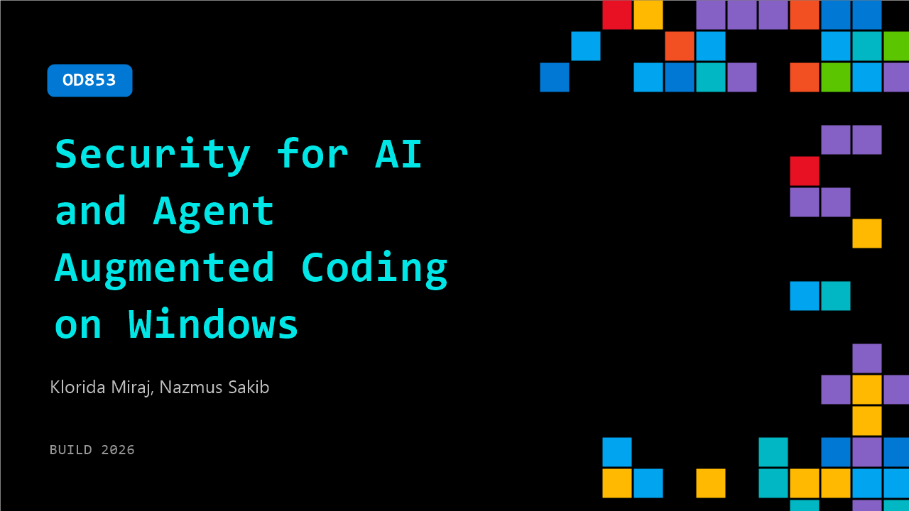

# OD853: Security for AI and Agent Augmented Coding on Windows

**Session code:** OD853  
**Watch on-demand:** <https://build.microsoft.com/en-US/sessions/OD853>

---

## Speakers

- **Klorida Miraj** - Group Product Manager, Microsoft
- **Nazmus Sakib** - Principal Product Manager Lead, Microsoft

## About the session

AI agents create new opportunities for Windows developers to help users do more with less effort. This session explores how agent development on Windows benefits from built‑in security, observability, and manageability at the OS level. Using real examples like sandbox in GitHub CLI , we show how de‑privileged execution and clear boundaries let developers safely move agents from experiments to production without sacrificing trust or velocity.

## AI summary

_No AI summary available._

## Session tags

- **Session type:** Pre-recorded
- **Level:** (300) Advanced
- **Topic:** Windows
- **Tags:** Security, Windows, Agents on Windows, Agent Observability, Containment
