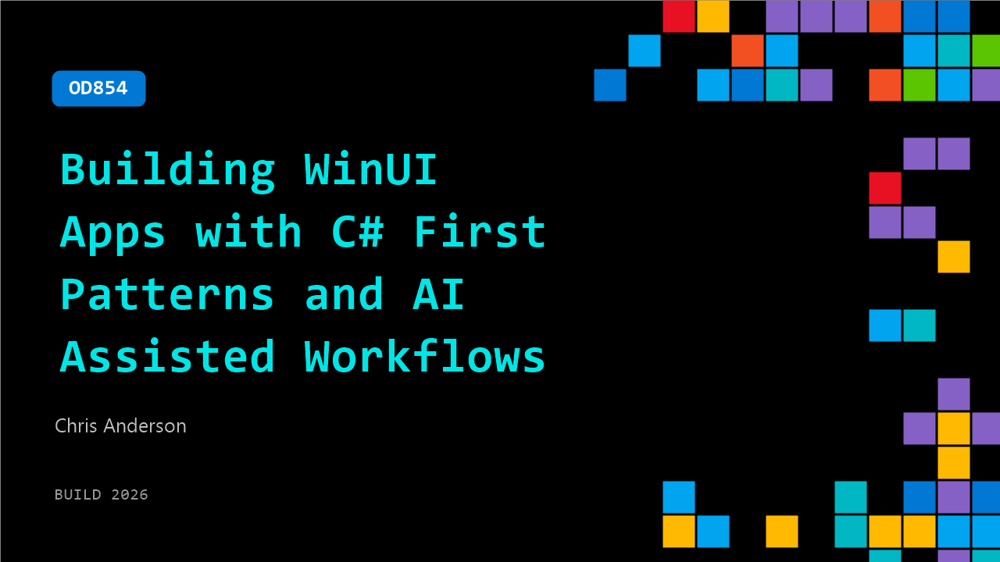

# OD854: Building WinUI Apps with C# First Patterns and AI Assisted Workflows

**Session code:** OD854  
**Watch on-demand:** <https://build.microsoft.com/en-US/sessions/OD854>

---

## Speakers

- **Chris Anderson** - VP Software Engineering, Microsoft

## About the session

Developers want faster iteration, clearer control flow, and tools that work well with AI assisted coding. WinUI remains the production platform for Windows apps while adapting to these needs. This session shows how emerging C# first patterns improve developer productivity, how experimental work such as Reactor informs future direction, and how these changes fit alongside the XAML based apps developers are shipping today.

## AI summary

_No AI summary available._

## Session tags

- **Session type:** Pre-recorded
- **Level:** (300) Advanced
- **Topic:** Windows
- **Tags:** Windows, WinUI
