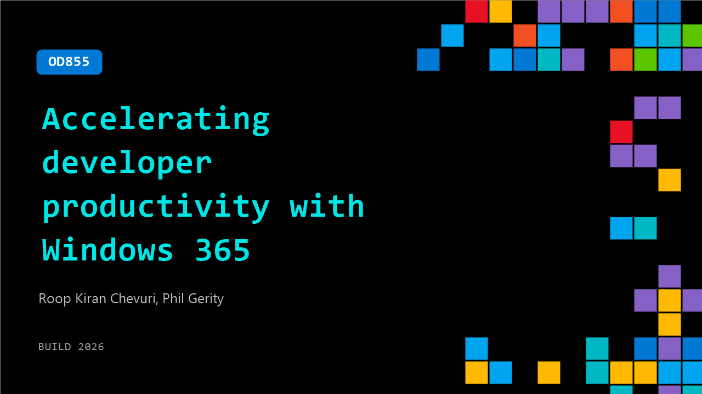

# OD855: Accelerating developer productivity with Windows 365

**Session code:** OD855  
**Watch on-demand:** <https://build.microsoft.com/en-US/sessions/OD855>

---

## Speakers

- **Roop Kiran Chevuri** - Group Product Manager, Microsoft
- **Phil Gerity** - Partner Group Product Manager, Microsoft

## About the session

This session explores how Windows 365 delivers secure, automated cloud experience for development. It covers developer ready images, performance enhancements, and professional grade Cloud PC capabilities. Learn what’s available today and how to use Windows 365 Cloud PCs as a flexible development platform across devices and locations—without sacrificing enterprise security.

## AI summary

_No AI summary available._

## Session tags

- **Session type:** Pre-recorded
- **Level:** (300) Advanced
- **Topic:** Windows
- **Tags:** Windows 365, GitHub Copilot, GitHub, Windows, Windows 365 for Agents, Visual Studio, Azure Local
