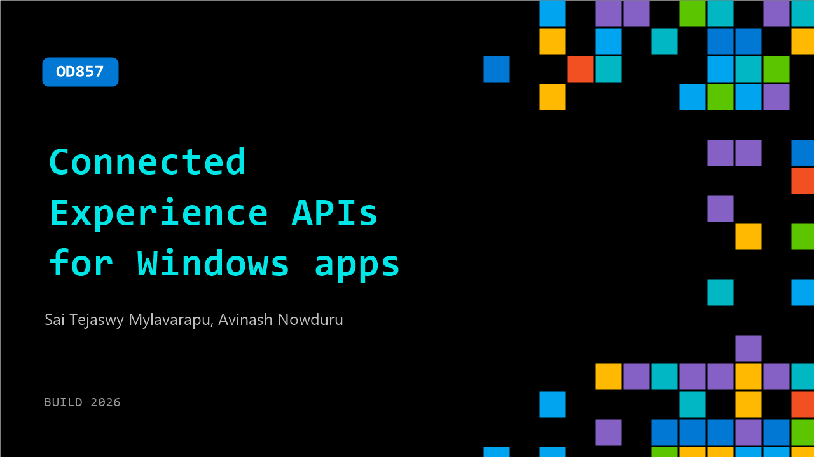

# OD857: Connected Experience APIs for Windows apps

**Session code:** OD857  
**Watch on-demand:** <https://build.microsoft.com/en-US/sessions/OD857>

---

## Speakers

- **Sai Tejaswy Mylavarapu** - Product Manager II, Microsoft
- **Avinash Nowduru** - Principal Software Engineer, Microsoft

## About the session

Users today are on multiple devices, Windows being one of them. As a Windows app developer, use "connected experience APIs" to make your app seamlessly discoverable and installable on the shell for user jobs like share, resume and communication. Try them out, not just for higher usage but also drive new installs on Windows, making your app stickier with users across all device ecosystems.

## AI summary

_No AI summary available._

## Session tags

- **Session type:** Pre-recorded
- **Level:** (300) Advanced
- **Topic:** Windows
- **Tags:** Developer, Windows, Windows APIs, DevTools, Windows SDKs, Cross-device, App Integration, Open Ecosystem
