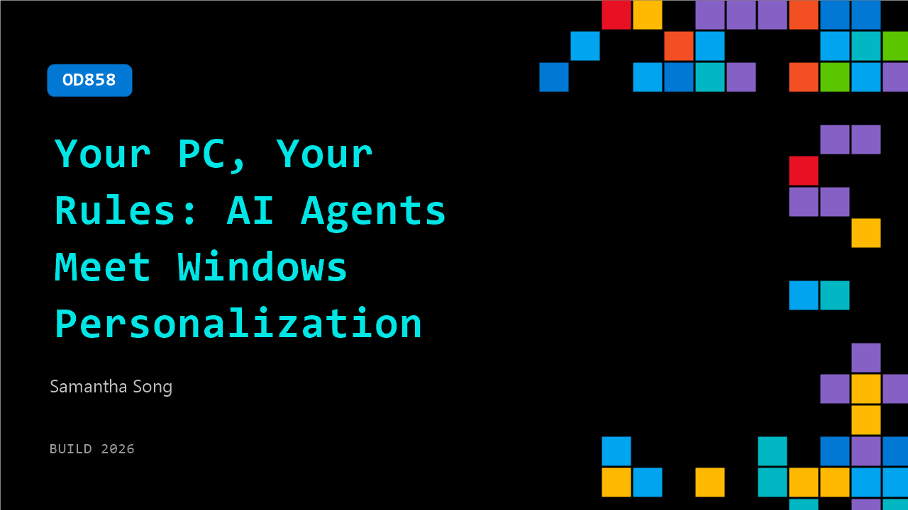

# OD858: Your PC, Your Rules: AI Agents Meet Windows Personalization

**Session code:** OD858  
**Watch on-demand:** <https://build.microsoft.com/en-US/sessions/OD858>

---

## Speakers

- **Samantha Song** - Product Manager, Microsoft

## About the session

What if Windows personalization was as simple as asking for a starry night vibe for late night coding and the system responded with custom RGB settings? This session shows how natural language prompts map to real Windows personalization APIs. You learn how to use MCP servers that drive Dynamic Lighting, system sounds, cursor themes, and multi monitor layouts, with a clear flow from prompt to MCP schema to API call, including scope, permissions, and rollback.

## AI summary

_No AI summary available._

## Session tags

- **Session type:** Pre-recorded
- **Level:** (300) Advanced
- **Topic:** Windows
- **Tags:** Windows, MCP, Agents on Windows, Personalization, Windows APIs, Dynamic Lighting
