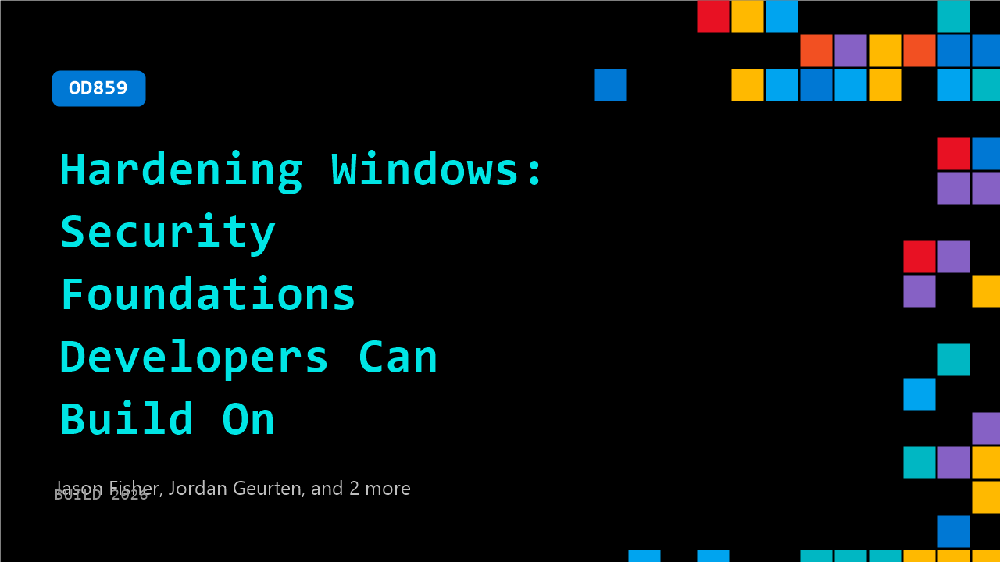

# OD859: Hardening Windows: Security Foundations Developers Can Build On

**Session code:** OD859  
**Watch on-demand:** <https://build.microsoft.com/en-US/sessions/OD859>

---

## Speakers

- **Jason Fisher** - Principal Group Software Engineering Manager, Microsoft
- **Jordan Geurten** - Senior Technical PM, Microsoft
- **Mariam Gewida** - Product Manager, Microsoft
- **Jeffrey Sutherland** - Principal Program Manager Lead, Microsoft

## About the session

Security assumptions are changing faster than most apps are built to handle. In this session, learn how Windows is raising the security foundation by reducing attack surface and preparing for the post‑quantum future. We’ll walk through Post‑Quantum Cryptography, moving authentication from NTLM to Kerberos, and stricter driver trust policies with live demos, so you know what’s changing, how it affects your apps, and what to do next.

## AI summary

_No AI summary available._

## Session tags

- **Session type:** Pre-recorded
- **Level:** (300) Advanced
- **Topic:** Windows
- **Tags:** Windows Security, Platform Security, Post Quantum Cryptography, NTLM Deprecation, Kerberos Authentication, Driver Trust Policy, Attack Surface Reduction
