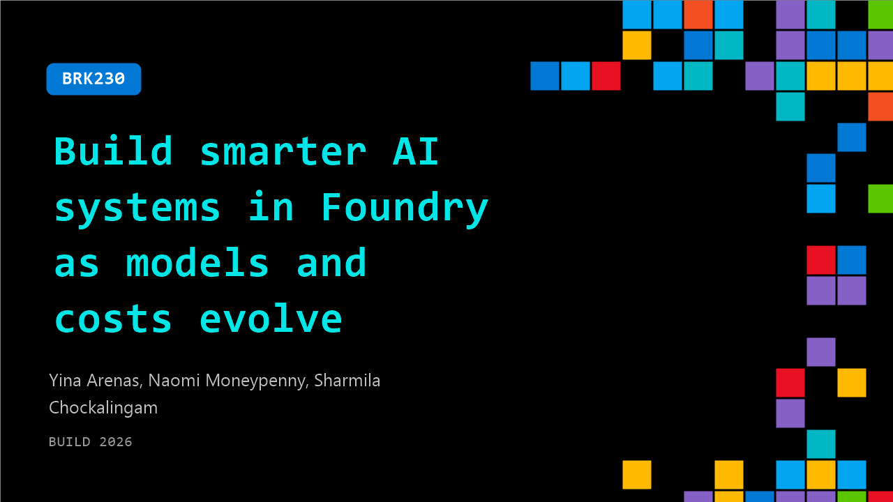

# BRK230: Build smarter AI systems in Foundry as models and costs evolve

**Session code:** BRK230  
**Date:** Tuesday, June 2, 2026 / 12:30 PM - 1:15 PM PDT (Duration 45 minutes)  
**Watch on-demand:** <https://build.microsoft.com/en-US/sessions/BRK230>

---

## Speakers

- **Yina Arenas** - CVP, Microsoft Foundry, Microsoft
- **Naomi Moneypenny** - Senior Director, Product Development, Microsoft
- **Sharmila Chockalingam** - Director product marketing, Microsoft

## About the session

Discover how to quickly choose, integrate, and validate AI models inside Microsoft Foundry. Learn techniques for navigating thousands of model options, benchmarking performance, and streamlining your workflow with deep IDE support. Build faster, ship smarter, and stay on top of the evolving AI landscape.

Seating for this session is first-come, first-served. Add it to your schedule to plan your day and arrive early to secure a spot.

## AI summary

**Introduction and Challenges in AI Development:** The session opens with Yina Arenas introducing "Building Smart AI Systems in Foundry" and setting the context for how rapidly evolving AI tools, models, and technologies make building AI systems increasingly complex (00:00:00–00:01:00). She explains that developers now need to think beyond simple chat applications and instead create full agentic or long-running systems that continuously improve. She highlights the common struggles developers face — choosing the right model, managing unpredictable costs, and keeping up with constant innovation. Yina emphasizes the need for systems that are simpler, scalable, and cost-effective through Microsoft Foundry (00:02:00), and she introduces Foundry’s ecosystem: GitHub Copilot CLI for building, Fabric IQ and Web IQ for grounding, and A365 for governance — all unified into a lifecycle platform for agentic systems. The introduction closes with a shift in mindset toward early evaluation and continuous quality improvements baked into development workflows.

**Model Selection and Foundry Ecosystem:** Naomi Moneypenny expands on how model selection works in Foundry (00:04:56–00:06:00). She notes Foundry provides access to thousands of frontier and open-source models via a unified catalog with enterprise-grade curation. The session reviews key partnerships: OpenAI, Anthropic, Hugging Face, and NVIDIA, along with announced model updates such as Claude now running on Azure hardware (00:07:00). Naomi presents Microsoft’s own AI models like Image 2.5 and discusses domains like geospatial and robotics AI with purpose-built models such as Aurora 1.5. She demonstrates Foundry’s portal, showing how developers can compare performance across quality, cost, and safety benchmarks, then save configurations as “agents” enriched with tools and memory. The section transitions to a live scenario — building a trip planning app — intended to demonstrate the workflow from base model selection to continuous evaluation (00:13:00).

**Evaluation-Driven Development:** Yina and Naomi use the travel planning scenario to establish baseline performance, applying GPT-4.1 to generate initial results (00:16:00–00:18:00). Quality starts low, confirming the importance of defining clear evaluation rubrics from the outset. They demonstrate decomposition — breaking the solution into smaller AI tasks — and using Foundry’s model routing to automatically select appropriate models per task (00:19:00). After switching to a routed multi-model design, costs drop and efficiency increases. The presenters stress that benchmarks shouldn’t dictate model choice; real workload evaluation should. Yina introduces custom and rubric-based evaluation tools now available in Foundry (00:25:00), complementing built-in quality, safety, and compliance evaluators. They demonstrate creating rubrics that incorporate travel policies, showing Foundry’s UI and Python code options for automated LLM “judging” and tracing results over time. This framework highlights that evaluations define product specs, helping teams hill climb — continuously improving and measuring success as systems evolve.

**Optimization, Caching, and Fine-Tuning:** The focus shifts to optimization, emphasizing that reducing AI cost rarely comes from cheaper models but from better system architecture (00:29:00). Naomi introduces performance levers including workload routing, batch inference, structured outputs, caching, and distillation. She announces explicit prompt caching — a new Azure capability granting developers private, persistent caching layers to cut latency and token costs (00:32:00). They later demonstrate fine-tuning and model distillation to encode company policies directly into models, embedding domain-specific logic for cost-effective results. Foundry provides three managed training modes — supervised fine-tuning, direct preference optimization, and reinforcement learning — supported by serverless APIs and full-control RL for advanced users (00:36:00). Newly announced integrations include Fireworks AI for high-speed inference and partnerships with Hugging Face for managing open models via Foundry-managed compute. Through these options, developers can balance quality, latency, and cost while leveraging secure compute, shared authentication, and consistent SDKs across deployments.

**Operations, Monitoring, and Continuous Improvement:** As the demo concludes, Naomi discusses moving from prototype to production with disciplined observability and governance (00:40:00). Foundry centralizes tracing, evaluation, and monitoring with Azure Monitor, enabling real-time cost, latency, and safety insights. A Copilot integration in the Foundry portal provides guidance directly in context, helping teams debug optimization issues. Yina wraps up the talk by summarizing the hill-climbing process: define success via evaluations, decompose systems, continuously optimize, and govern for scale (00:43:00). Foundry’s end-to-end tooling supports CI/CD integration, rollback controls, secure model governance, and iterative model updates, ensuring AI systems stay resilient as the technical landscape changes. The speakers close by inviting viewers to explore additional Build sessions on agents, post-training, responsible AI, and to join the community via ai.azure.com and Foundry’s Discord, reinforcing that building smart AI systems means building for continuous improvement — not one-off prompts, but governed, evolving systems.

## Session tags

- **Session type:** Breakout
- **Level:** (300) Advanced
- **Topic:** Working with models
- **Location:** Building B, Level 3, BATS Improv
