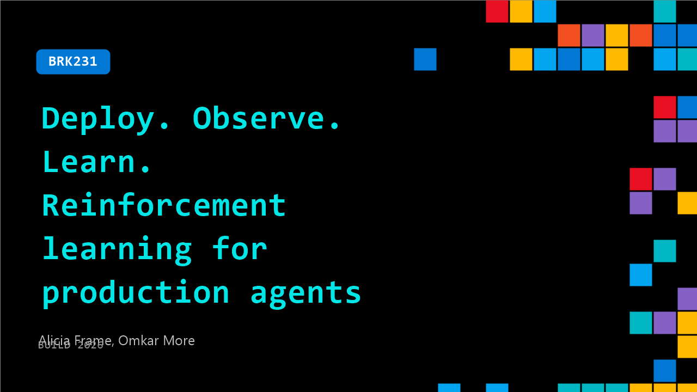

# BRK231: Deploy. Observe. Learn. Reinforcement learning for production agents

**Session code:** BRK231  
**Date:** Tuesday, June 2, 2026 / 3:45 PM - 4:30 PM PDT (Duration 45 minutes)  
**Watch on-demand:** <https://build.microsoft.com/en-US/sessions/BRK231>

---

## Speakers

- **Alicia Frame** - Principal Product Manager, Microsoft
- **Omkar More** - Partner Software Engineering Manager, Microsoft

## About the session

Agents don't fail in demos — they fail in production. In this breakout, see how teams use fine-tuning and reinforcement learning on Microsoft Foundry to improve production agents using real usage signals. We cover when fine-tuning reduces cost and latency, when RL delivers deeper gains, and how Foundry makes it easy to train, evaluate, and redeploy safely.

Seating for this session is first-come, first-served. Add it to your schedule to plan your day and arrive early to secure a spot.

## AI summary

**Introduction and Agenda:** At the start of the session 00:00:00–00:00:46, Alicia Frame welcomes attendees alongside Omkar More, introducing their roles as Product Lead and Engineering Lead for Model Customization. They outline the talk’s flow—covering fine-tuning, reinforcement learning, demos, and the upcoming low-level training API. The session’s goal is to show how to deploy, observe, and learn from production agents to produce better, faster, and smarter models. Alicia notes practicalities such as available headsets due to background noise, then begins with an overview of fine-tuning concepts and how these ideas apply directly to production agents 00:00:48–00:01:01.

**Understanding Fine-Tuning and Its Importance:** Alicia proceeds to explain Microsoft Foundry’s role as the backbone powering agent deployment, evaluation, and optimization 00:02:04. She contextualizes Foundry’s model library—over 11,000 models—and how fine-tuning helps manage token consumption and cost as agents grow more complex 00:03:00–00:03:47. Fine-tuning enables cheaper, faster, yet high-quality models, balancing performance and cost efficiency by replacing large frontier models (like GPT-5.4) with smaller, cost-effective variants such as 4.1 nano or Qwen. She describes optimization as an iterative journey—from prompt engineering and context management to adding tools and eventually optimizing performance via fine-tuning 00:06:07–00:07:02. Fine-tuning simplifies model customization through pretrained foundations, instruction tuning, and alignment tuning, enabling enterprises to create domain-tailored AI solutions 00:07:46–00:09:05.

**Demo 1 – Distillation and Supervised Fine-Tuning:** Moving into demonstrations, Omkar introduces a retail scenario—a customer service agent handling refunds 00:10:12–00:10:41. He showcases Foundry’s no-code interface alongside SDK-based workflows for distillation—training smaller models on data captured from larger “teacher” models (e.g., GPT-5.4). The first step is to test how smaller models perform without modification 00:13:05. Using evaluators and graders, both LLM-based and Python-based, Omkar assesses task accuracy and format consistency. After initial poor results from smaller models, he converts collected traces into clean training datasets using Foundry’s UI and starts supervised fine-tuning jobs 00:17:02. Once trained, the fine-tuned GPT-4.1 mini surpasses the original performance of larger models at significantly reduced cost and latency 00:20:21–00:21:22.

**Demo 2 – Reinforcement Learning and Interactive Optimization:** As the second phase 00:22:07 begins, Alicia explains how reinforcement learning (RL) enables models to learn from their own mistakes, moving beyond teacher limitations. In RL setups, generated responses are scored by a grader, and the model reinforces high-reward behaviors. Omkar demonstrates how Foundry makes RL practical through reinforcement fine-tuning (RFT) 00:25:03–00:27:02. He shows configuration using traces, defining RFT-specific graders to prevent “reward hacking,” and allowing real tool invocations during training. Foundry’s dashboard tracks metrics like rewards, reasoning token mean, and tool calls per rollout, which reflect learning progress and cost efficiency. Results show a fine-tuned o4-mini model achieving 84% evaluation scores—surpassing previous distillation results while maintaining budget-friendly operation 00:30:31. Alicia complements the demo with real-world examples from customers such as Decagon AI, Discovery Bank, and DocuSign, each realizing major latency and cost reductions through Foundry-based fine-tuning 00:31:59–00:32:24.

**Demo 3 – Low-Level API and Interactive Training:** The third demo 00:33:10 introduces Foundry’s upcoming interactive training API—a low-level interface granting data scientists direct control over algorithms without managing GPU infrastructure. Alicia clarifies that unlike managed fine-tuning, practitioners can define rollouts, calculate loss, update weights, and even modify graders mid-training 00:34:01. Omkar demonstrates using fine-grained APIs with the Qwen3 32B open-source model, writing recipes to generate rollouts, grade them, and compute advantages through GRPO passes. Telemetry and metrics such as entropy, gradient norm, and KL divergence are visible in Foundry’s local dashboard, offering diagnostic precision for debugging and optimization 00:39:01. The fine-tuned Qwen model achieves greater performance and cost savings, emphasizing Foundry’s flexibility for professional experimentation 00:41:02.

**Conclusion and Fine-Tuning Skill Demo:** To conclude 00:41:15–00:47:03, Alicia showcases the Fine-Tuning Skill integrated with GitHub Copilot for Azure. Using natural language, users can instruct Copilot to generate graders, gather datasets, and perform distillation automatically. It picks optimal models and hyperparameters for “cheaper and faster” goals without requiring SDK or UI interactions. The demo shows that even non-experts can fine-tune models reliably. Alicia wraps up by addressing key misconceptions: fine-tuning remains essential despite advancements in frontier models, as small models can outperform larger ones at lower costs while preserving customer IP. She highlights accessible experimentation tiers—developer-tier training and hosting—to minimize costs and accelerate learning. The talk concludes with resource links, invitations to join Foundry labs, and encouragement for hands-on exploration beyond the session.

## Session tags

- **Session type:** Breakout
- **Level:** (200) Intermediate
- **Topic:** Working with models
- **Location:** Festival Pavilion, Breakout 2
