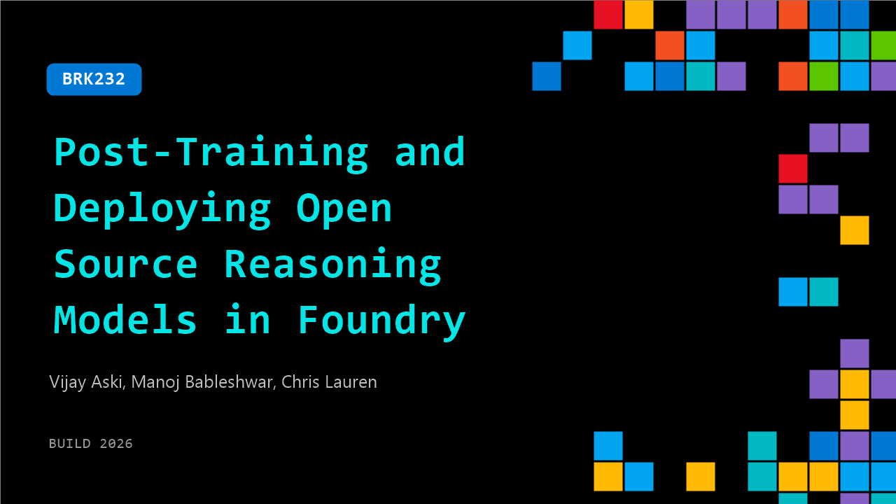

# BRK232: Post-Training and Deploying Open Source Reasoning Models in Foundry

**Session code:** BRK232  
**Date:** Wednesday, June 3, 2026 / 2:45 PM - 3:30 PM PDT (Duration 45 minutes)  
**Watch on-demand:** <https://build.microsoft.com/en-US/sessions/BRK232>

---

## Speakers

- **Vijay Aski** - Senior Partner Director, Microsoft
- **Manoj Bableshwar** - Principal Product Manager, Microsoft
- **Chris Lauren** - Partner Group Product Manager, Core AI, Microsoft

## About the session

Open-source reasoning models are powerful out of the box, but production performance comes from closing the loop. Learn how to use Microsoft Foundry to collect production traces, curate them into datasets, and post-train reasoning models with RL using frameworks like slime, verl, and TRL. We'll cover when RL drives real gains and how to redeploy improved models without managing infrastructure.

Seating for this session is first-come, first-served. Add it to your schedule to plan your day and arrive early to secure a spot.

## AI summary

**Session Introduction:** The session opens with a welcome and overview of the purpose (00:00:00–00:00:18). The speaker stresses how vital agents have become in transforming work across enterprises and startups. They note that deploying models into production is only the start; continuous learning and improvement are fundamental for performance at scale (00:00:49–00:01:04). The goal of the presentation is to showcase how Foundry enables cost-effective, high-quality, scalable AI agents through continuous optimization. A key point raised is that agents consume far more tokens than standard chatbots, naturally increasing costs (00:01:17–00:02:07), which drives the need for learning loops powered by reinforcement learning.

**Fine-Tuning and Model Selection:** The second section dives into post-training and fine-tuning techniques to teach models domain context and proper tool usage (00:02:27–00:04:00). Fine-tuning ensures the model acts intelligently and cost-efficiently, preventing erroneous or redundant actions. Foundry supports selecting optimal models and integrating evaluation pipelines to maintain quality and control cost. The speaker highlights an example of customer service agents handling product returns using both large frontier models, like GPT‑5, and smaller open-source ones, such as Quen‑314B (00:05:22–00:06:17). Foundry’s telemetry feature also allows teams to trace how each model responds in production, measure cost per tool call, and identify ways to improve model reliability.

**Evaluations and Quality Optimization:** The next portion focuses on the role of “evals” in ensuring success criteria and policy adherence (00:08:09–00:10:13). Evaluators in Foundry define what constitutes good performance and guide optimization. This approach shifts traditional monitoring—teams first define what “going well” means, then continuously climb toward better quality. Custom evaluators enable testing against proprietary data and scenarios instead of relying on general benchmarks. Using these tools, Foundry users can create unified metrics tailored to specific retail or business contexts (00:10:33–00:11:12), and learn to optimize those metrics through post-training based on production feedback.

**Post-Training Fundamentals and Demonstration:** The middle of the presentation transitions to Vijay, who explains the stages of model training—pre-training, mid-training, and post-training (00:13:01–00:15:00). Post-training, covering fine-tuning and reinforcement learning, makes models better suited to company-specific workflows. Examples include distilling production traces, SFT (supervised fine-tuning), and RFT (reinforcement fine-tuning) to improve agent response accuracy while minimizing token expense (00:18:54–00:20:04). Vijay walks through the Foundry interface showing how to initiate fine-tuning jobs, configure compute clusters, track reward signals, and visualize rollout improvements (00:25:23–00:28:28). Evaluation dashboards reveal how smaller, post-trained models catch up with large proprietary ones in quality while reducing cost.

**API Simplification and Advanced Tools:** Vijay concludes with an introduction to new Foundry capabilities—code-first and API-first training workflows (00:32:00–00:36:00). A new API, tentatively called “Loom,” simplifies reinforcement and supervised tuning on CPUs without configuring GPU clusters. The API handles infrastructure automatically, leaving developers to focus on forward and backward passes, sampling, and gradual difficulty progression when teaching models mathematics or reasoning. The new system offers complete visibility across training metrics, entropy reduction, and reward growth, giving data scientists greater control with minimal system configuration.

**Deployment and Wrap-Up:** The final section has Chris and Manoj demonstrating deployment workflows (00:37:00–00:44:00). Foundry managed compute enables scalable, serverless deployment for both base and fine-tuned models across multiple GPUs with cost and telemetry monitoring built in. Manoj shows deploying open-source models like Quen‑32B, selecting GPU configurations, and integrating the deployed APIs into agents to power tasks like real-time NBA queries (00:43:02–00:43:55). Dashboards visualize token usage and expenses per model. In conclusion (00:44:41–00:46:40), Chris reiterates that Foundry’s ecosystem seamlessly connects open-source and proprietary models, reinforcement learning APIs, and managed compute tools to empower teams to continuously optimize agents for cost, scale, and performance.

## Session tags

- **Session type:** Breakout
- **Level:** (300) Advanced
- **Topic:** Working with models
- **Location:** Festival Pavilion, Breakout 2
