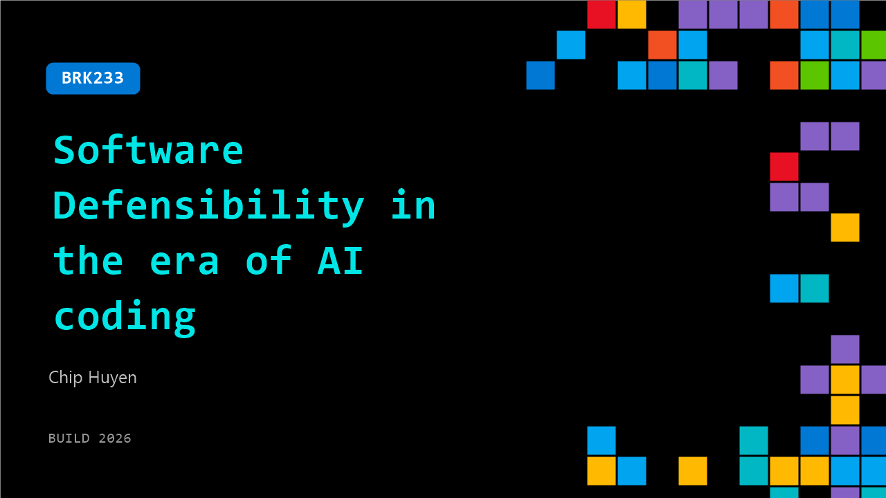

# BRK233: Software Defensibility in the era of AI coding

**Session code:** BRK233  
**Date:** Tuesday, June 2, 2026 / 5:00 PM - 5:45 PM PDT (Duration 45 minutes)  
**Watch on-demand:** <https://build.microsoft.com/en-US/sessions/BRK233>

---

## Speakers

- **Chip Huyen** - Builder, Stealth

## About the session

If the cost of building software is approaching 0, is the value of building software is also approaching 0? If most software can be easily replicated by AI, how can we defend our products after we've built it? This talk discusses what have traditionally been considered moats for software products, why they aren't really moats, and why we should, as builders, continue building.

Seating for this session is first-come, first-served. Add it to your schedule to plan your day and arrive early to secure a spot.

## AI summary

**Introduction and Background:** At the beginning of the talk 00:00:02–00:00:25, Chip Huyen greets the audience and introduces herself, sharing her professional history from NVIDIA to Snorkel AI and then founding and selling her own AI infrastructure startup. She explains that her current focus is robotics, before transitioning to the core topic—software defensibility in the age of AI. She reflects that both her strengths, writing and coding, are now easily automated, prompting her to ask what aspects of work can still be defended against automation 00:00:50. The opening sets the stage for a deep look at how AI is reshaping value creation and competition in software.

**The Vanishing Cost of Software and Replication Challenges:** Moving into the main discussion 00:01:00–00:04:00, Chip explores the idea that the cost of software creation is approaching zero, thanks to rapid AI-assisted code generation. Companies that once tested 20 variations can now test thousands cheaply, raising the question of whether the value of software also approaches zero when building becomes frictionless. She shares an anecdote about launching a weekend project that quickly gained traction—only to be replicated by someone using Claude Code a day later 00:02:51. This experience highlights how easily AI can duplicate not only effort but also creative output, challenging traditional notions of defensibility and unique value in software products.

**Identifying Moats in the AI Ecosystem:** Chip then engages the audience in an interactive discussion about what constitutes a “moat” for software products in this new landscape 00:06:16–00:12:00. Attendees propose proprietary data, trust or branding, and customer service as potential defenses. She elaborates that proprietary data can easily be acquired by companies with funds—making money, rather than data, the true moat. Similarly, trust and branding can erode quickly when product improvements occur at exponential pace, as seen when ChatGPT faced rapid competition from Claude and DeepSeek 00:08:01. Distribution advantages and expertise are considered next, with Chip noting that both can also be purchased or replicated. The only lasting advantage, she argues, may be momentum—moving faster than competitors, though that creates intense pressure for endless iteration.

**Building Value Amid AI Expansion:** In the next segment 00:13:00–00:20:00, Chip contends that despite the bleak implications, there is still meaningful value in building software. She describes “career audits” and the idea of defensibility of oneself—how engineers can find skills AI cannot yet automate. She discusses the rise of long-tail problems AI frontier labs often overlook: niche challenges that affect a minority of users, such as underrepresented languages and latency issues in voice chatbots. Using an example from her Iranian colleague struggling with Farsi output from ChatGPT 00:16:30, Chip argues that unique cultural and contextual understanding can serve as a defensible strength. Builders should focus on problems “big enough to be profitable but not big enough for AI labs to chase,” such as nuanced preferences and regional variability.

**Human–AI Interaction and Evolving Tooling:** Transitioning to practical engineering implications 00:21:00–00:33:00, she examines new workflows introduced by AI coding tools like Claude Code and Codex. She contrasts terminals’ deliberate complexity with IDE usability and imagines hybrid tools that blend interactive control and ease of use. Chip covers challenges of cloud-hosted agent persistence, code review dynamics on GitHub, and shifting artifacts—from human-written code to AI-generated instructions. She introduces the idea of adapting legacy workflows for human-AI collaboration, API-centric designs over GUI interfaces, and even re-architecting monolithic repositories into modular codebases to support AI-assisted development. She connects these software design trends with examples from robotics and urban infrastructure, like robots interacting through “streetlight APIs” to cross streets 00:30:51.

**Robotics, Safety, and The Future of AI Agents:** In her concluding section 00:33:00–00:42:00, Chip extends the concept of digital agents to the physical world. She discusses reversibility failures—like Claude Code deleting her database—and the importance of safety in physical AI, especially robotics for elderly care. Using examples such as battery failures in Unitree G1 robots and one-wheel transport accidents, she highlights how physical AI agents introduce exposure to irreversible events and necessitate design for safety, self-charging, and reliability. She projects a future where AI agents expand from generating tokens to performing digital then physical actions, bridging coding, reasoning, and manipulation with environment understanding. The talk closes with excitement about upcoming robotics demonstrations and Chip’s vision of AI-enhanced physical systems still grounded by human purpose and defensible expertise 00:42:36.

## Session tags

- **Session type:** Breakout
- **Level:** (300) Advanced
- **Topic:** Working with models
- **Tags:** Azure Copilot, PowerShell, AI Toolkit
- **Location:** Festival Pavilion, Breakout 3
