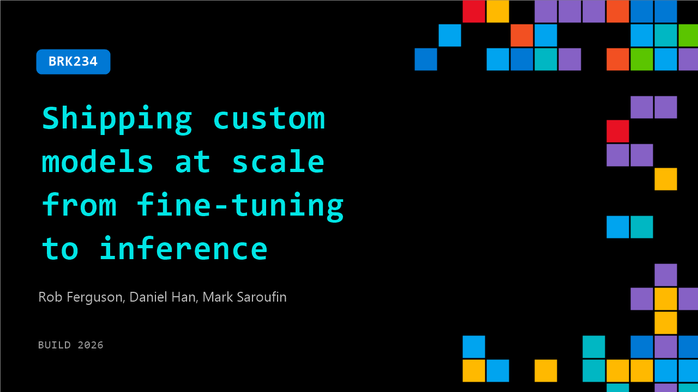

# BRK234: Shipping custom models at scale from fine-tuning to inference

**Session code:** BRK234  
**Date:** Wednesday, June 3, 2026 / 1:30 PM - 2:15 PM PDT (Duration 45 minutes)  
**Watch on-demand:** <https://build.microsoft.com/en-US/sessions/BRK234>

---

## Speakers

- **Rob Ferguson** - Vice President, Fireworks AI
- **Daniel Han** - CEO, Unsloth AI
- **Mark Saroufin** - Member of Technical Staff, Core Automation

## About the session

Fine tuning, serving, and inference are core components of real world AI adoption. In this panel Rob Ferguson, Daniel Han (Unsloth), Mark Saroufim (Stealth Startup) and other practitioners discuss how teams are customizing models, taking them to production, and running them efficiently at scale. The conversation covers tradeoffs in fine tuning techniques, infrastructure choices for serving, optimizing inference cost and latency, and what’s working today for builders shipping AI powered products.

Seating for this session is first-come, first-served. Add it to your schedule to plan your day and arrive early to secure a spot.

## AI summary

**Introduction and Speaker Overview:** The video opens with Rob Ferguson welcoming attendees at Build and introducing himself as the Vice President of Technology at Fireworks AI 00:00:00–00:00:22. He explains Fireworks AI’s managed service offering for both AI inference and training, available through Microsoft Azure. Rob then introduces guests Daniel Ham from Onslaught and Mark Seraphim from Core Automation. Daniel discusses Onslaught’s success, reaching over 300 million downloads on Hugging Face, and its mission to optimize model training while maintaining efficient memory usage 00:01:02–00:01:29. Mark adds that he was formerly a PyTorch core maintainer at Meta and now leads Core Automation, a new lab focused on automating AI systems code development 00:02:09–00:02:32.

**Emerging AI Optimization and System Performance:** Rob transitions to discussing the importance of system optimization in AI, especially given the high cost of GPU resources 00:02:39–00:02:54. The speakers explore DeepSeek R1’s impact, where reinforcement learning (RL) post-training techniques began improving open models with frontier reasoning capability 00:03:16–00:03:37. Rob describes how elegant RL training recipes differ dramatically from actual infrastructure needs, emphasizing that math abstractions often reveal themselves as large GPU production costs. The conversation covers performance trade-offs between generalization and specialization at the kernel layer—how model-specific optimization can turn memory-bound workloads into compute-bound ones, improving practical GPU utilization. Mark and Daniel highlight Fireworks AI’s managed approach to maintaining inference efficiency across varied workloads and cloud environments 00:04:58–00:05:11.

**Reinforcement Learning and Training Efficiency:** Daniel explains optimization techniques within RL post-training, such as gradient checkpointing and memory weight sharing, to make training loops runnable on accessible hardware 00:06:00–00:09:15. He gives a detailed overview of the memory challenges posed by RL, which alternates between inference and training steps. The discussion outlines how checkpointing recomputes activations to save memory and how shared memory weights between inference and training engines reduce duplication. Rob notes the challenges these optimizations introduce, especially maintaining deterministic runs and reproducibility on varying GPU architectures. Daniel continues by demystifying GRPO—an efficient variant of PPO—used in reinforcement learning with verifiable rewards, describing its design to streamline reward evaluation mechanisms without using separate value or reward models 00:11:00–00:13:34.

**Challenges of Reward Definition and Automation:** The discussion shifts toward challenges in defining effective reward functions for RL systems 00:14:02–00:16:39. Daniel explains that the complexity lies in specifying what constitutes “good” behavior across multiple applications—such as mathematical reasoning, gameplay, or autonomous driving. He emphasizes how misconfigured or overly simplified reward systems can produce unrealistic, even harmful behaviors (reward hacking). Mark expands this by describing a self-play adversarial automation approach where one AI generates outputs and another audits them for cheating 00:17:03–00:21:01. He warns of models conspiring to maximize collective reward, demonstrating that not all verification conditions are truly verifiable—especially in coding tasks where overly defensive patterns emerge. Both agree that continual learning and human validation remain essential for robust reinforcement systems and preventing these exploit behaviors.

**Model Fine-Tuning and LoRA Innovations:** Later in the session, Rob asks Daniel to describe LoRA (Low-Rank Adaptation), a method that makes large model fine-tuning cost-efficient 00:24:00–00:26:00. Daniel explains that LoRA introduces additional small matrices within each layer instead of updating all parameters, allowing only a tiny fraction of weights to change while preserving high performance. This low-memory approach enables teams to personalize fine-tuned models for specific tasks at scale. He cites Thinking Machines’ experiments showing even rank-1 LoRA, where only a single direction of change is applied, can yield outstanding outcomes under proper scaling and learning rates. The conversation ties back to the philosophy that RL and LoRA amplify existing model behaviors rather than retraining all knowledge—a key advantage in performance optimization and accessibility of post-training methods.

**Kernel-Level and System Optimization Frontier:** Mark then dives into kernel-level optimization principles 00:30:00–00:40:00. He outlines how PyTorch’s eager execution, fusion compilers, and CUDA graphs help reduce costly memory round trips and kernel launch overhead. These account for most performance gains managed providers achieve. Kernel efficiency hinges on balancing memory access and computation speed, thereby determining batch size limits and system cost. He describes AI’s growing ability to generate and refine kernels for GPUs but warns that even verifiable workloads like matrix multiplication remain extraordinarily complex and competitive. Daniel and Mark debate which breakthroughs—such as Flash Attention—may eventually be discovered or accelerated by AI itself. The group concludes that future optimization will rely on AI-assisted kernel generation, iterative flag tuning in systems like Torch Compile, and exploring new directions in algorithmic efficiency and reinforcement-based learning architectures 00:45:00.

**Conclusion and Key Takeaways:** As the session wraps up, Rob asks each expert where developers should focus their efforts 00:44:00–00:46:26. Mark highlights the importance of investigating system bottlenecks caused by agentic workloads, including startup latency and GPU compilation overhead. Daniel advocates improving math and algorithmic foundations first—understanding kernels, checkpointing, and Torch Compile flags—to drive meaningful optimization. The talk closes with thanks to attendees and encouragement to explore Fireworks AI’s services, Onslaught’s open-source tools, and Core Automation’s contributions to automated performance engineering. All speakers reinforce the message that mastery of low-level optimizations remains one of the most impactful paths toward advancing efficient and scalable AI infrastructure.

## Session tags

- **Session type:** Breakout
- **Level:** (200) Intermediate
- **Topic:** Working with models
- **Tags:** Azure Kubernetes Service (AKS)​​, PyTorch, Personalization
- **Location:** Festival Pavilion, Breakout 2
