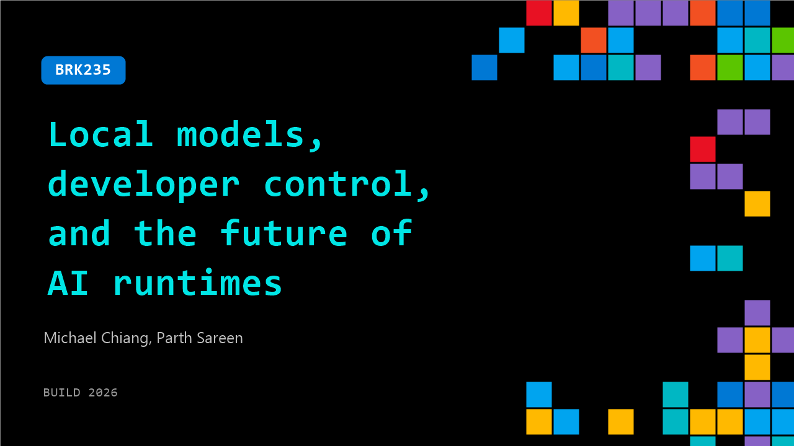

# BRK235: Local models, developer control, and the future of AI runtimes

**Session code:** BRK235  
**Date:** Wednesday, June 3, 2026 / 10:15 AM - 11:00 AM PDT (Duration 45 minutes)  
**Watch on-demand:** <https://build.microsoft.com/en-US/sessions/BRK235>

---

## Speakers

- **Michael Chiang** - Co‑founder, Ollama
- **Parth Sareen** - Software Engineer, Ollama

## About the session

How local and hybrid model execution is reshaping developer workflows, privacy, and experimentation. Why “run it yourself” is back.

Seating for this session is first-come, first-served. Add it to your schedule to plan your day and arrive early to secure a spot.

## AI summary

**Introduction and Overview:** The session begins with introductions by Parth and Michael from O Llama, who describe the talk’s focus on open models for agents and the combination of hybrid local and cloud systems that make these agent technologies viable (00:00:07–00:00:19). Michael explains that O Llama offers the simplest way for developers to access and deploy open models locally with just one command, and has grown to over eight million active developers. They introduce the concept of “O Llama Launch,” a command that allows easy integration of open models into familiar tools such as VS Code and GitHub Copilot (00:01:00–00:01:16). He notes partnerships with major model and hardware providers and announces that DeepMind’s new Jemma 4-12B unified model is already hosted and available on the O Llama platform (00:02:06–00:02:18).

**Hybrid Cloud and Local Integration:** Michael next discusses the addition of O Llama Cloud to complement local inference beginning earlier this year (00:02:21–00:02:28). He stresses its security and privacy with zero data retention, allowing users to run advanced “frontier” models on data-center-grade hardware when local compute is limited. The hybrid approach makes scaling seamless while preserving privacy. Use cases include parallel agents for complex tasks and models offering maximum context windows provided by partners (00:02:49–00:03:11). The talk emphasizes that the service is optional, catering both to local experimentation and enterprise scaling. Parth and Michael then highlight rapid improvements in open models that now handle mainstream use cases cost-effectively and enable customization based on organizational goals (00:03:14–00:03:59).

**Model Evolution and Real-World Adoption:** The speakers explain how open models have evolved from generic conversational systems to structured, reasoning-capable tools capable of multistep and long-horizon tasks (00:04:02–00:05:00). They showcase how organizations apply O Llama in real-world contexts: the Lawrence Berkeley National Laboratory uses it to automate X-ray physics research, NASA Glenn Research Center employs it for Mars mission task classification, and the U.S. Department of Energy integrates it for natural language log data summarization (00:05:00–00:06:31). In industry, companies use O Llama to process confidential financial documents securely, design mechanical components, and support factory technicians with retrieval-augmented systems, emphasizing its adaptability and privacy features (00:06:34–00:07:30).

**Demonstrations and Developer Workflow:** Parth transitions to live demonstrations showing how developers can use O Llama for both local and cloud workloads with consistent experience (00:07:32–00:07:56). He showcases O Llama Launch connecting to GitHub Copilot via command line, performing issue analysis and code suggestions. The demo illustrates automation through sub-agents that search and generate fixes within a developer’s terminal (00:09:03–00:10:28). Parth also emphasizes hybrid execution, where developers can run confidential analyses locally—for example, parsing a monthly credit card statement securely using a local Quant model—and contrasts this with heavier computation workloads suited for the cloud (00:10:51–00:12:19). He further demonstrates quick setup of personal agents such as Open Claw, showing how users can be fully operational within minutes.

**Audience Questions and Technical Insights:** During audience Q&A, one attendee asks about O Llama’s potential for mobile and edge devices. Michael responds that while the platform runs on Snapdragon hardware, mobile support is not yet a focus, as current efforts target mainstream workstations (00:15:03–00:15:12). Another question addresses VRAM, unified memory, and context window sizes, to which Parth explains that O Llama supports quantized models and MLX-based inference for strong performance on Apple Silicon. Upcoming hardware trends toward unified memory from NVIDIA, AMD, and Microsoft will further improve performance and model capacity (00:16:00–00:17:15). When asked about inference engines, they confirm that while LLama.cpp was foundational, the company now uses its own MLX engine optimized for Apple devices (00:17:40–00:18:03).

**Conclusion and Closing Remarks:** The talk ends with a discussion on model selection, where Parth recommends experimenting with multiple options—such as 13B or Gemma models—depending on the coding or agentic use case (00:18:17–00:19:56). He mentions that O Llama will soon include intelligent recommendations within its launch workflow to guide users toward optimal models for specific hardware. Finally, the speakers invite audience members to continue discussions after the session, collect O Llama stickers, and explore deeper collaborations, wrapping up a comprehensive exploration of how open-model ecosystems can power scalable, privacy-oriented AI agents (00:20:01–00:20:09).

## Session tags

- **Session type:** Breakout
- **Level:** (300) Advanced
- **Topic:** Working with models
- **Tags:** Purview, Purview, Azure DevOps, Agent Observability
- **Location:** Festival Pavilion, Breakout 2
