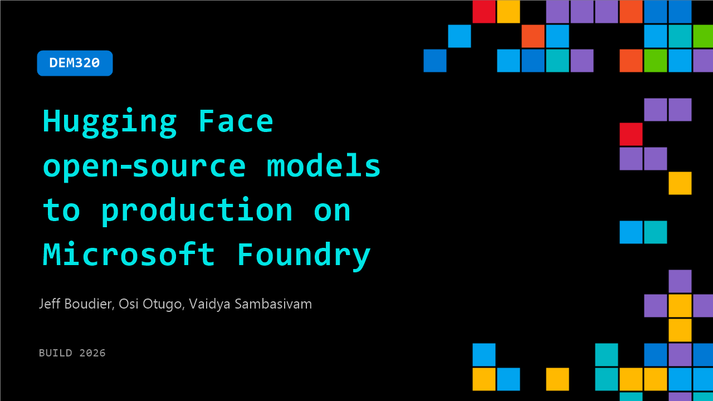

# DEM320: Hugging Face open‑source models to production on Microsoft Foundry

**Session code:** DEM320  
**Date:** Wednesday, June 3, 2026 / 10:30 AM - 10:55 AM PDT (Duration 25 minutes)  
**Watch on-demand:** <https://build.microsoft.com/en-US/sessions/DEM320>

---

## Speakers

- **Jeff Boudier** - VP of Product, HuggingFace
- **Osi Otugo** - Product Manager, Microsoft
- **Vaidya Sambasivam** - Partner GPM - Head of Product, Microsoft

## About the session

Open-source models fuel modern AI but running them in production is hard. In this lightning talk, Microsoft and Hugging Face demonstrate how to deploy and scale Hugging Face models using Foundry Managed Compute inside Azure AI Foundry. Through a fast, end to end demo, developers will see how to go from model discovery to production inference without managing GPUs, while gaining autoscaling, governance, and enterprise grade performance.

Seating for this session is first-come, first-served. Add it to your schedule to plan your day and arrive early to secure a spot.

## AI summary

_No AI summary available._

## Session tags

- **Session type:** Demo
- **Level:** (200) Intermediate
- **Topic:** Working with models
- **Location:** Festival Pavilion, Theater A
