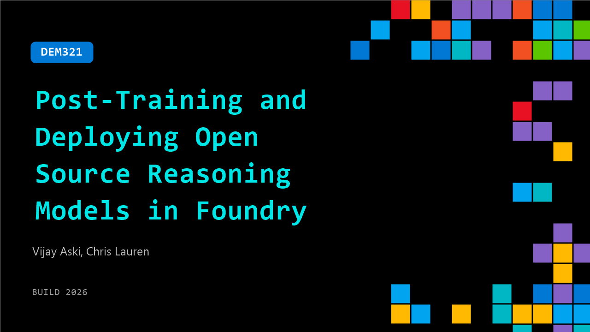

# DEM321: Post-Training and Deploying Open Source Reasoning Models in Foundry

**Session code:** DEM321  
**Date:** Tuesday, June 2, 2026 / 2:10 PM - 2:35 PM PDT (Duration 25 minutes)  
**Watch on-demand:** <https://build.microsoft.com/en-US/sessions/DEM321>

---

## Speakers

- **Vijay Aski** - Senior Partner Director, Microsoft
- **Chris Lauren** - Partner Group Product Manager, Core AI, Microsoft

## About the session

Go beyond prompt engineering to build custom reasoning models using reinforcement learning in Microsoft Foundry. We'll walk through how to train and fine-tune a model to improve reasoning quality, deploy it into Foundry, and integrate it into an agent workflow. Designed for developers comfortable with code, this session focuses on real implementation details, covering training loops, evaluation, and deployment patterns that directly impact agent performance.

Seating for this session is first-come, first-served. Add it to your schedule to plan your day and arrive early to secure a spot.

## AI summary

**Introduction and Context:** The session begins with light humor and an apology for a technical delay before moving into the core topic of intelligent agents 00:00:05–00:00:11. The speaker highlights that while agents are gaining popularity for handling autonomous workflows, they introduce scalability challenges due to high token consumption 00:00:32. The discussion sets the stage by comparing agents with traditional chat scenarios, emphasizing the need for cost-effective ways to deploy them in production through optimized model usage.

**Optimizing Agent Efficiency with Foundry:** To address cost and performance issues, the presenter introduces Foundry as a solution for fine-tuning smaller, open-source models that can outperform larger frontier models once customized for a specific business domain 00:00:56–00:01:19. Foundry allows users to define what “good” looks like in their workflows and iteratively train models at a fraction of the cost. The speaker stresses that rather than relying solely on massive proprietary models, organizations can leverage Foundry to control their data, optimize their agent logic, and achieve scalable, efficient performance 00:01:56.

**Test-Driven Development for Agents and Evaluation Framework:** A major conceptual shift is proposed—treating agent evaluation similarly to software testing. By defining evaluation criteria, or “evals”, upfront, teams can iteratively test and refine their models 00:02:09–00:03:04. The speaker parallels this approach with test-driven development, explaining that these evaluations govern expected behaviors, policy adherence, and tool usage patterns. Foundry now supports creating, deploying, and customizing agents using any open-source framework, ensuring that organizations can maintain consistency, trust, and quality regardless of model source 00:03:04–00:03:25.

**Demonstration of Model Customization in Foundry:** The live demonstration begins with a practical setup of Foundry’s workspace 00:03:32. The speaker contrasts the performance of the GPT 5.2 frontier model and an open-source model, Quen 314B, within a customer service agent scenario 00:03:49–00:04:43. While GPT 5.2 performs well but at a higher cost, the smaller Quen model demonstrates significant efficiency improvements when fine-tuned using reinforcement learning techniques 00:05:07. This process teaches the model not only to understand the business language but also to properly sequence tool interactions to achieve faster resolutions at lower costs.

**Automated Data Collection and Reinforcement Learning Cycle:** The presentation continues with an explanation of Foundry’s built-in observability and dataset creation features. Every user session and model interaction is traced and stored automatically, allowing teams to audit model behavior and cost 00:05:38–00:06:06. These traces can then be transformed into structured training datasets that feed future reinforcement learning rounds, continuously improving model effectiveness over time 00:06:30. This closed-loop approach ensures steady enhancement of accuracy and alignment between production data and model logic.

**Deep Dive into Post-Training Techniques and Conclusion:** Vijay transitions into the technical segment, explaining the concept of post-training as an umbrella for methods like supervised fine-tuning (SFT) and reinforcement fine-tuning (RFT) 00:07:27–00:08:14. He clarifies that SFT teaches models to imitate provided examples, while RFT rewards models for completing verifiable tasks accurately. Using Foundry’s integration with Ray dashboards, teams can monitor and manage training clusters, visualize job trajectories, and observe fine-tuning rewards in real time 00:09:04–00:10:56. The session concludes by reinforcing that combining SFT and RFT leads to more precise, token-efficient, and production-ready agents. The presenters thank the audience for their patience and summarize the value of data-driven, reinforced model customization 00:11:21.

## Session tags

- **Session type:** Demo
- **Level:** (200) Intermediate
- **Topic:** Working with models
- **Location:** Gateway Pavilion, Level 2, Theater B
