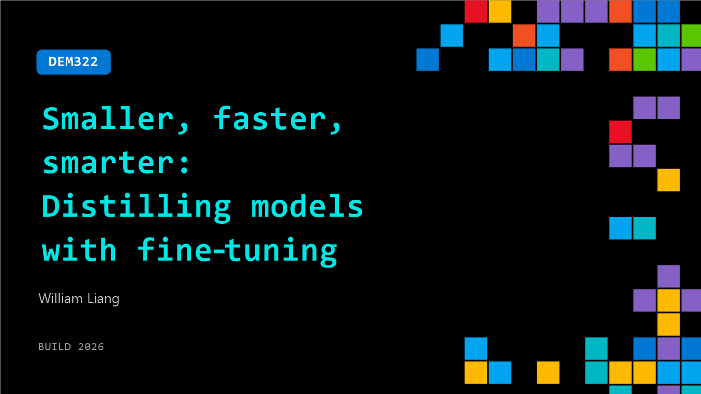

# DEM322: Smaller, faster, smarter: Distilling models with fine‑tuning

**Session code:** DEM322  
**Date:** Wednesday, June 3, 2026 / 12:20 PM - 12:45 PM PDT (Duration 25 minutes)  
**Watch on-demand:** <https://build.microsoft.com/en-US/sessions/DEM322>

---

## Speakers

- **William Liang** - Product Manager, Microsoft

## About the session

Large models are powerful, but expensive to run in production. In this demo, we’ll show how teams use Foundry for distillation and supervised fine-tuning to train small language models for task‑specific accuracy, dramatically reducing latency and cost. We’ll cover when distillation makes sense, how it complements fine tuning and reinforcement learning, and what real production teams have learned when deploying smaller models at scale. Expect fast examples and lots of Q&A.

## AI summary

**Introduction and Motivation:** The session opens with greetings and a brief overview of the purpose of the talk 00:00:00–00:00:07. William from the Foundry Fine Tuning team explains that six months ago, the focus was on building the fastest agent, but now the objective is shifting toward affordability and scalability in enterprise contexts 00:00:14–00:00:30. As AI transitions from research labs into enterprise workflows, it must become cheaper and more accessible—a utility rather than a luxury. The audience is told the session will demonstrate how production agent traces can be transformed into smaller, cost-effective models 00:00:47–00:01:03.

**Understanding Model Distillation and Agent Traces:** William introduces the core concept of model distillation, describing it as an apprenticeship between teacher and student models 00:01:37–00:02:12. A larger model performs tasks in production, generating examples that guide the smaller model's fine-tuning process. He further explains why learning from agent traces—real user interactions—is valuable for training models that replicate realistic problem-solving behavior 00:02:24–00:03:05. Real traces allow models to learn not just dialogue, but which tools to use, in what order, and with what arguments, teaching them correct decision-making trajectories. Foundry provides built-in tools to collect these traces automatically, allowing agents to grow smarter through continued interaction 00:03:37–00:04:18.

**Distillation Benefits and Setup for Demo:** The presenter outlines four wins from distilling models: lower cost, faster responses, quality comparable to teacher models, and improved behavioral consistency through supervised fine-tuning 00:04:23–00:05:12. To demonstrate this practically, William transitions to a live demo, explaining that difficult tasks will be given to both teacher (GPT‑55) and student (GPT‑41 Nano) models 00:05:26–00:06:11. The teacher model will generate rich traces simulating real-world interactions, which will then be cleaned and used to fine-tune the student model. The setup emphasizes how costly teacher models can be, motivating the need for efficient distillation strategies to produce smaller models that maintain accuracy but operate faster and cheaper 00:06:44–00:07:02.

**Evaluation Metrics and Fine-Tuning Process:** After simulating tasks, William discusses evaluating model performance through multi-dimensional scoring, including decision correctness, trajectory accuracy, financial accuracy, and communication quality 00:09:04–00:09:50. He introduces the "pass K" metric—how often an agent succeeds above a quality threshold after repeated trials 00:10:34–00:11:14. The results show that the fine-tuned student narrows the capability gap dramatically compared to its teacher 00:11:24–00:12:04. Visual comparisons confirm significant performance lift, proving distillation’s effectiveness. The workflow is then demonstrated on Foundry, showing how traces collected automatically from real conversations can be converted into supervised fine-tuning datasets, ensuring scalability and enterprise integration 00:13:00–00:16:09.

**Real-World Results and Case Examples:** William shares several concrete case studies to highlight performance improvements. One example involves a refund scenario where the base model misclassified a customer complaint, while the fine-tuned version correctly applied business policy and prevented unnecessary refunds 00:17:08–00:19:00. Another example shows improved procedural compliance—after tuning, the agent checks the fulfillment policy before issuing refunds, reducing risk 00:19:24–00:21:17. Further examples involve consistent handling of defective-item claims and correctly rejecting out-of-scope requests such as new orders 00:21:22–00:24:00. Each demonstrates improved reasoning, compliance with business logic, and more confidence in automated decision-making due to the distilled agent’s learning from teacher traces.

**Conclusion and Key Takeaways:** The session closes with a reflection on scaling intelligence affordably within organizations 00:24:11–00:25:05. The key message emphasizes treating intelligence as an embedded enterprise capability, not a luxury. By leveraging existing agent traces and production data, companies can distill expensive frontier models into tailored, efficient agents suited for specific business needs. William thanks attendees and expresses hope that they will apply these techniques to create smaller, faster, and smarter models that democratize AI within their environments.

## Session tags

- **Session type:** Demo
- **Level:** (100) Foundational
- **Topic:** Working with models
- **Location:** Gateway Pavilion, Level 2, Theater C
