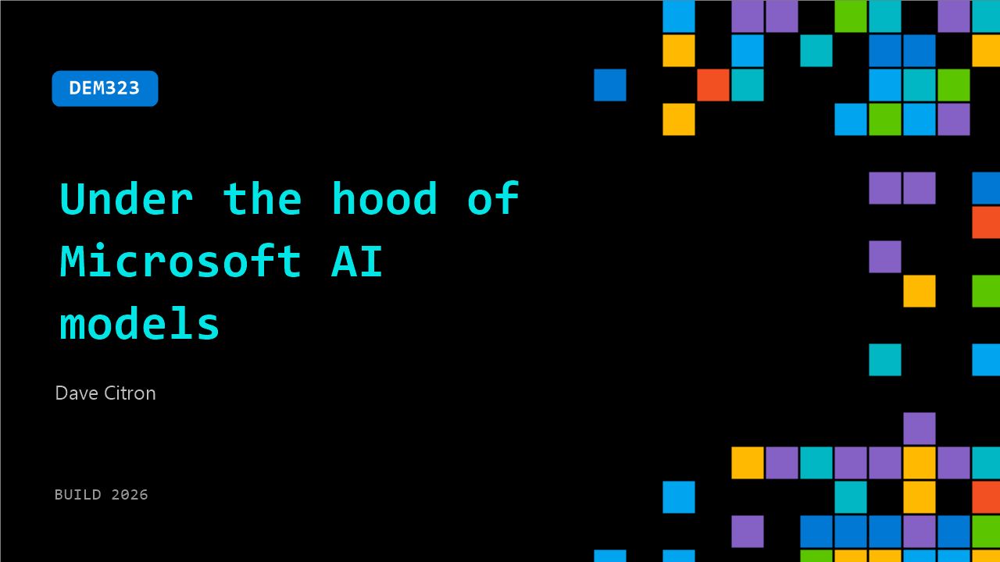

# DEM323: Under the hood of Microsoft AI models

**Session code:** DEM323  
**Date:** Tuesday, June 2, 2026 / 5:30 PM - 5:55 PM PDT (Duration 25 minutes)  
**Watch on-demand:** <https://build.microsoft.com/en-US/sessions/DEM323>

---

## Speakers

- **Dave Citron** - CVP of Product, Microsoft

## About the session

Microsoft AI (MAI) just announced a family of new models including new Thinking, Coding, Voice, Transcription, and Image models.  In this session, a leader from MAI will share an open and scientific walk through of what it takes to train our models, what we learn along the way, and how those learnings are designed into the model architectures, features, and capabilities.

Seating for this session is first-come, first-served. Add it to your schedule to plan your day and arrive early to secure a spot.

## AI summary

**Introduction and Session Overview:** The session opens at 00:00:02 with host Dave Citron, CVP of Products at Microsoft AI, welcoming attendees and explaining that this is an "under the hood" deep dive into models announced earlier that day. He describes the agenda at 00:00:32—starting with philosophy, followed by a walkthrough of seven released models, a deep exploration of the "Thinking 1" reasoning model, and closing with a detailed look at Microsoft’s "Frontier Tuning" methodology. This introduction sets the expectation that participants will learn precisely how these new AI models were constructed, trained, and optimized for enterprise-grade performance and customization.

**AI Model Portfolio Overview:** Beginning around 00:01:04, Citron highlights the seven core models announced that morning, spanning image generation, transcription, voice, coding, and reasoning. "Image 2.5" and its "Flash" variant deliver high-quality image generation at reduced cost. "Transcribe 1.5" offers record-setting accuracy across 43 languages at five times the performance speed of competitors. "Voice 2" provides rich, natural speech generation with emotional control and ultra-low latency, demonstrated at 00:06:20. "Code 1 Flash" enables efficient, high-speed code generation already integrated into GitHub and Visual Studio Code. Finally, Citron introduces "Thinking 1," Microsoft’s first frontier reasoning model performing at 97% accuracy on core benchmarks, built entirely through their own training loops without distillation.

**Philosophy and Design Principles:** From 00:02:29 to 00:04:11, Citron emphasizes Microsoft’s core development philosophy—dubbed "Humanist Superintelligence." This approach is defined by a commitment to AI that augments rather than replaces human potential. Three driving tenets—human-first design, service-oriented architecture, and developer empowerment—shape their modeling decisions. Notably, Microsoft avoids distillation, preferring to "hill climb from scratch" so that each model earns its own capabilities through authentic data learning loops. This methodology ensures full transparency and control, with clean datasets, no inherited third-party weights, and complete auditability. The foundation supports reproducible, safe, and ethically aligned AI development with traceable lineage for enterprise deployment.

**Model Deep Dive – Architecture and Reinforcement Learning:** Starting around 00:09:11, Citron focuses on "Thinking 1" and outlines its architectural composition—a 35-billion active parameter mixture-of-experts framework capable of handling a 256k context window. The model was trained on over 30 trillion in-house tokens, intentionally excluding synthetic or AI-generated data. At 00:11:22, he explains the reinforcement learning (RL) process, powered by a GRPO algorithm that iteratively scores and reinforces valid reasoning chains. RL was stabilized through five innovations allowing reliable capability growth over thousands of training steps, resulting in strong benchmark performances. Safety is handled through a dedicated RL climb using human preference data and red teaming with over 2,100 adversarial scenarios, ensuring high safety and helpfulness. Benchmarks presented at 00:13:16 show the model’s excellence across reasoning, coding, and scientific domains, proving that capabilities were “learned, not inherited.”

**Frontier Tuning and Customization:** In the segment beginning at 00:14:27, Citron introduces Microsoft’s "Frontier Tuning," which empowers organizations to run their own private modeling and optimization cycles atop the foundation models. The tuning system allows enterprises to train within secure environments using their proprietary data, achieving personalized AI behavior tailored to context, workflows, and domain expertise. The process emphasizes privacy, efficiency, control, and continuous improvement, transforming usage feedback into progressive model evolution. A case study with Land O’Lakes at 00:16:04 demonstrates this advantage—Frontier-tuned Thinking 1 Flash achieved 89.3% quality scores and 10X cost efficiency while outperforming generalist models on production tasks.

**Conclusion and Availability:** In closing at 00:16:48, Citron summarizes that Image 2.5, Voice 2, and Transcribe 1.5 are live today on Foundry and Microsoft’s Mai Playground, accessible even through mobile devices, while Thinking 1 is entering private preview through Foundry. "Code 1 Flash" is available in Visual Studio Code. All models will also deploy across Base10, OpenRouter, and Fireworks platforms. He invites users to visit Foundry or Microsoft.ai for detailed reports, model cards, pricing, and documentation. The talk ends at 00:17:49 with encouragement to test demos, share feedback, and follow Microsoft AI’s forthcoming innovations and research as the lab continues to expand its frontier development roadmap.

## Session tags

- **Session type:** Demo
- **Level:** (200) Intermediate
- **Topic:** Working with models
- **Tags:** Microsoft for Startups, Microsoft Foundry, AI Toolkit
- **Location:** Festival Pavilion, Theater A
