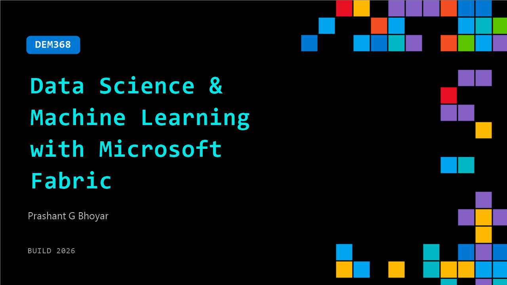

# DEM368: Data Science & Machine Learning with Microsoft Fabric

**Session code:** DEM368  
**Date:** Wednesday, June 3, 2026 / 2:30 PM - 2:55 PM PDT (Duration 25 minutes)  
**Watch on-demand:** <https://build.microsoft.com/en-US/sessions/DEM368>

---

## Speakers

- **Prashant G Bhoyar** - AI Architect - Office of CTO, Applied Information Science, Inc

## About the session

Explore Microsoft Fabric’s unified Data Science experience in this fast-paced 25-minute demo. See how to ingest and prepare data with OneLake and Lakehouse, build models using Notebooks, Spark, and SynapseML, and track experiments with MLflow. Learn how to operationalize models with batch scoring and integrate results into Power BI. The session also showcases building a simple generative AI Q&A solution using Fabric Data Agents, giving you a practical end-to-end view in a short time.

Seating for this session is first-come, first-served. Add it to your schedule to plan your day and arrive early to secure a spot.

## AI summary

_No AI summary available._

## Session tags

- **Session type:** Demo
- **Level:** (100) Foundational
- **Topic:** Working with models
- **Tags:** Community, MVP
- **Location:** Gateway Pavilion, Level 2, Theater C
