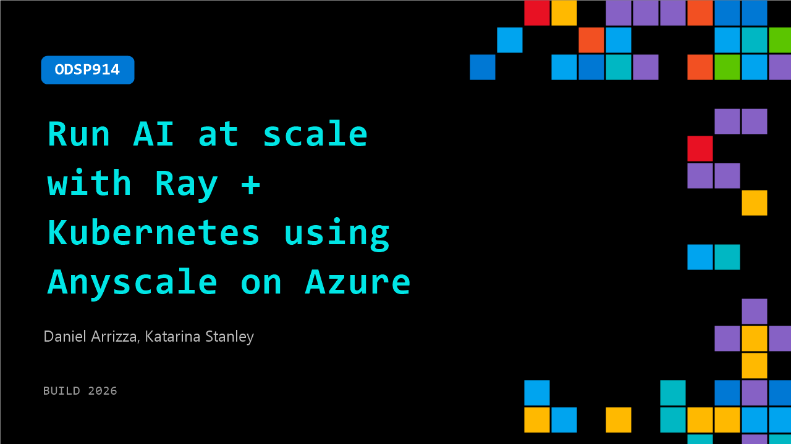

# ODSP914: Run AI at scale with Ray + Kubernetes using Anyscale on Azure

**Session code:** ODSP914  
**Watch on-demand:** <https://build.microsoft.com/en-US/sessions/ODSP914>

---

## Speakers

- **Daniel Arrizza** - Lead Partner Engineer, Anyscale
- **Katarina Stanley** - Product Marketing Manager, Anyscale

## About the session

In this session see how to build multimodal data pipelines, train and fine-tune models, and deploy them as inference services, all without managing infrastructure. Walk through the end-to-end architecture and run a live demo of building, training, and serving AI inside your Azure subscription. Anyscale on Azure is a production-ready AI platform built on a scalable stack of Ray and Azure Kubernetes Service that abstracts the complexity of distributed compute behind a Python-native interface.

## AI summary

_No AI summary available._

## Session tags

- **Session type:** Pre-recorded
- **Level:** (300) Advanced
- **Topic:** Working with models
- **Tags:** AI, Azure, Cost Management, Observability, Platform Engineering, Reliability, Resiliency, Security, Compute, Platform, Vector Embeddings, Agents, Developer, Azure Kubernetes Service (AKS)​​, Python, PyTorch, Microsoft for Startups, AKS, Data, Scaling, DevTools, Dev Tools, Development pipeline, Production Systems
