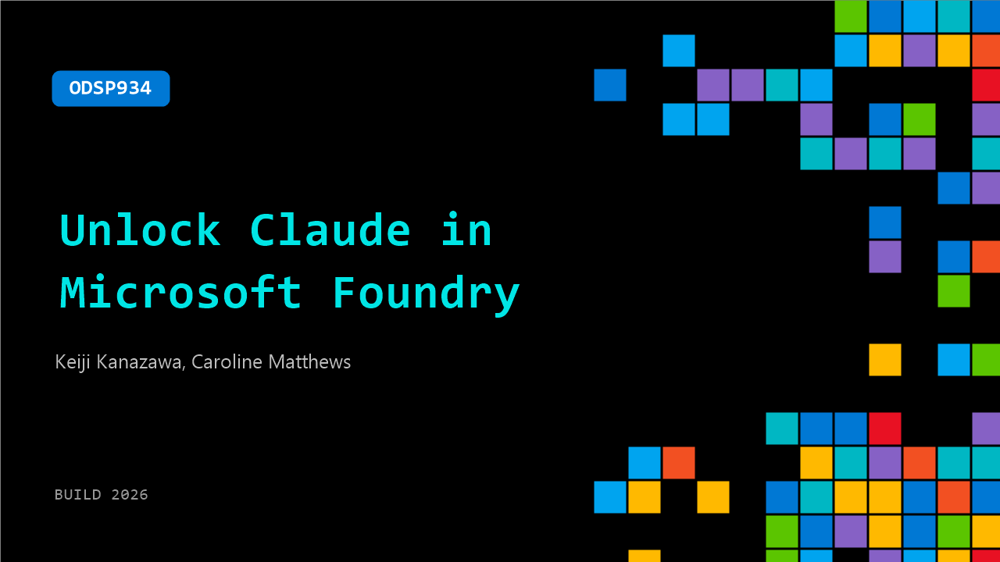

# ODSP934: Unlock Claude in Microsoft Foundry

**Session code:** ODSP934  
**Watch on-demand:** <https://build.microsoft.com/en-US/sessions/ODSP934>

---

## Speakers

- **Keiji Kanazawa** - Principal Product Manager, Microsoft
- **Caroline Matthews** - Applied AI Architect, Anthropic

## About the session

This session introduces enterprise developers and IT leaders to Claude models now available in Microsoft Foundry. Hear from Anthropic and Microsoft experts on deploying frontier AI within existing Azure infrastructure to build agents and automate complex workflows. See a live demo of Claude in action, plus a walkthrough of Claude model selection and how to get started with billing through MACC.

## AI summary

**Introduction and Business Context:** The webinar opens with Keiji Kanazawa welcoming viewers to the Microsoft and Anthropic session on building intelligent agents using Claude within Microsoft Foundry (00:00:00–00:00:13). He introduces the idea that leveraging AI to meet business needs requires understanding how intelligent systems can foster growth, enhance customer satisfaction, and optimize workflows. Caroline Matthews from Anthropic joins, describing her role in supporting teams deploying Claude in production (00:00:24–00:00:35). Kanazawa outlines the foundational needs for enterprise AI: orchestrating multiple agents, ensuring interoperability, integrating with data sources like Microsoft 365, and maintaining continuous monitoring with robust safety and evaluation tools (00:00:51–00:01:54). He stresses the importance of agents that can learn, customize, and evolve while remaining secure and enterprise-ready.

**Understanding Agentic Applications:** The discussion then shifts to explain the nature of “agentic” applications—systems that not only generate responses but engage in long-running, goal-driven reasoning loops (00:02:26–00:03:57). Kanazawa illustrates how modern agents automate tasks like analyzing performance spikes and generating reports, which previously required manual effort. These agents coordinate across multiple tools, handle complex data sources, and employ memory and self-improvement cycles to refine their performance (00:03:32–00:04:46). He emphasizes that building, deploying, and operating these agents requires secure governance, continuous optimization, and an iterative lifecycle approach. The rationale behind the Microsoft–Anthropic partnership becomes clear: to blend Microsoft’s enterprise infrastructure with Anthropic’s deep expertise in agentic AI, harnessing leading models like Claude Opus for real-world deployment (00:05:41–00:06:50).

**Microsoft Foundry and Claude Integration:** Kanazawa introduces Microsoft Foundry as the unified control plane for creating, managing, and securing AI agents and workflows (00:06:54–00:08:17). Foundry integrates coding tools like GitHub Copilot and VS Code, while supporting models such as Claude Opus, Sonnet, and Haiku. Agents are governed with Microsoft Entra, Purview, and Defender, ensuring compliance and security. Caroline Matthews then elaborates on the advantages of running Claude within Microsoft’s environment (00:08:32–00:10:00). She outlines four pillars: frontier intelligence for challenging reasoning and coding tasks, built-in safety through Anthropic’s constitutional AI, native integration across Microsoft’s ecosystem, and a streamlined path from prototype to production. This enables teams to focus on delivering value rather than building the surrounding AI infrastructure.

**The Claude Model Family and Demo:** Matthews presents the Claude model lineup available in Foundry—Opus for deep reasoning, Sonnet as the robust default for enterprise work, and Haiku for high-speed, low-latency processing (00:11:13–00:13:59). To illustrate these concepts, she walks through an interactive “cupcake factory” demo. Using Foundry’s playground, she deploys Claude Sonnet 4.6 and personalizes it as a chatbot that accepts cupcake orders through humorous prompts (00:14:10–00:15:49). She then transitions to VS Code to demonstrate the Anthropic Foundry client and an MCP (Model Context Protocol) connection enabling real-time order handling. Through a live exchange, the demo shows the agent setting up a customer, retrieving information, and confirming an order—illustrating how agents can seamlessly connect external and internal systems through Foundry’s SDK tools (00:15:50–00:19:32).

**Advanced Agent Architecture and SDK Insights:** Kanazawa returns to define agent harnesses—the framework that drives how frontier models like Claude iterate, reason, and act in a continuous loop (00:20:01–00:21:06). Foundry’s Agent Service is highlighted as an open, secure, and multi-agent environment that supports diverse frameworks and deployment targets including M365 and Agent 365. A live demo follows, showing a customer-support agent executing automated weekly operations and generating analytical reports through the Claude Agent SDK (00:22:00–00:24:39). Matthews then unpacks the Claude Agent SDK itself—a production-proven harness programmable in Python and TypeScript. She explains its core loop of context gathering, action, verification, and repetition, along with built-in execution tools, permissions, lifecycle hooks, and observability features (00:25:05–00:27:04). The SDK lets organizations skip infrastructure plumbing and focus on building differentiated value-driven agents.

**Evaluation, Observability, and Conclusion:** The final part delves into observability, monitoring, and systematic evaluations to ensure quality, safety, and reliability of enterprise AI agents (00:32:01–00:33:49). Matthews emphasizes setting up evaluations early, covering aspects like groundedness, coherence, relevance, risk mitigation, and code robustness. These metrics, built into Azure Foundry, allow continuous monitoring across production environments, ensuring adherence to standards and identifying drift or degradation over time (00:34:10–00:35:12). Closing remarks feature customer outcomes from partners like Adobe and Dentons, underlining that high reasoning quality is translating into tangible business impact. Kanazawa concludes by reinforcing that combining the advanced reasoning of Claude with Microsoft Foundry’s enterprise architecture empowers teams to design resilient, scalable, and transformative AI workflows (00:36:07–00:36:36).

## Session tags

- **Session type:** Pre-recorded
- **Level:** (100) Foundational
- **Topic:** Working with models
- **Tags:** AI, Agents, Developer, Microsoft Foundry, Responsible AI, MCP, Foundry Agents, Agentic SDLC, Enterprise
